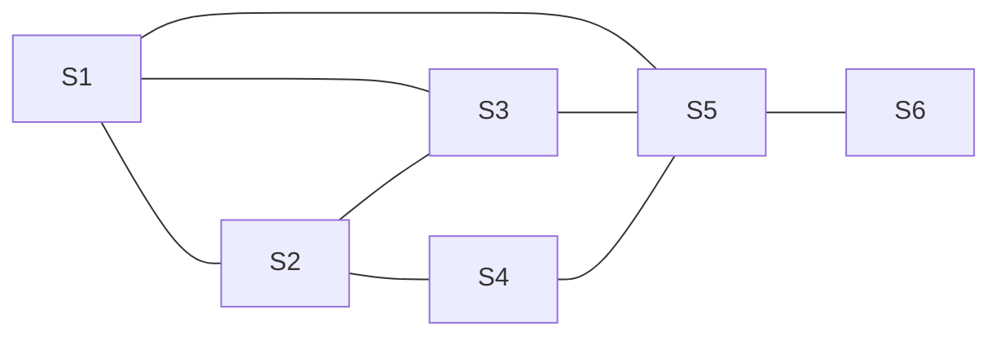

#  Arbitra

An A-level Computer Science project by Samuel Newman

## Design - Protocol and UI Concepts

### How the network works

The idea behind how I've structured the protocol is that there are different types of messages, each of which has a different specific reply. Each message is meant to stand alone by itself, and there is no 'conversation' between nodes. For example, if a node want's to check that it's blockchain is up to date, it will send out a message asking for the top block. If someone replies with their top block and it's different to what they have on disk, instead of replying to the same node asking for the blockchain, it will instead send out a chain request to all the nodes it is in contact with. This greatly simplifies complexity of the messaging system, allowing me to develop each function separately from each other.

### A closer look at the Protocol

So that messages in the network can be understood by everyone in it, we need to make sure that there are strict definitions on message types. If a node receives an invalid message, it will reject it.

Since this project will be written in Javascript, each packet will use the JavaScript Object Notation (JSON). A rough example of a JSON object looks like this:

```json
{
	id: "cad944434a29dcfcfb4080cec264396fd23d73c1708db39bd780e7e30ef9072f",
    sender: "4a57bd2226eb76cceddf0cfe0baa2a1391b4952db4610dc3762845cedffdff62",
    recipient: "aed1fe98cda4ba5a1681a19aa768f73b9d707c5621c7effdf2938e242080505e",
    amount: 50.0,
    timestamp: "1505052733",
    signature: "5773487d221545d26fd0f57fdb3a7d986bc479a850d7b0d762e8c7f4772790a0"
}
```

This means that it will be much easier to parse the messages as they are already in a format that Javascript can use.

However, it would be strange to have all of the info in one blob - for example, when checking a hashed block, you would have to remove some of the block's values and then hash it which, while possible, is inefficient and weird. The solution to this is separating each message into a header and a body. The header contains info about the block - who it was send by, what it's hash is, what kind of message it is etc. The body contains the actual message.

This system is far better because it means that the system can simply check the standardised header to find out what the message is, rather than parse each type of message separately. Also, since a lot of the messages are hashed, we can simply hash the content and put the hash into the header, which makes a lot more sense than having to remove elements from the message before you can confirm the hash.

A message with a header would look like this:

```json
{
    header: {
        type: "block"
      	sender: "168.123.421.9",
      	hash: "0000000d221545d26fd0f57fdb3a7d986bc479a850d7b0d762e8c7f4772790a0"
    }
    body: {
         id: "cad944434a29dcfcfb4080cec264396fd23d73c1708db39bd780e7e30ef9072f",
         sender: "4a57bd2226eb76cceddf0cfe0baa2a1391b4952db4610dc3762845cedffdff62",
         recipient: "aed1fe98cda4ba5a1681a19aa768f73b9d707c5621c7effdf2938e242080505e",
         amount: 50.0,
         timestamp: "1505052733",
         signature: "5773487d221545d26fd0f57fdb3a7d986bc479a850d7b0d762e8c7f4772790a0"
    }
}
```


#### Data types

So that it is easier to determine if a message is valid or not, we need to determine not only what the different messages are, but also the different formats that each part of the message will be (i.e. integer, hex string, enum). The way that I'll do this is with a table with the name, the type, and the maximum length.

The size does not apply to all types, mainly numbers. JS numbers are all 64bit double-precision floats, so it assumed they are that size.

The JSON object used in the first example above in this format would look like this:

| name      | type       | size |
| --------- | ---------- | ---- |
| id        | hex string | 64   |
| sender    | hex string | 64   |
| recipient | hex string | 64   |
| amount    | float      |      |
| timestamp | timestamp  |      |
| signature | hex string | 64   |

Please note this is an example and not the final definition of a transaction message.

#### Header

Each message has a header. It has the following attributes:

| name    | type       | size |
| ------- | ---------- | ---- |
| type    | string     | 2    |
| size    | integer    |      |
| hash    | hex string | 64   |
| version | string     |      |
| time    | timestamp  |      |

`size` is the size of the body in bytes. `hash` is the SHA256 hash of the body, and acts as both an identifier and as a checksum. If size becomes a concern, it may become necessary to truncate the hash. The `version` is the version number of the client.

However, not all message types have unique contents, and therefore their hashes would be the same, making the usage of the hash as a unique identifier. I initially though that this can be fixed by appending the timestamp onto the end of the `body` before hashing it.

```pseudocode
hash = sha256(msg.body+msg.header.time)
```

However, this does not work for message types where they are relayed (block and transaction). This is because the timestamp is in the header, which changes each time that it's sent, as well as other complications that I ran into. I realised that a better solution was to move the time into the `body`. This way, the body is always unique, and the hash can always be found by just hashing the body.

The message type is a string, and is one of:

| message type              | string |
| ------------------------- | ------ |
| Transaction               | tx     |
| Block                     | bk     |
| Latest block hash request | hr     |
| Block request             | br     |
| Ping                      | pg     |
| Node request              | nr     |

#### Message types

##### Transaction

A transaction, as mentioned earlier, has the sender, the recipient, the amount, the signature, and the time. However, it needs to be decided how to support multiple senders, so that in the case that someone need to send a large amount of Arbitrary Units, but had multiple wallets with that amount split between them, they would not need to clutter the blockchain consolidating funds before sending the transaction.

One way could be to have two lists, one with the recipient's names and one with the value they are given:

```json
{
    sender: "0980192830198019",
    amounts: [10, 4]
    signatures: ["19321092","12301932019"]
  	recipient: "1239817320812033987193",
    ...
}
```

This is a good method as it allows you to clearly see the list of recipients.

Unfortunately, this is not very clear which amount is being taken from each wallet. It could also be vulnerable to the list's order being confused. It also does not support transaction fees (unless, for example, if the list of amounts is great than the list of recipients, the remaining amounts are given to the miner).

Another way of doing it could be to have a list of object literals:

```json
{
    to: "109230918093"
  	from: [{person:"091230192012", amount:10, signature:"123129"}, {person:"109127981737", amount:4,signature:"792873928"}],
}
```

A benefit of doing it this way is that it saves putting the total amount as a separate value. However, this then means that the ability to add a transaction fee is lost without having it as a different value.

Between the two, I would say that the second method is better, because it explicitly binds the recipients to the amounts they get. However, the other option is still available if, for whatever reason, I can't use the preferred method. I also aim to get rid of transaction fees, so not being able to implement that is fine.

Finally, a wallet is a public key, which is a point on the curve. We can convert them to hex and concatenate them into a big hex string, which should be 128 bytes long.

From this, we can make our table for transactions:

| name | type       | size |
| ---- | ---------- | ---- |
| to   | hex string | 128  |
| from | array      |      |
| time | timestamp  |      |

The `from` array would contain objects of the form:

| name      | type       | size |
| --------- | ---------- | ---- |
| wallet    | hex string | 128  |
| amount    | integer    |      |
| signature | hex string | 128  |

The signing mechanism, as covered earlier, takes an input string and a private key, and produces a signature. However, the input string can't just be the amount, as then the signature can be reused. It also can't just be the amount plus the public key it's addressed to, otherwise an attacker could repeatedly send the same transaction. Therefore, we need to sign the amount concatenated with the public key concatenated with the current time. Since all of these are available in the transaction message itself, the signature can still be verified, but it also can't be duplicated.

Something to note about floating-point operations is that they're not very accurate.

```javascript
>>> 0.1+0.2
0.30000000000000004
```

This is not good for handling transactions like this. We can circumvent this, however, using integers, and then multiplying them by a fixed amount. I decided that the smallest unit an arbitrary unit could be split up into is a micro-Arbitrary unit, or $1\times 10^{-6}$. Then, we don't have to deal with floating point operations, as we can just use integers to define the number of $\mu$au, which we can then convert back to au. For example, to send 50au, the `amount` would be written as `5000000`.

When a client receives the flowing, it should do the following:

```flow
st=>start: Receive Message
end=>end: Send "ok"
er=>end: Send "er"
ver=>condition: Is valid?
txpool=>condition: Is in chain/txpool?
sta=>operation: Send to all


st->ver
ver(yes)->txpool
txpool(yes)->sta->end
txpool(no)->end
ver(no)->er
```

##### Block

Blocks contain transactions, which are objects. We also need to determine the method whereby the miner receives their reward, and the simplest way of doing that is to have a `miner` attribute in the body in which the person who mined the block can put any public key they desire, and it will be rewarded 50au.

| name         | type       | size |
| ------------ | ---------- | ---- |
| transactions | array      |      |
| miner        | hex string | 128  |
| nonce        | string     |      |
| difficulty   | integer    |      |
| parent       | hex string | 64   |
| time         | timestamp  |      |
| height       | integer    |      |

The `transactions` array would contain the `body` of transaction messages. The `nonce` can be any string that makes the hash of the body meet the required difficulty. The difficulty is determined by how long it took to mine the previous block, but the mechanisms behind that works will have to be determined by testing once block mining is implemented. `parent` is the hash of the block that comes before it in the chain. `height` is the number of blocks it is away from the genesis block.

```flow
st=>start: Receive Message
end=>end: Send "ok"
er=>end: Send "er"
ver=>condition: Is valid?
chain=>condition: Is in chain?
sta=>operation: Send to all
parent=>condition: Is parent in chain?
add=>operation: Add to blockchain
cr=>operation: Send "cr"

st->ver
ver(yes)->chain
chain(yes)->e
chain(no)->parent
parent(yes)->add->sta->end
parent(no)->cr->end
ver(no)->er
```

##### Ping

The ping message is a critical part of the network. Sending a ping signals that the node wants to be sent messages that other nodes receive. It also has a Boolean value `advertise`, which means that, if set to true, the node that received the ping will send the IP address of the node that sent it to nodes that send a node request. This should be a toggle that the client can switch if they receive too many messages.

| name      | type      | size |
| --------- | --------- | ---- |
| advertise | boolean   |      |
| time      | timestamp |      |

On receiving a ping, a client will reply with a ping. This shows that they acknowledge each other.

```flow
st=>start: Receive Message
end=>end: Send "pg"
ver=>condition: Is IP in connections?
add=>operation: Add to connections

st->ver
ver(yes)->end
ver(no)->add->end
```

##### Node Request

Sending a node request asks for the list of recent connections that each client maintains, provided that the connection has marked itself as willing in the ping message. A node request has an optional value defining the maximum number of nodes that it wants to receive (blank for all). 

| name | type      | size |
| ---- | --------- | ---- |
| max  | integer   |      |
| time | timestamp |      |

```flow
st=>start: Receive Message
end=>end: Send "nd"
gtb=>operation: Get connections where "advertise" = true

st->gtb->end
```

##### Block Hash Request

This asks for the hash of the highest block on the blockchain.

| name | type       | size |
| ---- | ---------- | ---- |
| hash | hex string | 64   |
| time | timestamp  |      |

```flow
st=>start: Receive Message
end=>end: Send "bh"
gtb=>operation: Get top block

st->gtb->end
```

##### Chain Request

This asks for a subsection of the blockchain that is directly beneath the block referred to in the message.

| name | type       | size |
| ---- | ---------- | ---- |
| hash | hex string | 64   |
| time | timestamp  |      |

```flow
st=>start: Receive Message
end=>end: Send "cn"
er=>end: Send "er"
chain=>operation: Get chain below hash
ver=>condition: Is hash in chain?

st->ver
ver(yes)->chain->end
ver(no)->er
```

#### Reply types

No only are there messages that are sent out by the client, but there are also the different types of message that are sent back in reply to these messages. Some we have already touched on, such as the block and the ping. However, some messages don't need a specific reply, so they have a generic "received" message. Each reply corresponds to a message:

| name       | reply to | string |
| ---------- | -------- | ------ |
| Ping       | pg       | pg     |
| Chain      | br       | cn     |
| Block Hash | hr       | bh     |
| Node       | nr       | nd     |
| Received   | tx, bk   | ok     |

##### Ping reply

The ping reply is just another ping.

##### Chain

In reply to a chain request. It is just an array of blocks block and it's associated hash.

| name  | type      | size |
| ----- | --------- | ---- |
| chain | array     |      |
| time  | timestamp |      |

When a client receives this message, it verifies each one and if it passes, it adds it to the blockchain.

##### Block hash

In reply to a block hash request. It is simply the hash from the top of the blockchain.

| name | type       | size |
| ---- | ---------- | ---- |
| hash | hex string | 64   |
| time | timestamp  |      |

When a client receives a block hash, it checks it to see if it is the same as their top block. If it is not, it sends a chain request to all connections.

##### Node

In reply to a node request. This is simply an array of nodes from the list of recent connections that the client maintains that have marked themselves as willing to be broadcast across the network.

| name  | type      | size |
| ----- | --------- | ---- |
| nodes | array     |      |
| time  | timestamp |      |

The array is just an array of strings.

When a client receives this message, it sends a ping to each of the IP listed in the message.

##### Received

The received message type is just a confirmation that the message had been received and accepted. Therefore, the only thing in the body is the timestamp.

| name | type      | size |
| ---- | --------- | ---- |
| time | timestamp |      |

#### Error Message

As well as correct replies, we need to messages that a client will reply with if the messages received is incorrect in some way. The message will have type `er`, for error. It also contains the hash of the failed message, if available.

| name  | type       | size |
| ----- | ---------- | ---- |
| error | string     | 20   |
| hash  | hex string | 64   |

The `error` can be one of several strings, that correspond to different errors.

| error string | description                                      |
| :----------- | ------------------------------------------------ |
| parse        | Failed to parse JSON - message is not valid JSON |
| hash         | Hash does not match                              |
| signature    | Signature is invalid                             |
| type         | The type of the message is invalid               |
| amount       | Transaction invalid due to not enough funds      |
| transaction  | Transaction in a block is invalid                |
| notfound     | Requested block/data not found                   |

When a client receives an error message, it stores it.

#### Network diagrams

In order to gain an understanding about how the network would function, I decided to model a network with a limited number of nodes, manually.



I set up the network in this way so that network traffic has to disperse through the network through multiple nodes. This simulates a real network, where not every node will be connected to every other node.

The rule is that when a node receives a message, it passes it on to every node that it is connected to.

The arrows indicate that the message is passed from the node on the left to the node on the right, and the lines indicate a step. The nodes listed after the line are the nodes that have received the message

##### Simulation 1: From S1

```
1 ---------- S1
S1 > S2
S2 > S3
S1 > S5
2 ---------- S1, S2, S3, S5
S2 > S1
S2 > S3
S2 > S4
S3 > S1
S3 > S2
S3 > S5
S5 > S1
S5 > S3
S5 > S4
S5 > S6
```

I'm going to stop the simulation at the second state, because I can see a loop is starting to form. Since S2 is connected to S1, it will send the message back, which in turn will send the message back, forever.

This can be fixed with a single rule: *No passing messages back to the node that sent it*.

However, there is another issue - in a loop of three nodes like S1, S2, and S3, the can still be a loop if a message gets passed from S1 to S3 via S2. Since S3 doesn't know that S1 sent the message, it can send it to S1 which will send it around the loop again. Therefore, we need a second rule: *Never send the same message to the same node twice*. This, in the actual network, would probably mean keeping track of the list of messages that have passed through the node via their hash, and not repeating an incoming message if it's hash is on this "blacklist".

##### Simulation 2: From S1

```
1 ---------- S1
S1 > S2
S2 > S3
S1 > S5
2 ---------- S1, S2, S3, S5
S2 > S1
S2 > S3
S2 > S4
S3 > S2
S3 > S5
S5 > S3
S5 > S4
S5 > S6
3 ---------- S1, S2, S3, S4, S5, S6
```

### User Interface Design

Since the application will use Electron, the frontend is made with HTML/CSS. Because I have experience with web design I decided to prototype the UI using a static HTML page.

The code used to create the UI is located at the bottom of this section.

#### Concept 1

I decided to go with concept 1.


This first pass, while it captures the aesthetics that I'm going for, does not have the functionality I want. There are no buttons, and I want a visually striking graph or other graphic to fill the space beneath the current balance and the important buttons.


In this updated prototype, I remove the placeholder text, as there is no need for text anyway, and moved the existing information boxes to the bottom. I then added the most important buttons - making a transaction, mining the blockchain, and settings. Beneath those is a temporary graph (which can be found [here](https://blog.cex.io/wp-content/uploads/2015/03/market-price.png)). The proper graphic, whatever it turns out being, will be the same grey colour with purple highlights.

This update is an improvement, but it is still missing some features. The most important being a way to access the transaction history and other minor features. However, I don't want to clutter the top of the page. In a normal website, this would probably be hidden in a sidebar menu or something similar, but since this is pretending to be a desktop app that would be out of place.

The solution I came up with was to create a preview list of previous transactions. Through this approach, there is more information available at a glance to the user, it adds more functionality to the homepage, and it creates a non-intrusive way to add the link to the list of previous transactions.


I think it works quite well. You would be able to switch between all recent transactions, all recent outbound transactions, and all recent inbound transactions, and also be able to navigate to a more in-depth page.

I also made some slight adjustments to the spacing to make it more consistent, as well as adding a 0.5 second easing animation effect to all background transitions using `transition: background-color 0.5s ease`.

Something that occurred to me when using other cryptocurrencies is that it is often unclear when the application is downloading the blockchain. I therefore had the idea to turn the purple banner at the top of the application into a huge loading slider, like so (mockup):


I had to manually position the `45%` as it was a child of the progress bar itself, so this is obviously a temporary solution. However, if I have time it would be a cool way to incorporate the banner into the functionality of the application.

##### Redesign

I really don't like the way this it turning out. It feels more like a website than an app, and with this in mind I decided to try to rearrange it into concept 2, from the analysis. With this second attempt I took into consideration:

- Ease of navigation
- More sensible colour scheme
- Position of the drag region


I think that this is a vast improvement. It now looks much more like a traditional desktop application. The colours are much more professional and the way you navigate through the app is much more streamlined and easy to understand.

I also made the drag region a separate `div`. I highlighted it here in red:


After some minor polish, this is the final concept:


#### Source code

##### HTML - index.html

```html
<html>
	<head>
		<meta charset="utf-8">
		<title>Arbitra Client</title>
		<link rel="stylesheet" href="style.css"/>
		<script src="https://use.fontawesome.com/c7895c8683.js"></script>
	</head>
	<body>
		<div class="left">
			<h1 class="money">10000</h1>
			<ul>
				<li><i class="fa fa-rss" aria-hidden="true"></i> 5 connections</li>
				<li><i class="fa fa-link" aria-hidden="true"></i> 11832 chain length</li>
				<li><i class="fa fa-clock-o" aria-hidden="true"></i> 5 seconds since last block</li>
			</ul>
			<div class="subsec">Overview</div>
			<div class="subsec">Transactions</div>
			<div class="items">Make Transactions</div>
			<div class="items">Recieve Transactions</div>
			<div class="items">Transaction History</div>
			<div class="subsec">Blockchain</div>
			<div class="items">View Blockchain</div>
			<div class="items">Mine for Arbitrary Units</div>
			<div class="subsec">Settings</div>
			<div class="items">Network Settings</div>
			<div class="items">Application Settings</div>
		</div>
		<div class="right">
			<div class="dragbar"></div>
			<div class="closebox">
				<i id="min" class="fa fa-window-minimize" aria-hidden="true"></i>
				<i id="max" class="fa fa-window-restore" aria-hidden="true"></i>
				<i id="close" class="fa fa-window-close" aria-hidden="true"></i>
			</div>
			<div id="body">
				<h1>Overview</h1>
			</div>
		</div>
	</body>
</html>
```

The HTML structure is split into three parts - the left menu, the drag bar, and the main section. They are given the class names `.left`, `.dragbar`, and `#body`, respectively. `#body` and `.dragbar` are grouped into a `div` called `.right`, to ensure that they are kept together.

The menu in `.left` is made up of a series of `div`s called `.subsec` and `.items`. There is probably a better way of doing this, but I was struggling to align list elements so I decided to use `div`s. `.subsec` describes the menu subsections, and `.items` describes the different links - these will have to be buttons eventually, but for now they are fine.

The drag bar is made of two elements - `.dragbar`, which is what you can use to drag the window around, and `.closebox`, which contains minimise, maximise, and close buttons - they are now [Font Awesome](http://fontawesome.io/) icons. This is because if the entire top section is a draggable region, you are not able to click the close buttons. To solve this, I made sure that the two elements do not overlap.

#####CSS - style.css

```css
* {
	font-family: Segoe UI, Helvetica, sans-serif;
	margin: 0;
	padding: 0;
	transition: background-color 0.5s ease;
}

body {
	height: 100vh;
	overflow: hidden;
}

.money::after {
	content: "au";
	font-size: 0.65em;
}

.left {
	width: 300px;
	height: 100%;
	float: left;
	padding-top: 20px;
	background-color: #333;
}

.left > * {
	color: #fdfdfd;
	list-style: none;
	padding-left: 25px;
}

.left > .items:hover {
	background-color: rgba(43, 43, 43, 0.5);
}

.left > .subsec:hover {
	background-color: rgba(43, 43, 43, 0.5);
}

.left > h1 {
	font-size: 3em;
}

.subsec {
	font-size: 1.5em;
	padding: 3px;
	padding-left: 25px;
	margin-top: 15px;
}

.items {
	font-size: 1.2em;
	padding: 3px;
	padding-left: 35px;
}

.right {
	width: calc(100vw - 300px);
	height: 100vh;
	background-color: #fdfdfd;
	float: left;
}

.dragbar {
	width: calc(100% - 150px);
	height: 50px;
	float: left;
}

.closebox {
	width: 140px;
	height: 40px;
	float: left;
	padding: 5px;
}

.closebox > i {
	font-size: 2em;
	padding-left: 11px;
	color: #333;
	cursor: pointer;
}

#close:hover {
	color: red;
}

#body {
	width: calc(100% - 20px);
	padding: 10px;
	color: #333;
}

#body > h1 {
	font-size: 2.5em;
	border-bottom: 2px solid #333;
}
```

For the CSS, I made use of some cascading, for example making all the icons in the  `.closebox` div have the same colour, size and padding, without having to give them their own class.

I also used the `calc()` function a lot as it allowed me to, for example, make the `.dragbar` full width minus the size of the close buttons.

To get the "au" suffix on the number on the top, I used a `::after` tag with `content: "au";` and a different size. This meant that every element with the `.money` class is automatically followed by "au", which is very useful as if I have a text element that I know will contain an amount of currency, I can give it this class rather than having to manually append "au" in the backend.

For the colours, I generally used `#333` (grey) and `#fdfdfd` (off-white). The font is Segoe UI.

#### Generic Page Template

Now that we have the overall style decided upon, we now need to flesh out all the UI elements that we need. This includes:

- Buttons & Fields
- Highlighted areas
- Pop-ups
- Inline lists
- Full-page lists
- Fonts and sizes

Since the page is pretty much already blank, all I did was create a new file and copy the HTML code over.

To start, I listed out most of the HTML elements that we might need.

```html
			<div class="body">
				<h1>Testing Page</h1>
				<h2>Subheading</h2>
				<h3>Subsubheading</h3>
				<h4>Subsubsubheading</h4>
				<h5>Subsubsubsubheading</h5>
				<h6>Subsubsubsubsubheading</h6>
				<p>Lorem ipsum dolor sit amet, consectetur adipiscing elit. Fusce nec ex congue ligula pretium vulputate sit amet vel enim. Proin tempor lacinia dui, sit amet maximus velit commodo ut. Etiam nulla justo, cursus eu risus in, interdum convallis nibh. Phasellus non rutrum tortor. Pellentesque habitant morbi tristique senectus et netus et malesuada fames ac turpis egestas. Donec viverra nec est vitae mollis. Donec pharetra nisl enim, vitae efficitur arcu rutrum non. Phasellus id congue mi. Integer sagittis diam sed luctus dapibus. Proin at feugiat sapien. Nam ac mauris vitae massa placerat ultrices in eget odio. Nunc vehicula neque ut neque molestie, a tempor massa viverra.</p>
				<p>Aliquam efficitur cursus sollicitudin. Nulla eu diam in ex commodo aliquet in sit amet augue. Cras maximus auctor dui eu imperdiet. Suspendisse et sem est. Nunc lectus dui, accumsan nec lacus in, auctor pharetra purus. Nullam eu nisi porttitor, tempor nibh nec, accumsan velit. Vestibulum posuere erat et placerat lacinia. Nulla eget fermentum arcu. Quisque aliquam tellus id felis pharetra sagittis. Donec venenatis ligula nibh, nec dignissim magna lobortis mattis. Aliquam ultrices orci et pretium feugiat.</p>
				<ul>
					<li>Unordered</li>
					<li>List</li>
				</ul>
				<ol>
					<li>Ordered</li>
					<li>List</li>
				</ol>
				<form>
					<input type="text" placeholder="Text field"><br>
					<select name="dropdown">
						<option>Dropdown</option>
						<option>List</option>
						<option>Options</option>
					</select><br>
					<input type="radio"> Radio<br>
					<input type="checkbox"> Checkbox<br>
					<input type="submit" value="Submit">
				</form>
				<button>Button</button>
				<div class="highlight">Highlighted area</div>
			</div>
```


As you can see, since I removed all padding and margins from every element at the start of the CSS page, the `p` elements lack any separation between paragraphs, and the lists are not indented as they should be.

Furthermore, the buttons are very ugly by default in Chrome, and do not fit with the style at all.

However, they all inherit the correct colours from the `#body` div, which is what we want.

My first attempt to fix this was to add back the default padding and margins.


This completely broke it, as many HTML elements have default margins that I was relying on not existing. However, if the margin is set to 0 but we don't change the padding, it fixes the unordered and ordered lists.


The next step is to fix the `p` tags.

```css
p {
	margin-top: 2px;
	margin-bottom: 5px;
}
```


At this point, I think that basic elements like headings and paragraphs are fine, so I will remove them from the testing page. The next thing to do is to try to style the buttons, as they are an important part of the visual theme of the application.

```css
button, input[type=submit] {
	background-color: #fdfdfd;
	font-weight: 400;
	margin: 2px 0;
	min-width: 70px;
	padding: 3px 10px;
	border: 1px solid #333;
	border-radius: 15px;
}

button:hover, input[type=submit]:hover {
	background-color: #333;
	color: #fdfdfd;
}

h1 {
	margin-bottom: 8px;
}
```


I decided upon a capsule-shaped button with very rounded corners and a thin, `1px` thick border. The second button is what it looks like when hovered over - it transitions to a dark background to signify to the user that it is a button. The transition is achieved by applying `transition: background-color 0.5s ease` and `transition: color 0.2s ease` to `*` (all elements).

I also applied `margin-bottom: 8px` to `h1` as it was touching the text field.

```css
input[type=text], input[type=number] {
	background-color: #fdfdfd;
	font-weight: 400;
	margin: 2px 0;
	width: calc(100% - 20px);
	max-width: 300px;
	padding: 3px 10px;
	border: 1px solid #333;
	border-radius: 15px;
}

input[type=text]:focus, input[type=number]:focus {
	border-radius: 5px;
	outline: none;
}
```


I found that much of the styles applied to the buttons could be also applied to the text field. As with the buttons, the second field ("Number field") has been focus. As you can see, the focused field as slightly less rounded corners, so that it is clear which field has been selected.

I am not 100% happy with how it has turned out, but it is fine for a first pass.

It turns out that to create custom radio buttons and checkboxes requires replacing them completely, and since I don't think that I'll use them much they are fine having the default look.

At this point I added a hyperlink to the testing page, and changed the `max-width` of the text fields to `278px` so that they are the same size as the dropdowns.

```css
.highlight {
	background-color: #333;
	display: inline;
	color: #fdfdfd;
	border-radius: 3px;
	padding: 1px 3px 3px;	
}

p > a {
	color: #666;
}
```


For the highlighted area I decided to go with a `#333` background and rounded edges, and for the hyperlink I decided to just lighted it slightly and keep the underline to differentiate it from the rest of the text. I also used `p > a` to select it, as it then only selects hyperlinks that are in text as otherwise it could accidently apply the background and padding to a div or button that is wrapped in a hyperlink, which would cause issues.

```css
p > a:hover {
	color: #fdfdfd;
	background-color: #333;
	padding: 0 2px 2px;
	margin: 0 -2px -2px;
	text-decoration: none;
	border-radius: 3px;
}
```


Using the `:hover` pseudo-class, the hyperlink has a dark background when hovered over with the mouse. I used negative margins to ensure that the increased padding did not change the size of the element, as otherwise it would shift around on the page when hovered over.

##### Lists

There are multiple instances in the application where we will need to display a list of information. I decided to implement this using HTML tables. Here is a basic table with some arbitrary data:

```html
<h2>Sent Transactions</h2>
<table>
    <tr>
        <td>Recipient</td>
        <td>Hash</td>
        <td>Amount</td>
        <td>Timestamp</td>
    </tr>
    <tr>
        <td>3fc9b689459d738f8c88a3a48aa9e33542016b7a4052e001aaa536fca74813cb</td>
        <td>3fc9b689459d738f8c88a3a48aa9e33542016b7a4052e001aaa536fca74813cb</td>
        <td>200</td>
        <td>1505052733</td>
    </tr>
    <tr>
        <td>3fc9b689459d738f8c88a3a48aa9e33542016b7a4052e001aaa536fca74813cb</td>
        <td>3fc9b689459d738f8c88a3a48aa9e33542016b7a4052e001aaa536fca74813cb</td>
        <td>200</td>
        <td>1505052733</td>
    </tr>
    <tr>
        <td>3fc9b689459d738f8c88a3a48aa9e33542016b7a4052e001aaa536fca74813cb</td>
        <td>3fc9b689459d738f8c88a3a48aa9e33542016b7a4052e001aaa536fca74813cb</td>
        <td>200</td>
        <td>1505052733</td>
    </tr>
    <tr>
        <td>3fc9b689459d738f8c88a3a48aa9e33542016b7a4052e001aaa536fca74813cb</td>
        <td>3fc9b689459d738f8c88a3a48aa9e33542016b7a4052e001aaa536fca74813cb</td>
        <td>200</td>
        <td>1505052733</td>
    </tr>
</table>
```

As you can see, the hashes are very large. We need to make sure that it doesn't push the rest of the contents off of the screen. In this case, tables may not be the best option. Perhaps it would be better to simply do it using `div`s, as then we can make sure it is responsive.


There is also the issue that transactions can have multiple recipients. To account for this, I created a list object that would be repeated. I also used wallets instead of transactions, but we can reuse the same styles on the transaction page.

```html
<h2>Wallets</h2>

<div class="highlight-box">
    <h3>My wallets</h3>
    <button>Create new wallet</button>
    <div class="list">
        <div class="list-item">
            <p>Wallet name</p>
            <p>3fc9b689459d738f8c88a3a48aa9e33542016b7a4052e001aaa536fca74813cb</p>
            <p><span class="money">0</span></p>
        </div>
        <div class="list-item">
            <p>Wallet name</p>
            <p>3fc9b689459d738f8c88a3a48aa9e33542016b7a4052e001aaa536fca74813cb</p>
            <p><span class="money">0</span></p>
        </div>
        <div class="list-item">
            <p>Wallet name</p>
            <p>3fc9b689459d738f8c88a3a48aa9e33542016b7a4052e001aaa536fca74813cb</p>
            <p><span class="money">0</span></p>
        </div>
        <div class="list-item">
            <p>Wallet name</p>
            <p>3fc9b689459d738f8c88a3a48aa9e33542016b7a4052e001aaa536fca74813cb</p>
            <p><span class="money">0</span></p>
        </div>
    </div>
</div>
```

This produces:


This is much better looking, and much more flexible than the table approach. It is much simpler than the table, consisting of an outer div, then the `.list` div which contains all the `.list-item`s. `.list-item` is very simple, as it just contains three `p` tags on top of each other.

```css
.highlight-box {
    margin-top: 20px;
    width: calc(100% - 20px);
    position: relative;
    border-radius: 5px;
    padding: 10px 10px 5px;
    max-height: 70vh;
    background-color: #ececec;
    border: 1px solid #333;
}

.highlight-box > button {
    position: absolute;
    top: 5px;
    right: 10px;
}

.list {
    overflow-y: auto;
    overflow-x: hidden;
}

.list-item {
    overflow-x: auto;
    width: calc(100% - 12px);
    background-color: white;
    margin: 5px 0;
    padding: 5px;
    border: 1px solid #333;
    border-radius: 5px;
}
```