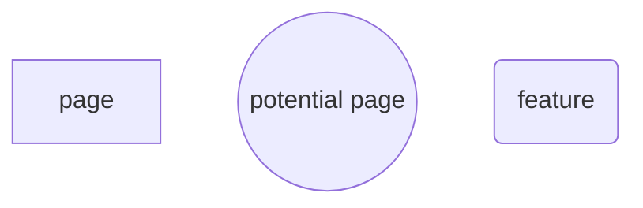
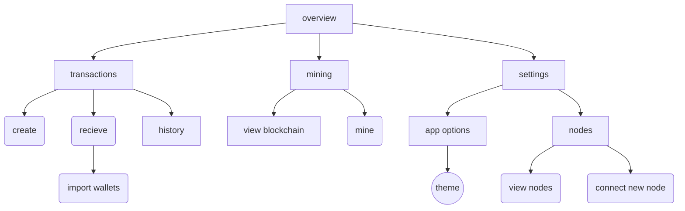
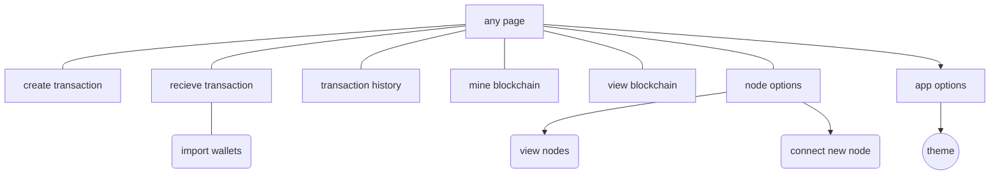

## Introduction

Arbitra is a cryptocurrency – a way of performing transactions that are guaranteed by the rules of mathematics rather than a central bank or some other 3rd party. A blockchain shared amongst a decentralized peer-to-peer network is used to verify transactions.

### Project Aims

1. **Describe in detail how the cryptocurrency would work.**
   As well as this document there needs to be detailed documentation on how a client application would work, and the protocols which the network would work. It must be in sufficient detail such that a fully-compliant client could be built by a third party using only the documentation as reference.
2. **Implement a client application with which one would interact with the network.**
   This includes:
   -- Hashing
   -- Public-key cryptograph
   -- Blockchain technology
   -- Peer-to-peer networking
   -- Electron desktop application
3. **Use the client on a small network of computers, creating a network and thus creating a cryptocurrency.**

### Languages and software

The initial plan is to use the Electron framework. This means that the frontend will be using HTML/CSS, and the backend will use Javascript with a bit of Node.js, the Javascript runtime that is usually used for web server backends. This is helpful because the nature of cryptocurrencies involves a lot of peer-to-peer communication, which Node should excel at.

https://electron.atom.io

https://nodejs.org/en/

The reason I chose Javascript and Electron is that I have a lot of experience with web development, but next to no experience in the GUI systems of any other of the languages I know. Given the time constraints, having to learn a new language could be risky because of how long it would take. Electron will allow me to work with HTML and CSS, which I am very comfortable with, and using Javascript has turned out to have other benefits. With access to the Node Package Manager (npm), I should have no problem finding a cryptography package or anything else I might need.

Something to consider is that Bitcoin and Litecoin were made in C++ and Ethereum was made in Golang. However, since I have no experience in either of those languages I thought it would be safer to stick with what I am comfortable with. If performance with Javascript turns out to be too much of an issue I could potentially write the performance-critical parts of the application in a lower-level language like C++ but still use Javascript for the UI/networking/other logic.

### Names

The cryptocurrency is called Arbitra. However, the unit of currency is an Arbitrary Unit, or au.

The reason it is called Arbitra is because I thought it would be funny to have the unit of currency be an arbitrary unit. It  also happens that using the shortened term is the same as the chemical symbol for gold, which has an amusing juxtaposition between something worthless (an arbitrary unit) and something valuable (gold).

#### Usage

> I really like Arbitra. I have over 100 arbitrary units!
>
> That will cost you 50au.

## Analysis

### Research

The Bitcoin whitepaper (https://bitcoin.org/bitcoin.pdf) was used to understand much of how a cryptocurrency works.
"Ever wonder how Bitcoin (and other cryptocurrencies) actually work?" (https://www.youtube.com/watch?v=bBC-nXj3Ng4) by 1Brown3Blue was also very helpful.
"Building a desktop application with Electron" (https://medium.com/developers-writing/building-a-desktop-application-with-electron-204203eeb658) was useful as reference when building the Electron app, as well as the Electron Quick Start Guide (https://electron.atom.io/docs/tutorial/quick-start/).

### A brief introduction to Cryptocurrencies

A transaction, most simply, is a message that says "I want to send this person x arbitrary units". The idea of a cryptocurrency is that rather than having a physical unit that you hand over to someone, you instead have a list of all transactions ever made and determine your account balance from that. This means that everyone can be certain that no-one is forging money or faking transactions - everyone can see the list and validate it. It also removes trust out of the equation - you don't have to just hope that your bank is keeping your money safe. 

To create a transaction, you must have a “wallet” that has some currency in, and use a public/private key pair to cryptographically “sign” your transaction. Public/private key pairs are a cryptographic function that allows a private key to create a message with which one can use the public key to mathematical verify that the message was created with it's paired private key. You would then submit your transaction to a node on the network. If your transaction is valid, the node will send it to all other nodes in the network who will add it to a “block” of transactions.

A block consists of all transactions submitted since the previous block, the timestamp, the hash of the block that came before, and a nonce (which I’ll get to). Having the hash of the previous block irrevocably links the block to the one that came before it, and since it is easy to check, it is impossible to change the previous block’s contents without changing all the blocks that have come after. It also ensures that they are ordered. These blocks thereby form a chain from the genesis block, hence “blockchain”.

```json
{
	id: "cad944434a29dcfcfb4080cec264396fd23d73c1708db39bd780e7e30ef9072f",
    sender: "4a57bd2226eb76cceddf0cfe0baa2a1391b4952db4610dc3762845cedffdff62",
    recipient: "aed1fe98cda4ba5a1681a19aa768f73b9d707c5621c7effdf2938e242080505e",
    amount: 50.0,
    timestamp: "1505052733",
    signature: "5773487d221545d26fd0f57fdb3a7d986bc479a850d7b0d762e8c7f4772790a0"
}
```
This is an example of a transaction, represented in JavaScript Object Notation (JSON).  A block would be a collection of these.

A blockchain is the equivalent of a bank's ledger - all transactions are recorded to keep track of everyone's balance. The difference between a ledger and a blockchain is that a ledger is kept secret by the banks, whereas the blockchain is held by anyone who wants it. This guarantees that the transactions cannot be messed with.

Anyone can download the blockchain and see if it is valid. But how do you stop someone adding a malicious yet technically valid block to the chain? This is what the nonce is for. In order to be added to the blockchain, the block is hashed using SHA-256 and if the hash meets some criteria, it is sent to all the other nodes in the network. Otherwise, the nonce is changed over and over until the right hash is found. This means that it takes a lot of work to find a valid block, and this work can be verified almost instantly.

This means that if someone wants to submit a malicious block, they will have to either get impossibly lucky, or have more computing power at their disposal than the rest of the network, which is infeasible. Furthermore, even if you do manage to validate a malicious block, nodes will always accept the longest chain, so you would have to keep adding to your malicious chain effectively forever, which gets exponentially harder.

This means, to become a node in the network, you (or your computer) would need to:

1. Collect transactions until the next block is added to the chain.
2. Start iterating the nonce and hashing the block, while collecting transactions for the next block.
   a. If you find the right hash, broadcast it to the network.
   b. If a completed block is sent to you, check if it is valid. If so, accept it.
3. Start hashing the next block.

Hashing the block in order to find the correct nonce is called “mining”.

In order to incentivize mining, each block contains a transaction at the top that gives some amount of currency to whoever mines the block. This means that a miner can recoup the cost of the electricity and equipment spent mining the block. It also means that, if you had 51% of the CPU power of the network, it could well be more profitable to play by the rules and get the mining rewards rather than stealing coins.

Unlike in Bitcoin and most other cryptocurrencies, Arbitra will not reduce the mining rewards over time to cap the number of coins. This is to avoid the issue of requiring transaction fees, as this penalizes poorer users. It does mean that Arbitra will inflate over time, but unlike fiat currencies it will be completely predictable.

Something else to consider is that once a block is added it does not mean that it is there to stay. Even if a block is mined, if another block is also found at the same time (a "branch") it depends on which one ends up having the longer chain follow it. Having multiple competiting blocks is intentional, to ensure legitimacy, but this also means that the "top layer" of the blockchain is not necessarily trustworthy.

However, since it becomes exponentially harder to keep up with the main chain if a branch starts lagging behind. This should ensure that smaller branches die off quickly

A client application, which is what most ordinary people would use, does not do any mining. It simply checks the blockchain to see how much money is attributed to it, and it can sign and send transactions to the network. In this project I will make both a client and a node, but wrapped into one application for simplicity's sake.

As you can see, there is no need to trust any one central authority in the network once it starts. For as long as the cryptographic principals hold, the currency is effectively a democracy based on computing power - the blockchain is controlled by those who hold the majority of computing power, and this will almost certainly never be controlled by one party.

#### More on wallets

Something that must be cleared up - a wallet is not like a bank account. All that is needed for a wallet is a private key, which can be created freely. You also don't need to register your wallet with any central authority, once again ensuring the honesty and security of the network. All a wallet is is a random number. It also solves the problem of everyone seeing every transaction - it doesn't matter because your balance is split up amongst a bunch of anonymous keys.

### Objectives

These objectives estimate what must happen for the project must be a success.

- The user should be able to construct and send a valid transaction.
- The program should be able to automatically parse, validate, and deal with messages.
- The user should be able to mine the blockchain.
- Users should be rewarded for mining the blockchain.
- All transactions should be secured through the Elliptic Curve Digital Signature Algorithm.
- The user should be able to see sent transactions, their wallets, and the blockchain.
- The user should be able to change basic settings.
- The program should connect to other clients automatically, and default to a IP that is running the program.
- The program should be able to detect and reject invalid messages.
- The blockchain should function as described by the previous section.
- The user should be able to interact with the program through an easy-to-use UI.
- The user should be able to save their wallets.

### Basic Protocol

From the description of the cryptocurrency, we can determine the format of the most important types messages that would be sent in the Arbitra network. 
Most simply, the basic message types and their contents are:

- Transaction

  -- Transaction ID

  -- Recipient

  -- Amount

  -- Signature

  -- Timestamp

- Block

  -- Previous block’s hash
  
  -- Timestamp
  
  -- Nonce
  
  -- Number of transactions
  
  -- List of transactions
  
  -- It's own hash (added after the nonce is found)

- Recognise Request

  This is effectively a ping asking a node to add them to it's list of known nodes

- Latest Block Request

  Node will send back all the blocks at the top of the chain

- Block Request
  -- Hash of requested block
     Node will send back a block with the requested Hash

- Error
  -- Type of error
  This is what a client replies with if it receives an invalid message

When a new node joins the network, it will send a Latest Block Request to a few nodes, and will use the previous block’s hash to fill in the chain from the top. If the Latest Block Request returns a few different blocks, the system should default to the longest chain, and only use the other blocks if no other nodes recognize that block. The specific details on how that process should work needs investigation.

### Prototyping Core Functions

In order to working out the specifics of how this is going to work, I decided to use Python to implement some of the functions that a real client would use. The final client will be an Electron app made with Node.js, but due to the ease of iteration in Python I think that using Python for testing purposes would be easier and simpler.

#### Hashing and Blocks

First off, I needed to make a simple hashing function. I created a wrapper around the SHA256 function from the `hashlib` library so that I could easily get the SHA256 hash of a string.

```python
import hashlib

def sha256(inputstr):
    h = hashlib.sha256()
    h.update(inputstr.encode("utf-8"))
    return h.hexdigest()
```

First, I import hashlib at the top of the program.
Then, I define a function called `sha256()`, which takes in a variable called `inputstr`.
`sha256()` creates a `hashlib.sha256()` object, which we can use to create a hash.
We then `update()` the hashlib object with the string we want to hash. Notice we encode `inputstr`, which is because `hashlib` can only hash bytes, not characters, so we call `encode("utf-8")` on it.
Finally, we return the `hexdigest()` of the object. This converts the object into a hex string.

This produces the following result:

```
>>> sha256("something")
'3fc9b689459d738f8c88a3a48aa9e33542016b7a4052e001aaa536fca74813cb'
```

It worked. We now can hash any string. Therefore, the next step is to prototype mining. 
The next program should then, while the output does not fit a criteria, repeatedly hash a random string with a nonce.
To fit the criteria, the string must begin with a certain number of zeros.

```python
def mine(inputstr):
    DIFFICULTY = 4
    nonce = 0
    fail = False
    while(True):
        hashed = sha256(str(inputstr)+str(nonce))
        for i in range(DIFFICULTY):
            if hashed[i] != "0":
                fail = True
        if not fail:
            print("INPUT:", inputstr)
            print("NONCE:", nonce)
            print("HASH:", hashed)
            break
        else:
            print(nonce)
            fail = False
            nonce += 1
```

`mine()`, like the other function, takes an input called `inputstr`.
It then sets up the constant `DIFFICULTY` and the initial variables, `nonce` and `fail`.
`DIFFICULTY` is the number of zeros that need to be at the beginning of the hash for it to pass.
`nonce` is (obviously) the nonce. This iterates each time the hash does not pass.
`fail` is a boolean that is false, and will set to true if any one of the first 4 (or whatever the difficulty is) characters of the hash is not zero.

There is then a while loop that will loop forever until it is broken.
Then, `inputstr` and `nonce` are hashed using the `sha256` function we made earlier, and the hash is assigned to `hashed`
When the hash is found, a for loop is used to see if the any of the first few characters of the hash are not zero. If so, fail is set to `True` so that when the loop is over it fails the test if any one of the first few characters are zero.

If the test did not fail, it prints out the input, the final nonce and the final hash, then breaks the while loop, ending the function. If it were a proper function, it would return these values instead of printing them
If it did fail, it iterates the nonce and resets `fail`. It also prints the nonce so that you can see the progress.

```
>>> mine("something")
0
1
2
...
54392
54393
54394
INPUT: something
NONCE: 54395
HASH: 00001d711101fe4555b9e644cbf85ad205db46d052d4b7af4f28b80d9476c391
```

It found a hash that begins with 4 zeros in only 54395 iterations. This took quite a long time (9 minutes 30 seconds).
This is way too long - the target time is (currently) 5 minutes. However, this was only one laptop. With a network of computers around the world checking random nonces and a different difficulty, this can be achieved. In fact, as the overall computing power of the network increases, the difficulty will need to increase with it.
To confirm that it works, I changed the difficulty to 2 and made it so that it also prints the hash as well as the nonce when it fails.

```
>>> mine("something")
cad944434a29dcfcfb4080cec264396fd23d73c1708db39bd780e7e30ef9072f 0
aed1fe98cda4ba5a1681a19aa768f73b9d707c5621c7effdf2938e242080505e 1
5773487d221545d26fd0f57fdb3a7d986bc479a850d7b0d762e8c7f4772790a0 2
...
4925d66314281301618fffc8d1b262f94910aab08c748710a7d736abbe266799 342
4a57bd2226eb76cceddf0cfe0baa2a1391b4952db4610dc3762845cedffdff62 343
35bc236517ea9d427e0fcd912e267b4fb11d7b1364b00224b632944b5852236a 344
5e5ea76515cac322cb94794eec77f9ef1969df95e4c1dcb7dd55d7fa0b3db0d3 345
INPUT: something
NONCE: 346
HASH: 0083dde42af5cb39d72decae7004c18d11b34969faa70d2d5a6ce3e167a6edf9
```

As you can see, with the difficulty reduced to 2 it only took 346 iterations, which took about 5 seconds. In this way, we can dynamically set the difficulty so that as the computing power of the network increases we can make sure that the time to mine each block stays about the same. If we want more granular control of the difficulty, we could make it so that it requires, for example, 2 zeros and 3 numbers less than 5.

At this early stage, statements like these are guesswork, but I think that there will be a target time (5 minutes) and if a block is significantly earlier than that the target time the number of zeros increases by one and vice versa if it takes too long.

### Elliptic Curve Digital Signature Algorithm

To sign messages in Arbitra, we are going to use the Elliptic Curve Digital Signature Algorithm, or ECDSA. As previously explained, Digital Signatures  are a way of verifying that a message was sent from someone, by including a private key that can only have been generated by the private key, which only the sender should know. We can use a mathematical concept called *Elliptic Curves* to sign the messages in Arbitra.

Rather than using the Node.js `crypto` module's implementation, I decided to implement it myself, so I understand what's happening behind the scenes. I found a paper called *Implementation of Elliptic Curve Digital Signature Algorithm*, which provides some insight into the mathematics behind ECDSA, as well as an article called *Understanding How ECDSA Protects Your Data*. The best article I found was called *Elliptic Curve Cryptography: a gentle introduction*, as it covers the mathematics in depth enough to implement, but not assuming prior knowledge as the majority of other articles did, as well as providing Python examples of some algorithms.

https://pdfs.semanticscholar.org/c06a/d6512775be1076e4abd43e3f2928729da776.pdf

http://www.instructables.com/id/Understanding-how-ECDSA-protects-your-data/

http://andrea.corbellini.name/2015/05/17/elliptic-curve-cryptography-a-gentle-introduction/

##### Disclaimer

The reason I decided to implement ECDSA myself is that I could not figure out how to do it in the `crypto` module, and when I realised how to do it by that point I'd already done way too much research to back down. Still, it has proved a valuable learning experience.

#### Elliptic Curves

Elliptic curves are curves of the form $y^2=ax^3+bx+c$.


But how does this relate to cryptography?

From http://wstein.org/edu/2007/spring/ent/ent-html/node89.html:

> Suppose $E$ is an elliptic curve over $\mathbb{F}_p$ and $P\in E(\mathbb{F}_p)$. Given a multiple $Q$ of $P$, the *elliptic curve    discrete logarithm problem* is to find $ n\in\mathbb{Z}$ such that $nP=Q$.

This means that it's really hard to find $n$ when you only have $Q$ and $P$- so hard, that we can use this problem to prove mathematically that $Q$ has been generated by $n$. This is how we sign messages in Arbitra - it shows that the message has to have been signed by the person who has the secret key.

However, before we start that we need to understand the operations we can perform on points on the curve, which is different to normal arithmetic. There are some operations we can perform:

- point addition
- point doubling

##### Point Addition

Point addition is the process of adding two points together to find a third. This is best shown by this interactive Desmos graph:
https://www.desmos.com/calculator/ialhd71we3


To add two points, you draw a straight line between them, and then find the negative of the third root when this line meets the curve.

This is very simple to calculate graphically, and relatively simple to calculate with pen and paper. However, to create a function we will need to create a formula using $x_1, y_1$ and $x_2, y_2$. 

It would be easier to just have to input $x_1$ and $x_2$ and for the function to calculate the corresponding $y$ values. Using the curve $y^3 = x^3 + 7$, we can find them using:
$$
y = \sqrt{x^3 + 7}
$$

###### Finding the line between a and b

To find the equation of the line between the points, we need to find the gradient of the line, which is given by:
$$
m = \frac{y_2 - y_1}{x_2 - x_1}
$$
The equation of the line is of the form $y = mx + c$, and since we have values for $x_1$, $y_1$, and $m$, we can rearrange to find $c$:
$$
c = y_1 - mx_1
$$
This is the $y$-intercept of the straight line.

###### Finding the third point

$y_3$ is given by:
$$
y_3 = mx_3 + c
$$
We need to find $x_3$. We can use:
$$
x_3 = m^2 - x_1 - x_2
$$
The point we are trying to find is therefore given by:
$$
(x_3, -y_3)
$$

###### Python Implementation

I wrote this into a Python function, where the curve is $y^2 = x^3 + 7$

```python
import math

def addPoints(x1, x2):
    # adding two points on an elliptic points
    y1 = math.sqrt(x1**3 + 7)
    y2 = math.sqrt(x2**3 + 7)
    # m is the gradient of the line between the points
    m = (y1-y2)/(x1-x2)
    # c is the y intercept
    c = y1 - m*x1
    x3 = m**2 - x1 - x2
    y3 = m*x3 + c
    return x3, -y3
```

From the interactive Desmos graph, inputting $x$ values of 1 and 3 gave $(-1.746,1.294)$.

```
>>> addPoints(1,3)
(-1.7462112512353212, 1.2943565281332712)
```

The function works. It doesn't handle edge cases yet, but we'll cover that later.

##### Point Doubling

The second operation we can perform is point doubling. From this graph:


It looks as if point $2P$ is the negative of the second intercept of the tangent from point $P$. This makes sense, as $2P = P + P$, and doing point edition with the same point will result in the tangent of that point. Unfortunately, since we find the gradient of the line using $m = \frac{y_2 - y_1}{x_2 - x_1}$, if $(x_1,y_1)=(x_2,y_2)$ that would divide by zero. Therefore we need to differentiate $y = \sqrt{x^3 + 7}$ using the chain rule:
$$
\frac{dy}{dx} = \frac{1}{2} \times 3x^2 \times (x^3+7)^{-\frac{1}{2}}
$$

$$
m = \frac{3x^2}{2 \sqrt{x^3+7}}
$$

We can now implement this in Python - I just used the same `addPoints()` function for simplicity. Also more comments.

```python
import math

def addPoints(x1, x2):
    # for the line y^2 = x^3 + 7
    y1 = math.sqrt(x1**3 + 7)
    y2 = math.sqrt(x2**3 + 7)
    # m is the gradient of the line between them
    if x1 == x2: # if points are the same, find the tangent
        m = (3*(x1**2))/(2*math.sqrt((x1**3)+7))
    else: # otherwise find gradient normally
        m = (y1-y2)/(x1-x2)
    # y-intercept
    c = y1 - m*x1
    # finding 3rd point
    x3 = m**2 - x1 - x2
    y3 = m*x3 + c
    return x3, -y3
```

```
>>> addPoints(1,1)
(-1.71875, -1.386592203732996)
```

We can verify this result using this tool, from *Elliptic Curve Cryptography: a gentle introduction*, since it takes this into account while the other tool doesn't.

https://cdn.rawgit.com/andreacorbellini/ecc/920b29a/interactive/reals-add.html?px=1&py=2&qx=1&qy=2

Therefore this function works. Before we finish, I wanted to make sure we could easily change the curve, by changing it to $y = x^3 +ax + b$. This means that we have to recalculate some of the maths, most notably the tangent equation:
$$
m = \frac{3x^2 + a}{2 \sqrt{x^3+ax+b}} = \frac{3x^2 + a}{2y}
$$
I also noticed we could simply the tangent equation given we know $y$ already. All the changes that were necessary to the python function were changing the differential and changing how it finds `y1` and `y2`.

```python
import math

def addPoints(x1, x2):
    # for the line y^2 = x^3 + 7
    a = 0
    b = 7
    y1 = math.sqrt(x1**3 + a*x1 + b)
    y2 = math.sqrt(x2**3 + a*x2 + b)
    # m is the gradient of the line between them
    if x1 == x2: # if points are the same, find the tangent
        m = (3*(x1**2)+a)/(2*y1)
    else: # otherwise find gradient normally
        m = (y1-y2)/(x1-x2)
    # y-intercept
    c = y1 - m*x1
    # finding 3rd point
    x3 = m**2 - x1 - x2
    y3 = m*x3 + c
    return x3, -y3
```

When `a = 0` and `b = 7` it gives the same results:

```
>>> addPoints(1,3)
(-1.7462112512353212, 1.2943565281332712)
>>> addPoints(1,1)
(-1.71875, -1.386592203732996)
```

With `a = -7` and `b = 10`, it gives:

```
>>> addPoints(1,3)
(-3.0, 2.0)
>>> addPoints(1,1)
(-1.0, -4.0)
```

Which can be verified with the tool:

https://cdn.rawgit.com/andreacorbellini/ecc/920b29a/interactive/reals-add.html?px=1&py=2&qx=1&qy=2

###### Point at Infinity

> What happens if the line doesn't intersect with the curve

If the line does not intersect, we say that it intersects the point at infinity, $O$. This only happens if you try to double $P$ where $y_P = 0$. However, this is not critically important at this phase, although we will have to add this in as an exception when creating the real function later on, as it will break the function (which is not good).

##### Point Multiplication

Now that we can do the basic function, we need to be able to multiply points, as we need to get to the stage where we can calculate $nP = Q$. The obvious way would be to double $P$, and then calculate $\text{Ans} + P$ for $n$ number of times. However, as *Elliptic Curve Cryptography: a gentle introduction* points out, this equation has an efficiency of $O(n)$, which is not particularly fast. However, they suggest using the **double and add** method to multiply points.

http://andrea.corbellini.name/2015/05/17/elliptic-curve-cryptography-a-gentle-introduction/#scalar-multiplication

In summary, if you repeatedly double $P$, you would get the pattern:
$$
P, 2P, 2^2P, 2^3P, 2^4P, 2^5P...
$$
And we can can represent a decimal number in the following form:
$$
20_{10} = 10100_2
$$

$$
20 = 1 \times 2^5 + 0 \times 2^4 + 1 \times 2^3 + 0  \times 2^2 + 0  \times 2^0
$$

$$
20 = 2^5 + 2^3
$$

Therefore:
$$
20P = 2^5P + 2^3P
$$
Since we can find $2^nP$ using point doubling, and since we can represent a large number very easily using binary, we can massively cut down on the calculations needed to multiply a point. In our example, five doublings and one addition is needed to find $20P$ and in the article, they show that only seven doublings and four additions are needed to find $151P$. This brings the complexity down to $O(\log n)$, which is much faster for larger numbers.


We can implement this in python (note that this is without looking at the given example code):

```python
def multiPoints(n,P):
    a = 0
    b = 7
    # find binary equivlent of n
    # and take the first 3 digits off
    nb = str(bin(n))[3:]
    total = P
    # and reverse it
    for bit in nb[::-1]:
        P,y = addPoints(P,P)
        if bit == "1":
            total,y = addPoints(total,P)
    return total, math.sqrt(total**3 + a*total + b)
```

The reason that it takes the first three digits off of the binary string is that they firstly are not of fixed length, so always start with 1, and secondly begin with `0b`. Knowing this, we can remove the first 3 digits and set total to start with the value $2^0P$.

This gives:

```
>>> multiPoints(5,5)
(-1.562727156221965, 1.7842754133340577)
```

We can verify this with this calculator:

https://cdn.rawgit.com/andreacorbellini/ecc/920b29a/interactive/reals-mul.html

Unfortunately it does not work, and it turns out the reason is that I made a logical error in the code. Even though the first digit of the binary sequence is always $1$, because that is the most significant bit it is actually the last number we want. The least significant bit, $2^0P$, can be $1$ or $0$, and so the corrected code looks like this (with total now initialising to $0$ and the loop rearranged):

```python
def multiPoints(n,P):
    a = 0
    b = 7
    # find binary equivlent of n
    # and take the first 2 and last digits off
    # first 2 are "0b" and last is definitly a 1
    nb = str(bin(n))[2:]
    total = 0
    # and reverse it
    for bit in nb[::-1]:
        if bit == "1":
            if total:
                total,y = addPoints(total,P)
            else:
                total = P
        P,y = addPoints(P,P)
    return total, math.sqrt(total**3 + a*total + b)
```

Strangely enough, this doesn't work for some numbers, but still does for others - looping though 0 to 24 produces the correct answers for 1, 2, 3, 4, 8, 9, 10, 11, 16, 17, 18, 19, and 24 (with the caveat that the y value is always positive because of the square root), but incorrect answers for the rest. Why is that? For 0 it is because there is starts at zero when it should start at infinity - that will be fixed. But the rest are strange, especially considering that it starts getting numbers incorrect, but then starts being correct again, which should not be possible considering each number relies on the previous one.

On top of this, it forms a sequence of 4 correct, 3 wrong, 4 correct, 4 wrong, which is very odd.

I decided to map out 1 to 10, with their binary equivalent, the answer the function gave, and the answer the calculator gave.

| Decimal | Binary | Function            | Calculator | Correct? |
| ------- | ------ | ------------------- | ---------- | -------- |
| 1       | 1      | 5                   | 5          | Yes      |
| 2       | 10     | 0.6534090909090917  | 0.6534     | Yes      |
| 3       | 11     | -1.562727156221965  | -1.56275   | Yes      |
| 4       | 100    | -1.250473444973121  | -1.25046   | Yes      |
| 5       | 101    | -1.5627271562219653 | 1.07934    | No       |
| 6       | 110    | 0.6534090909090918  | 7.3407     | No       |
| 7       | 111    | 5.000000000000002   | 169.37407  | No       |
| 8       | 1000   | 3.5915053505509373  | 3.59139    | Yes      |
| 9       | 1001   | 0.24372294383777238 | 0.24367    | Yes      |
| 10      | 1010   | -1.7888421516340784 | -1.78888   | Yes      |

Some observations:

- When it becomes incorrect, it repeats previous values. I have not seen a pattern in how it repeats itself.
- With some exceptions, when it breaks one of the correct values is often greater than about 12.

###### The Pattern

I noticed that when it started to go wrong, it was after the previous `x` value was negative, which I confirmed using the calculator. What could cause this? Of course, the usual answer is something to do with square roots. If we look at the `addPoints()` function:

```python
def addPoints(x1, x2):
    # for the line y^2 = x^3 + 7
    a = 0
    b = 7
    y1 = math.sqrt(x1**3 + a*x1 + b)
    y2 = math.sqrt(x2**3 + a*x2 + b)
    # m is the gradient of the line between them
    if x1 == x2: # if points are the same, find the tangent
        m = (3*(x1**2)+a)/(2*y1)
    else: # otherwise find gradient normally
        m = (y1-y2)/(x1-x2)
    # y-intercept
    c = y1 - m*x1
    # finding 3rd point
    x3 = m**2 - x1 - x2
    y3 = m*x3 + c
    return x3, -y3
```

There it is - calculating `y1` and `y2` uses `math.sqrt()`. This effectively means that it only adds points above the line $y=0$. We need to work around the square root in order for the algorithm to work in all cases.

###### The Solution

The solution is probably to not calculate the `y` values in this function. Instead both the `x` value and the `y` value should be passed to the function. The best way to do this is to group points into a tuple like so: `point = (4,6)`. Then when we want to get those variables back:

```python
x, y = point
# x is 4, y is 6
```

Alternatively we could use a list or even an object, but this is probably the simplest way.

Since I will soon be rewriting this function, I won't make changes here. As shown previously, the algorithm gets back on course after encountering a negative x value, so the `multiPoint()` function itself seems to work pretty well. All that is left to do is to add exceptions for multiplying by $0$, which I will do later on.

At this point, we can now find $nP = Q$. However, notice that we have no "point subtraction" or "point division". What if we wanted to find $n$ (the private key) from $Q$ and $P$? That is the *logarithm problem*, and the point of doing all this is to make that as hard as possible - the harder it is, the more secure the algorithm is. The next step is to make it even more difficult to find $n$.

#### Finite Fields

The way that ECDSA makes it harder is by using finite fields, which limits the number of elements we have. This makes the curve into a finite number of discrete points, and should make it much harder to find $n$. The problem, as stated at the beginning of the ECDSA section, is the *discrete logarithm problem*.

To restrict to a finite field, we use modular arithmetic.

In summary, the modulus operation finds the remainder when dividing one number by another. There are five different operations we can do:

- $(A+B)\bmod C = (A\bmod C + B\bmod C)\bmod C$
- $(A-B)\bmod C = (A\bmod C - B\bmod C)\bmod C$
- $(A \times B)\bmod C = (A\bmod C \times B\bmod C)\bmod C$
- $(A^B)\bmod C = ((A\bmod C)^B)\bmod C$
- $(A \times A^{-1})\bmod C = 1$

The last one is called the modular inverse, and is the most important. It is the equivalent of a modular division, because multiplying by an inverse number is the same as dividing by a non-inverse number.
$$
\frac ab = a \times b^{-1}
$$
Modular addition, subtraction, multiplication and exponentiation can all be calculated using Python's modulus operator `%`. We can also find the quotient without the remainder using `//`.

```
>>> 20/7
2.857142857142857
>>> 20//7
2
>>> 20%7
6
```

However, there is no built-in find the inverse mod of a number, so we need to implement our own algorithm. The naïve approach would be to iterate through possible values of $A^{-1}$ (also known as $k$).

```python
def slow_inv_mod(n,p):
    for i in range(p):
        if (n*i)%p == 1:
            return i
    raise ValueError(str(p)+" is not prime")
```

Unfortunately that runs slowly at $O(p)$. We need a more efficient algorithm, and for that we need to implement the Extended Euclidean Algorithm, which has a complexity of $O(\log (p)^2)$. It takes in two numbers $a$ and $b$, and returns $x$ and $y$ that satisfy the equation:
$$
ax + by = gcd(a,b)
$$
Where $gcd(a,b)$ is the greatest common divisor of the two numbers.

##### Implementing Modular Inverse 

We can calculate the $gcd$ easily using recursion:

```python
def gcd(a, b):
    if a and b:
        return gcd(b,a%b)
    else:
        return a or b
```

For example:

```
>>> gcd(270,192)
6
```

However, the algorithm itself works differently.

Implementing the pseudocode found on Wikipedia:

https://en.wikipedia.org/wiki/Extended_Euclidean_algorithm#Pseudocode

```python
def eec(a,b):
    x, old_x = 0, 1
    y, old_y = 1, 0
    r, old_r = b, a

    while r != 0:
        quot = old_r // r
        old_r, r = r, old_r - quot * r
        old_x, x = x, old_x - quot * x
        old_y, y = y, old_y - quot * y
	
    # ax + by = gcd(a,b)
    # returns (gcd, x, y)
    return old_r, old_x, old_y
```

Since [Wikipedia was kind enough to provide a trace table](https://en.wikipedia.org/wiki/Extended_Euclidean_algorithm#Example) of the algorithm, we can confirm that it works. For the input $240$, $46$, we expect the values $2$, $-9$, $49$.

```
>>> eec(270,192)
(2, -9, 47)
```

We can further confirm that the $gcd$ is 2 using the `gcd()` function.

```
>>> gcd(270,192)
2
```

Now for the actual inverse modulus function. Something to mention at this point is that $p$ must be a prime number. This is because $gcd$ must be equal to $1$ so  that it can be used in the modular inverse function - in fact, $N$ *only* has an inverse if $gcd = 1$.

```python
def invMod(n,p):
    gcd, x, y = eec(n,p)
    if gcd == 1:
        return x%p
    else:
        raise ValueError(str(p)+" isn't prime (or n = 0)")
```

Whilst this seems too simple to be correct, as far as I can tell that is all that is needed, since if $k$ is the inverse of $N$:
$$
(N \times k)\bmod p = 1
$$
and we know that this equation is equal to $1$ if $p$ is prime:
$$
Nx + py = gcd(N,p) = 1
$$
therefore if we find the $\bmod p$ of all values:
$$
(N \times x)\bmod p + (p \times y)\bmod p = 1\bmod p
$$
and since $1\bmod p = 1$ and $(n\times C)\bmod C = 0$:
$$
(N \times x)\bmod p = 1
$$
This is the same form as the modular inverse. Now all we need to do is find $x\bmod p$ so that we can then later use it in the form $(A \times B)\bmod C = (A\bmod C \times B\bmod C)\bmod C$ (or similar).

Now we have this algorithm down, it is time to explore the implications of $\bmod p$.

##### mod p

If you were to find the modulus of all real numbers - $\mathbb{R}\bmod n$ - you would be splitting up $\mathbb{R}$ into $n$ groups.

Here is $\mathbb R \bmod 5$:


Image from Khan Academy: https://www.khanacademy.org/computing/computer-science/cryptography/modarithmetic/a/congruence-modulo

When we do that, it is known as a Finite Field, and is represented as $\mathbb F_n$. It contains all integers from $0$ to $n$. In the above example, that is the finite field $\mathbb F_5$, and contains $0$, $1$, $2$, $3$, $4$. Whilst this doesn't seem too useful, we can still do maths on it - except instead of normal arithmetic, we use the modular arithmetic. For example, if we wanted to do $3+4$ in $\mathbb F_5$, we would have to do $5+4 \pmod 5$, which is $4$.

###### Side note regarding notation

Whilst previously I had been using $(A+B)\bmod C$, I will now be switching to $A+B \pmod C$, because it indicates that it's all modulus $C$, which will be the case from now on.

###### Graphs and mod p

The most important thing about curves in $\mathbb F_p$ is that instead of being a continuous line, they become a bunch of discrete points. The bigger that $p$ is, the more points there are. The axis also only goes from $0$ to $p-1$ (therefore "finite field").

Something else important to understand about modulus is how it "wraps around". If we were to find $65536\pmod 5$, it doesn't matter that $65536>5$ as it just removes $5$ over and over until the resulting number is less than $5$, which is the remainder. That is why it is know as "clock arithmetic", because if you wanted to find the time 50 hours after 2pm, you would go around the clock until the resulting number is less than 24. We can therefore represent this problem as $2+50\pmod{24}$, which is $4$, and therefore 4am.

This means that a plane in the $x,y$ axis in the finite field $\mathbb F_p$ would only go from $0$ to $p-1$, but when a line in the graph reaches the edge of the plane it wraps around to the other side.

This means that we can still add and multiply points, as visually demonstrated in this calculator:

https://cdn.rawgit.com/andreacorbellini/ecc/920b29a/interactive/modk-add.html

However, we now need to update our point adding function. Instead of adding points on the curve $y^2 = x^3 +ax +b$, it now needs add points on the curve $y^2 = x^3 +ax +b \pmod p$. This basically includes adding `%p` to the end of all our functions, but we need to make some deeper changes (for example to account for the point at infinity)

Before we start, two things:

1. $p$ is a prime number. This is because when $p$ isn't prime, some points can often overlap, and we also can't find the modular inverse.
2. $p$ is very, very big when doing cryptography. In the `secp256k1` curve, for example, $p = 2^256 - 2^32 - 977$.

$p$ can just be an argument passed to the function in this case.

Since we will need to remake most of the functions that we've made so far, I decided to take this opportunity to clean up the code a bit. To start, I made a `elliptic_curve` class so that we can define $a$, $b$ and $p$ once, and then use `ec.p` (for example) if we wanted $p$.

```python
class elliptic_curve():
    def __init__(self,a,b,p):
        self.a = a
        self.b = b
        self.p = p

ec = elliptic_curve(0,7,97)
```

In this example, we have made the curve $y^2 = x^3 + 7 \pmod{97}$ .

Next, we need to think about how the `addPoints()` function works. First of all, we need to take into account the changes mentioned in the point multiplication section - passing both co-ordinates of the points.

```python
def addPoints(P1,P2):
    x1,y1 = P1
    x2,y2 = P2
```

Second of all, we need to make sure that the points are actually on the curve - previously, we dealt with that by only requiring one value. Now, we have to make sure the inputs make sense. To do this, we will make a new function that makes sure that $y^2 - x^3 - ax -b = 0 \pmod p$ by raising a `ValueError` if it doesn't:

```python
def onCurve(point):
    x,y = point
    if (y**2 - x**3 - ec.a*x - ec.b) % ec.p != 0:
        raise ValueError("({},{}) is not on the curve".format(x,y))
```

Now `addPoints()` looks like this:

```python
def addPoints(P1,P2):
    # make sure they're on the curve
    onCurve(P1)
    onCurve(P2)
    
    x1,y1 = P1
    x2,y2 = P2
```

Now we need to account for the $\pmod p$. This is simple enough.

```python
	...    
    # need to define m
    
    x3 = (m**2 - x1 - x2) % ec.p
    y3 = (y1 + m*x3 - m*x1) % ec.p
```

However, we need to find the gradient, and there we have a problem.
$$
m = \frac{y_2 - y_1}{x_2 - x_1} \text{ or } m = \frac{3x^2 + a}{2y}
$$
Both these equations have a division in them, and we can't do that!

We need to rearrange them like so:
$$
m = (y_2 - y_1)(x_2 - x_1)^{-1} \text{ or } m = (3x^2 + a)(2y)^{-1}
$$
Now we can use our inverse modulus algorithm.

```python
def addPoints(P1,P2):
	...
	# finding gradient
	if x1 == x2:
		m = ((3*(x1**2)+3)*invMod(2*y1,ec.p))
	else:
		m = ((y2 - y1)*invMod(x2-x1,ec.p))
    
	x3 = (m**2 - x1 - x2)
	y3 = (y1 + m*x3 - m*x1)
```

Finally, we can the resultant point.

```python
def addPoints(P1,P2):
	# make sure they're on the curve
    onCurve(P1)
    onCurve(P2)
    
    x1,y1 = P1
    x2,y2 = P2
	# finding gradient
	if x1 == x2:
		m = ((3*(x1**2)+3)*invMod(2*y1,ec.p))
	else:
		m = ((y2 - y1)*invMod(x2-x1,ec.p))
    
	x3 = (m**2 - x1 - x2) % ec.p
	y3 = -(y1 + m*x3 - m*x1) % ec.p
    P3 = (x3,y3)
    onCurve(P3)
    
    return P3
```

This should work in most cases, but we're missing something - the point at infinity.

###### Things we know about the point at infinity

- It's the third point if the line between two points doesn't intersect a third time
- $O + \text{point} = \text{point}$
- $O = -O$
- $\text{point} + -\text{point} = O$ (which can be visualized by drawing a straight vertical line line through the curve)

The most important point here is $O + \text{point} = \text{point}$ - that means we can just return `P1` if `P2 == O`, and vice versa. It also means that if `x1 == x2` but `y1 != y2`, the third point is $O$.

The thing to notice in all these points is that none of these require $O$ to be an actual number, as if it is passed to the function, it returns something before the maths starts. Therefore, I have decided for $O$ to be the string `"infinity"`, so it definitely cannot be confused, and will throw a `TypeError` if I make a mistake and it manages to get through to the maths.

With this in mind, I created the final function:

```python
def addPoints(P1,P2):
    # make sure they're on the curve
    onCurve(P1)
    onCurve(P2)

    if P1 == "infinity":
        return P2
    elif P2 == "infinity":
        return P1

    x1,y1 = P1
    x2,y2 = P2

    # finding gradient
    if x1 == x2:
        if y1 != y2:
            return "infinity"
        else:
            m = ((3*(x1**2)+ec.a)*invMod(2*y1,ec.p))
    else:
        m = ((y2 - y1)*invMod(x2-x1,ec.p))

    x3 = (m**2 - x1 - x2) % ec.p
    y3 = -(y1 + m*x3 - m*x1) % ec.p
    P3 = (x3,y3)
    onCurve(P3)

    return P3
```

 I tested it out with the points $(5,36)$ and $(20,21)$, which I knew were on the curve thanks to the calculator:

```
>>> addPoints((5,36),(20,21))
(73, 32)
```

We can verify it with this calculator:

https://cdn.rawgit.com/andreacorbellini/ecc/920b29a/interactive/modk-add.html


It worked. It should now be simple to convert the point multiplication function.

```python
def multiPoints(n,P):
    onCurve(P)
    if P == "infinity":
        return P
    # find binary equivlent of n
    # and take the first digits off
    nb = str(bin(n))[2:]
    total = "infinity"
    # and reverse it
    for bit in nb[::-1]:
        if bit == "1":
            total = addPoints(total,P)
        P = addPoints(P,P)
    onCurve(P)
    return total
```

`multiPoints()` is now much simpler, because of two things:

1. Now that we properly support $O$, it starts `total` as $O$ which will give the correct answer, rather than manually setting `total` to the correct answer after the first run.
2. Passing points rather than $x$ values eliminates the problem we were having with negative values.

Now for testing:

```
>>> multiPoints(20,(20,21))
(62, 54)
```

Which we can verify with the calculator:

https://cdn.rawgit.com/andreacorbellini/ecc/920b29a/interactive/modk-mul.html

It worked.This is all of the functions that we need to actually create signatures.

##### Objectifying

I decided to move all the functions into one class (`elliptic_curve()`), to make it simpler.

Here is the class in it's entirety:

```python
class elliptic_curve():
    def __init__(self,a,b,p):
        self.a = a
        self.b = b
        self.p = p
        
    def onCurve(self,point):
        if point != "infinity":
            x,y = point
            if (y**2 - x**3 - self.a*x - self.b) % self.p != 0:
                raise ValueError("({},{}) is not on the curve".format(x,y))
    
    def eec(self,a):
        x, old_x = 0, 1
        y, old_y = 1, 0
        r, old_r = self.p, a

        while r != 0:
            quot = old_r // r
            old_r, r = r, old_r - quot * r
            old_x, x = x, old_x - quot * x
            old_y, y = y, old_y - quot * y
        
        # ax + by = gcd(a,b)
        # returns (gcd, x, y)
        return old_r, old_x, old_y

    def invMod(self,n):
        gcd, x, y = self.eec(n)
        if gcd == 1:
            return x % self.p
        else:
            raise ValueError(str(p)+" isn't prime (or n = 0)")

    def addPoints(self,P1,P2):
        # make sure they're on the curve
        self.onCurve(P1)
        self.onCurve(P2)

        if P1 == "infinity":
            return P2
        elif P2 == "infinity":
            return P1

        x1,y1 = P1
        x2,y2 = P2

        # finding gradient
        if x1 == x2:
            if y1 != y2:
                return "infinity"
            else:
                m = ((3*(x1**2)+self.a)*self.invMod(2*y1))
        else:
            m = ((y2 - y1)*self.invMod(x2-x1))

        x3 = (m**2 - x1 - x2) % self.p
        y3 = -(y1 + m*x3 - m*x1) % self.p
        P3 = (x3,y3)
        self.onCurve(P3)
        return P3

    def multiPoints(self,n,P):
        self.onCurve(P)
        if P == "infinity":
            return P
        # find binary equivlent of n
        # and take the first digits off
        nb = str(bin(n))[2:]
        total = "infinity"
        # and reverse it
        count = 0
        for bit in nb[::-1]:
            if bit == "1":
                total = self.addPoints(total,P)
            P = self.addPoints(P,P)
        self.onCurve(P)
        return total
```

We don't even need to import `math` anymore.

All we need to do to interact with this class is create a curve:

```python
ec = elliptic_curve(0,7,97)
```

Then call the functions from that object:

```python
print(ec.multiPoints(5,(20,21)))
```

#### Back to Cryptography

Now that we have all the functions we need, we can soon start actually creating and verifying signatures!

However first, we need some finally things.

##### Picking a curve

I found the very useful website http://safecurves.cr.yp.to that has a list of many of the elliptic curves that have been found. It also rates their security based on several different factors. Interestingly `secp256k1`, the curve Bitcoin uses, is not rated as safe.

However, before we pick a curve, there is something that needs to be mentioned about curves - there are different kinds. All the work so far has been for **Weierstrass curves** - curves with the equation $y^2 = x^3 +ax +b$ that satisfy the equation $4a^3+27b^2 \neq 0$.

Elliptic curves can take other forms, such as the **Edwards curves** of the form $x^2 + y^2 = 1 + dx^2y^2$

Since using other curve forms would require redoing a lot of our maths, and converting from one curve type to another is very complex (I tried), I decided just to use a Weierstrass curve. Although none were deemed safe by http://safecurves.cr.yp.to/, I decided on `secp256k1`, which is defined as:
$$
y^2 = x^3+7 \pmod {115792089237316195423570985008687907853269984665640564039457584007908834671663}
$$
I chose `secp256k1` for several reasons:

- It is the curve that both Bitcoin, Ethereum, and Litecoin use
- The $a$ and $b$ values are very easy to remember
- Due to it's aforementioned popularity, there is far more resources for `secp256k1` than other curves, for example I was not able to find the subgroup order when trying to implement a different curve

##### Curve Characteristics

The characteristics of the curve are specified in this document, from the *Standards of Efficient Cryptography* group:

http://www.secg.org/sec2-v2.pdf

We don't just need the the $a$ and $b$ values for the curve, we also need some other values. First of all, we need the **Base Point** $G$. There is a specific value for each curve, and it's just a static number you can look up. So for `secp256k1` the base point is:
$$
x_G = 55066263022277343669578718895168534326250603453777594175500187360389116729240
$$

$$
y_G = 32670510020758816978083085130507043184471273380659243275938904335757337482424
$$

But what is the base point? A base point generates a subgroup - a subsection of the points on the curve. If you find the multiples of a point, it generates a group of coordinates that eventually loops back on itself.

The **order** of a group is the number of points in it. The number of points in the curve as a whole is it's order, $N$.

Therefore the **subgroup order** $n$ is the number of points in the subgroup created by our base point. For `secp256k1`:
$$
n = 115792089237316195423570985008687907852837564279074904382605163141518161494337
$$
Finally there is the subgroup cofactor, which is just $h = 1$. I don't believe this will come up in the calculations.

We can add these characteristics to our Python class:

```python
ec = elliptic_curve(0,7,115792089237316195423570985008687907853269984665640564039457584007908834671663,(55066263022277343669578718895168534326250603453777594175500187360389116729240,32670510020758816978083085130507043184471273380659243275938904335757337482424),115792089237316195423570985008687907852837564279074904382605163141518161494337)
```


##### Creating a signature

Finally, we have all the functions that we need to start signing messages.

First off, what we're signing needs to be the same bit length as $n$, the subgroup order. Since we hash the messages using `sha256`, and we're using the curve `secp256k1`, they both have the same big length of, unsurprisingly, 256. The message we're signing is denoted as $z$.

We also need a public key and a private key. The private key $w$ is a random integer chosen from $\{1,...,n-1\}$, and the public key $q = wG$ using the scalar multiplication function. I created a Python function to create these:

```python
def createKeys(self):
    private = randrange(1,self.n)
    public = self.multiPoints(private,self.g)
    return (private,public)
```

`randrange()` is from the `random` module, which I imported at the top of the program using `from random import randint`.

To create a signature, we need to follow these instructions:

1. Choose a random integer $k$ chosen from $\{1,...,n-1\}$
2. Calculate  the point $P = kG$
3. Calculate $r = x_P \pmod{n}$ where $x_P$ is the $x$ value of $P$
4. If $r = 0$, start again with a different value of $k$
5. Calculate $s = k^{-1} (z + rw) \pmod{n}$
6. If $s = 0$, start again with a different value of $k$

From http://andrea.corbellini.name/2015/05/30/elliptic-curve-cryptography-ecdh-and-ecdsa/

The signature is then $(r,s)$.

Implementing that in Python, as a part of the `elliptic_curve()` class:

```python
def signMsg(self,msg,w):
    z = sha256(msg)
    while True:
        k = randrange(1,self.n)
        P = self.multiPoints(k,self.g)
        xP,yP = P
        r = xP % self.n
        if r != 0:
            s = (self.invMod(k)*(z + r*w) ) % self.n
            if s != 0:
                return (r,s)
```

##### Verifying a signature

We also can now verify a signature.

From the same source, the method to verify a secret key is:

1. Calculate $u_1 = s^{-1} z \pmod{n}$
2. Calculate $u_2 = s^{-1} r \bmod{n}$
3. Find the point $P = u_1 G + u_2 H_A$
4. Find $x_P \pmod n$

If $r = x_P \pmod n$, then the signature is valid.

We can implement this in Python as well:

```python
def verifyMsg(self,msg,signature,q):
    r,s = signature
    z = sha256(msg)
    u1 = (self.invMod(s)*z) % self.n
    u2 = (self.invMod(s)*z) % self.n
    x,y = self.addPoints(self.multiPoints(u1,self.g),self.multiPoints(u2,q))
    return r == x % self.n
```

##### Verifying the program

We need to test the program. At first, we will sign the string `"hello"`, and then verify it.

```python
public,private = ec.createKeys()

signature = ec.signMsg("hello",private)

print(ec.verifyMsg("hello",signature,public))
```

Unfortunately, this doesn't work.

```
Traceback (most recent call last):
  File "c:\Users\Mozzi\Documents\Programming\arbitra\ec.py", line 121, in <module>
    signature = ec.signMsg("hello",private)
  File "c:\Users\Mozzi\Documents\Programming\arbitra\ec.py", line 103, in signMsg
    s = (self.invMod(k)*(z + r*w))
OverflowError: cannot fit 'int' into an index-sized integer
```

It's a strange error that I've never had before.

It then occurred to me that this is the first time that `z` is operated on, and `z` is $z$, the hash. The hash, if you remember the function, returns the hash as a hex string. Presumably, this is what the error is referring to. I replaced the decimal inputs with hexadecimal inputs:

```python
# secp256k1
ec = elliptic_curve(
    0,
    7,
    0xfffffffffffffffffffffffffffffffffffffffffffffffffffffffefffffc2f,
    (0x79be667ef9dcbbac55a06295ce870b07029bfcdb2dce28d959f2815b16f81798,
    0x483ada7726a3c4655da4fbfc0e1108a8fd17b448a68554199c47d08ffb10d4b8),
    0xfffffffffffffffffffffffffffffffebaaedce6af48a03bbfd25e8cd0364141)
```

It still didn't work. [I looked up the error](https://stackoverflow.com/questions/4751725/python-overflowerror-cannot-fit-long-into-an-index-sized-integer), and apparently it's an issue converting Python `int`s to a C integer. Since the change makes the code more readable, I decided to keep it regardless.

I split up the offending line to see which operation causes the error.

```python
one = (z + r*w)
two = self.invMod(k)
s = (one*two) % self.n
```

```
Traceback (most recent call last):
  File "c:\Users\Mozzi\Documents\Programming\arbitra\ec.py", line 128, in <module>
    signature = ec.signMsg("hello",private)
  File "c:\Users\Mozzi\Documents\Programming\arbitra\ec.py", line 103, in signMsg
    one = (z + r*w)
OverflowError: cannot fit 'int' into an index-sized integer
```

Even more:

```python
rw = r*w
one = z + rw
```

```
Traceback (most recent call last):
  File "c:\Users\Mozzi\Documents\Programming\arbitra\ec.py", line 129, in <module>
    signature = ec.signMsg("hello",private)
  File "c:\Users\Mozzi\Documents\Programming\arbitra\ec.py", line 103, in signMsg
    rw = r*w
OverflowError: cannot fit 'int' into an index-sized integer
```

So clearly, `r * w` is causing an overflow error. I printed both values, and it turns out the `w` is `(105339730627913794384744097333103439091751005834042565437622273746527120460296, 57526216366140097205440521137091723264218019353485851044212924740410855711206)` - a point. This is probably the cause of the error. I looked at the `createKeys()` function, and it returns `(private,public)`. However, when we call it:

```python
public,private = ec.createKeys()
```

They're the wrong way round.We were passing the public key (a point) as the private key. Once I fixed it:

```
Traceback (most recent call last):
  File "c:\Users\Mozzi\Documents\Programming\arbitra\ec.py", line 129, in <module>
    signature = ec.signMsg("hello",private)
  File "c:\Users\Mozzi\Documents\Programming\arbitra\ec.py", line 104, in signMsg
    one = z + rw
TypeError: Can't convert 'int' object to str implicitly
```

Now we have a new error, and it was the error that I thought caused the other one. `z` is the wrong type - we need it to be an integer. At the moment, it's just a string. I replaced all instances of `z = sha256(msg)` with:

```python
z = int(sha256(msg),16)
```

This should work:

```
False
```

Whilst it's not throwing errors anymore, it is also not the answer we want.

After a lot of checking, I realised that when we need to find $s = k^{-1} (z + rw) \pmod{n}$, we use the `invMod()` function. However, if we look at `invMod()`:

```python
def invMod(self,n):
    gcd, x, y = self.eec(n)
    if gcd == 1:
        return x % self.p
    else:
        raise ValueError(str(p)+" isn't prime (or n = 0)")
```

It returns `x % self.p`, whereas we want `x % self.n`. To fix this, I changed both `invMod()` and `ecc()` to take both `n` and `p`, where `p` is the value we want for the modulus. The new code looks like this:

```python
def eec(self,a,p):
    x, old_x = 0, 1
    y, old_y = 1, 0
    r, old_r = p, a

    while r != 0:
        quot = old_r // r
        old_r, r = r, old_r - quot * r
        old_x, x = x, old_x - quot * x
        old_y, y = y, old_y - quot * y
    
    # ax + by = gcd(a,b)
    # returns (gcd, x, y)
    return old_r, old_x, old_y
def invMod(self,n,p):
    gcd, x, y = self.eec(n,p)
    if gcd == 1:
        return x % p
    else:
        raise ValueError(str(p)+" isn't prime (or n = 0)")
```

This new code is more correct. Unfortunately, the verify function still fails.

```
False
```

This is very inconvenient to debug, as it is almost impossible to tell what the correct answers should be.

After hours of debugging, checking every single function - and rewriting half of them - I found the issue.

The problem was... a typo.

```python
def verifyMsg(self,msg,signature,q):
    r,s = signature
    z = int(sha256(msg),16)
    u1 = (self.invMod(s,self.n)*z) % self.n
    u2 = (self.invMod(s,self.n)*r) % self.n # r used to be z
    x,y = self.addPoints(self.multiPoints(u1,self.g),self.multiPoints(u2,q))
    return r % self.n == x % self.n
```

I forgot to change `u2` to take `r` instead of `z`. Finally, the function works:

```
True
```

We can check that it rejects incorrect messages:

```python
private,public = ec.createKeys()
signature = ec.signMsg("hello",private)
print(ec.verifyMsg("hello",signature,public))
print(ec.verifyMsg("bean",signature,public))
```

```
True
False
```

#### Conclusion

In this section, I built a working Elliptic Curve Digital Signature Algorithm in Python. This should allow me to easily convert to Javascript in the implementation phase.

I learnt a lot about the mathematics behind not just ECDSA, but also about finite fields and modular arithmetic.

From here, we need to design the application serves as an interface to Arbitra's functions.

### Networking

We need to figure out how to ensure that the client can connect to the network. The way most other cryptocurrencies handle this is firstly maintaining a list of recent connections, and reconnecting to them. However, the client needs to connect to it's first node. Bitcoin, for example, solves this by having a few trusted nodes hardcoded into  the client, which in turn maintain a list of a few trusted nodes. What I believe would be best for Arbitra is to create and maintain our own list, but of course allow the client the option of adding their own nodes. Bitcoin then also has some websites that maintain their own list of trustworthy nodes, which clients can connect to.

We also need a system of node discovery. The client is never going to expand it's list of nodes if it only connects to the default nodes. A way that we could implement it is by having mined blocks optionally include their address, so that whenever a new block is mined, a new IP is broadcast eventually to the entire network so that client's list of nodes can expand over time. However, having everyone connect to the same node if the manage to mine a block is probably not the best idea.

Bitcoin, for a time used to run an IRC server where nodes could broadcast their IP for people to connect to. However, this feature was removed as it was not scalable and provided a single point of failure to an aspect of the network. Whilst it clearly is not the best idea (as they got rid of it) it could be a stop-gap solution if clients are having difficulty connecting to enough nodes.

For Arbitra, I am probably going to have the websites with a list of trusted nodes, and then also have some hardcoded nodes in the client. The client will then remember nodes that it connects to. Then, most importantly, it will have a message type that will allow clients to ask other clients to share their list of nodes. This way, a client can expand their list 

### Application planning

Not only does the network need to be described in detail, but the application as well, as that is what will be used to interface with it. As previously mentioned, Electron will be used to create the application. Electron is a technology that embeds a webpage within a chromium instance, and also allows access to lower level OS functions.

This means that the UI is implemented in HTML/CSS, and the backend is done using Javascript.

There are three main parts of the application - **creating transactions**, **viewing and interpreting the blockchain**, and **mining the blockchain**. Therefore, the application should focus on these areas.

Something not yet mentioned is the ability to import and export wallets - users should be able to transfer their wallets from one computer or application to another.

#### Concept

The first thing I decided to do was to roughly sketch out how I wanted the application to look.

##### Concept 1

This concept was designed to be striking, with the purple backdrop drawing the eye. This was made thinking about how cryptocurrency wallet apps look like on mobile devices.


##### Concept 2

This concept was inspired by this redesign of Windows File Explorer, by Frantisek Mastil.


##### Concept 3

This is a purple/grey version of concept 2.


#### Pages

##### Key



The first concept would be quite minimal, therefore there would only be three or so buttons that could be accessed from the main page. Therefore the structure of this app would be quite hierarchical.



However, the other two concepts are different. Since they both have a big menu on the left, most parts of the application can be accessed from every page. This makes the structure of the application much flatter.

