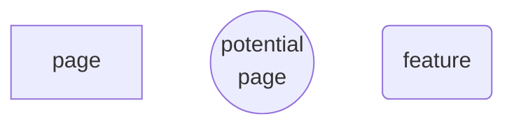
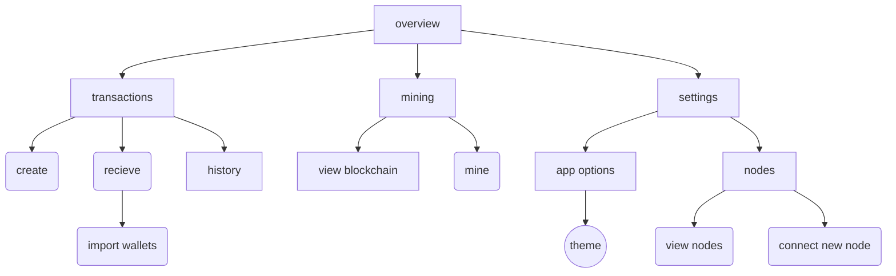
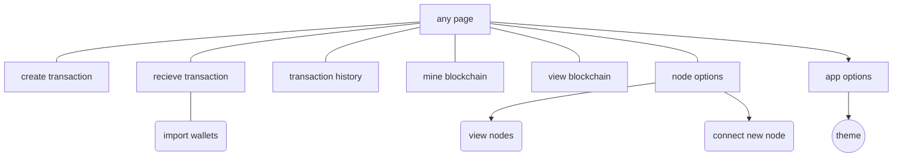
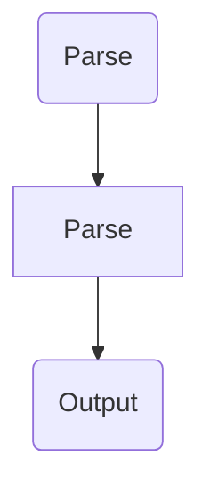
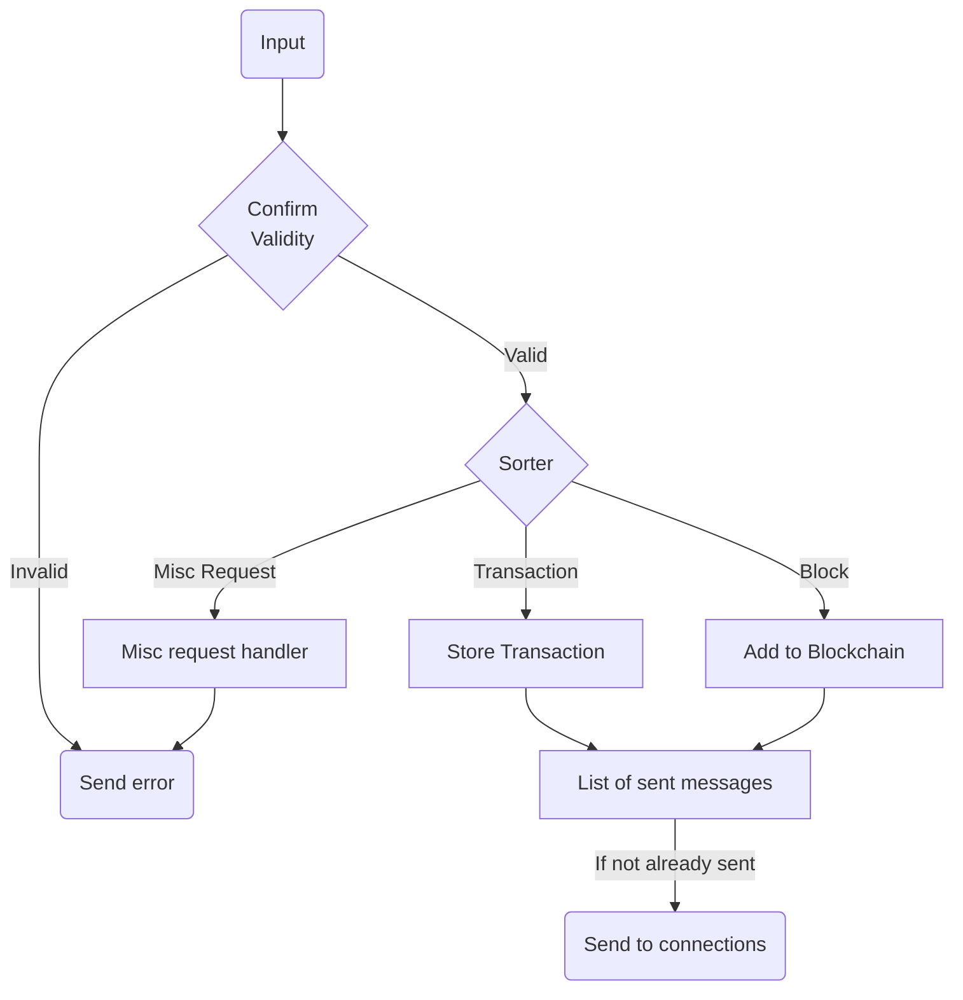

# Arbitra

An A-level Computer Science project by Samuel Newman

## Introduction

Arbitra is a cryptocurrency – a way of performing transactions that are guaranteed by the rules of mathematics rather than a central bank or some other 3rd party. A blockchain shared amongst a decentralized peer-to-peer network is used to verify transactions.

### Project Aims

1. **Describe in detail how the cryptocurrency would work.**
   As well as this document there needs to be detailed documentation on how a client application would work, and the protocols which the network would work. It must be in sufficient detail such that a fully-compliant client could be built by a third party using only the documentation as reference.
2. **Implement a client application with which one would interact with the network.**
   This includes:
   -- Hashing
   -- Public-key cryptograph
   -- Blockchain technology
   -- Peer-to-peer networking
   -- Electron desktop application
3. **Use the client on a small network of computers, creating a network and thus creating a cryptocurrency.**

### Languages and software

The initial plan is to use the [Electron](https://electron.atom.io) framework. This means that the frontend will be using HTML/CSS, and the backend will use Javascript with a bit of [Node.js](https://nodejs.org/en/) ("Node"), the Javascript runtime that is usually used for web server backends. This is helpful because the nature of cryptocurrencies involves a lot of peer-to-peer communication, which Node should excel at.

The reason I chose Javascript and Electron is that I have a lot of experience with web development, but next to no experience in the GUI systems of any other of the languages I know. Given the time constraints, having to learn a new language could be risky because of how long it would take. Electron will allow me to work with HTML and CSS, which I am very comfortable with, and using Javascript has turned out to have other benefits. With access to the Node Package Manager (npm), I should have no problem finding a cryptography package or anything else I might need.

However, this is not set in stone. If a different technology appears to be a better fit, I have no problem changing over. Still, at this stage using Electron seems to be best for me.

Something to consider is that Bitcoin and Litecoin were made in C++ and Ethereum was made in Golang. However, since I have no experience in either of those languages I thought it would be safer to stick with what I am comfortable with. If performance with Javascript turns out to be too much of an issue I could potentially write the performance-critical parts of the application in a lower-level language like C++ but still use Javascript for the UI/networking/other logic.

### Names

The cryptocurrency is called Arbitra. However, the unit of currency is an Arbitrary Unit, or au.

The reason it is called Arbitra is because I thought it would be funny to have the unit of currency be an arbitrary unit. It  also happens that using the shortened term is the same as the chemical symbol for gold, which has an amusing juxtaposition between something worthless (an arbitrary unit) and something valuable (gold).

#### Usage

> I really like Arbitra. I have over 100 arbitrary units!
>
> That will cost you 50au.

## Analysis

### Research

The [Bitcoin whitepaper](https://bitcoin.org/bitcoin.pdf) was used to understand much of how a cryptocurrency works.
[This video](https://www.youtube.com/watch?v=bBC-nXj3Ng4) was also very helpful.
[This article](https://medium.com/developers-writing/building-a-desktop-application-with-electron-204203eeb658) was useful as reference when building the Electron app, as well as the [Electron Quick Start Guide](https://electron.atom.io/docs/tutorial/quick-start/).

### A brief introduction to Cryptocurrencies

A transaction, most simply, is a message that says "I want to send this person x arbitrary units". The idea of a cryptocurrency is that rather than having a physical unit that you hand over to someone, you instead have a list of all transactions ever made and determine your account balance from that. This means that everyone can be certain that no-one is forging money or faking transactions - everyone can see the list and validate it. It also removes trust out of the equation - you don't have to just hope that your bank is keeping your money safe. 

To create a transaction, you must have a “wallet” that has some currency in, and use a public/private key pair to cryptographically “sign” your transaction. Public/private key pairs are a cryptographic function that allows a private key to create a message with which one can use the public key to mathematical verify that the message was created with its paired private key. You would then submit your transaction to a node on the network. If your transaction is valid, the node will send it to all other nodes in the network who will add it to a “block” of transactions.

A block consists of all transactions submitted since the previous block, the timestamp, the hash of the block that came before, and a nonce (which I’ll get to). Having the hash of the previous block irrevocably links the block to the one that came before it, and since it is easy to check, it is impossible to change the previous block’s contents without changing all the blocks that have come after. It also ensures that they are ordered. These blocks thereby form a chain from the genesis block, hence “blockchain”.

```json
{
	id: "cad944434a29dcfcfb4080cec264396fd23d73c1708db39bd780e7e30ef9072f",
    sender: "4a57bd2226eb76cceddf0cfe0baa2a1391b4952db4610dc3762845cedffdff62",
    recipient: "aed1fe98cda4ba5a1681a19aa768f73b9d707c5621c7effdf2938e242080505e",
    amount: 50.0,
    timestamp: "1505052733",
    signature: "5773487d221545d26fd0f57fdb3a7d986bc479a850d7b0d762e8c7f4772790a0"
}
```
This is an example of a transaction, represented in JavaScript Object Notation (JSON).  A block would be a collection of these.

A blockchain is the equivalent of a bank's ledger - all transactions are recorded to keep track of everyone's balance. The difference between a ledger and a blockchain is that a ledger is kept secret by the banks, whereas the blockchain is held by anyone who wants it. This guarantees that the transactions cannot be messed with.

Anyone can download the blockchain and see if it is valid. But how do you stop someone adding a malicious yet technically valid block to the chain? This is what the nonce is for. In order to be added to the blockchain, the block is hashed using SHA-256 and if the hash meets some criteria, it is sent to all the other nodes in the network. Otherwise, the nonce is changed over and over until the right hash is found. This means that it takes a lot of work to find a valid block, and this work can be verified almost instantly.

This means that if someone wants to submit a malicious block, they will have to either get impossibly lucky, or have more computing power at their disposal than the rest of the network, which is infeasible. Furthermore, even if you do manage to validate a malicious block, nodes will always accept the longest chain, so you would have to keep adding to your malicious chain effectively forever, which gets exponentially harder.

This means, to become a node in the network, you (or your computer) would need to:

1. Collect transactions until the next block is added to the chain.
2. Start iterating the nonce and hashing the block, while collecting transactions for the next block.
   a. If you find the right hash, broadcast it to the network.
   b. If a completed block is sent to you, check if it is valid. If so, accept it.
3. Start hashing the next block.

Hashing the block in order to find the correct nonce is called “mining”.

In order to incentivize mining, each block contains a transaction at the top that gives some amount of currency to whoever mines the block. This means that a miner can recoup the cost of the electricity and equipment spent mining the block. It also means that, if you had 51% of the CPU power of the network, it could well be more profitable to play by the rules and get the mining rewards rather than stealing coins.

Unlike in Bitcoin and most other cryptocurrencies, Arbitra will not reduce the mining rewards over time to cap the number of coins. This is to avoid the issue of requiring transaction fees, as this penalizes poorer users. It does mean that Arbitra will inflate over time, but unlike fiat currencies it will be completely predictable.

Something else to consider is that once a block is added it does not mean that it is there to stay. Even if a block is mined, if another block is also found at the same time (a "branch") it depends on which one ends up having the longer chain follow it. Having multiple competiting blocks is intentional, to ensure legitimacy, but this also means that the "top layer" of the blockchain is not necessarily trustworthy.

However, since it becomes exponentially harder to keep up with the main chain if a branch starts lagging behind. This should ensure that smaller branches die off quickly

A client application, which is what most ordinary people would use, does not do any mining. It simply checks the blockchain to see how much money is attributed to it, and it can sign and send transactions to the network. In this project I will make both a client and a node, but wrapped into one application for simplicity's sake.

As you can see, there is no need to trust any one central authority in the network once it starts. For as long as the cryptographic principals hold, the currency is effectively a democracy based on computing power - the blockchain is controlled by those who hold the majority of computing power, and this will almost certainly never be controlled by one party.

#### More on wallets

Something that must be cleared up - a wallet is not like a bank account. All that is needed for a wallet is a private key. Since they can just be mathematically generated, you would typically just generate a new key for every transaction to avoid having too much value in one key. You also don't need to register your wallet with any central authority, once again ensuring the honesty and security of the network. All a wallet is is a random number. It also solves the problem of everyone seeing every transaction - it doesn't matter because your balance is split up amongst a bunch of anonymous keys.

### Objectives

These objectives estimate what must happen for the project must be a success.

#### Phase 1 - Protocol

- [x] Define basic message types. Block, Transaction, etc
- [x] Define data types
- [ ] Define error messages and other miscellaneous messages

#### Phase 2 - Client

- [x] Hash a string [done]
- [ ] Hash the mockup of a block
- [x] Implement hashing in an Electron app
- [x] Create a public/private string pair generator
- [x] Sign and verify a mockup of a transaction message
- [ ] Implement signing into the Electron app
- [x] Create UI for Electron app

#### Phase 3 - Network

- [ ] Allow the Electron app to construct valid messages
- [ ] Allow the Electron app to receive and process messages
- [ ] Send a transaction message to another system
- [ ] Check a received message's validity and send an error back if it not valid
- [ ] Allow the app to create blocks based off of received messages
- [ ] Implement system to send received transactions to other blocks
- [ ] Automate systems to work in conjunction with each other
- [ ] Partial protocol test with multiple clients
- [ ] Complete error handling
- [ ] Full protocol test

#### Phase 4 - The End

- [ ] Feedback from others
- [ ] Final UI polish
- [ ] Genesis block - all systems live

Creating the genesis block is where the currency starts existing. At that point, all systems should work and the implementation phase of the project should be done, bar any minor improvements.

### Basic Protocol

From the description of the cryptocurrency, we can determine the format of the most important types messages that would be sent in the Arbitra network. 
Most simply, the basic message types and their contents are:

- Transaction
  -- Transaction ID
  -- Recipient
  -- Amount
  -- Signature
  -- Timestamp

- Block
  -- Previous block’s hash
  -- Timestamp
  -- Nonce
  -- Number of transactions
  -- List of transactions
  -- It's own hash (added after the nonce is found)

- Recognise Request

  This is effectively a ping asking a node to add them to it's list of known nodes

- Latest Block Request

  Node will send back all the blocks at the top of the chain

- Block Request
  -- Hash of requested block
     Node will send back a block with the requested Hash

- Error
  -- Type of error
  This is what a client replies with if it receives an invalid message

When a new node joins the network, it will send a Latest Block Request to a few nodes, and will use the previous block’s hash to fill in the chain from the top. If the Latest Block Request returns a few different blocks, the system should default to the longest chain, and only use the other blocks if no other nodes recognize that block. The specific details on how that process should work needs investigation.

### Prototyping Core Functions

In order to working out the specifics of how this is going to work, I decided to use Python to implement some of the functions that a real client would use. The final client will be an Electron app made with Node.js, but due to the ease of iteration in Python I think that using Python for testing purposes would be easier and simpler.

#### Hashing and Blocks

First off, I needed to make a simple hashing function. I created a wrapper around the SHA256 function from the `hashlib` library so that I could easily get the SHA256 hash of a string.

```python
import hashlib

def sha256(inputstr):
    h = hashlib.sha256()
    h.update(inputstr.encode("utf-8"))
    return h.hexdigest()
```

First, I import hashlib at the top of the program.
Then, I define a function called `sha256()`, which takes in a variable called `inputstr`.
`sha256()` creates a `hashlib.sha256()` object, which we can use to create a hash.
We then `update()` the hashlib object with the string we want to hash. Notice we encode `inputstr`, which is because `hashlib` can only hash bytes, not characters, so we call `encode("utf-8")` on it.
Finally, we return the `hexdigest()` of the object. This converts the object into a hex string.

This produces the following result:

```
>>> sha256("something")
'3fc9b689459d738f8c88a3a48aa9e33542016b7a4052e001aaa536fca74813cb'
```

It worked! We now can hash any string. Therefore, the next step is to prototype mining. 
The next program should then, while the output does not fit a criteria, repeatedly hash a random string with a nonce.
To fit the criteria, the string must begin with a certain number of zeros.

```python
def mine(inputstr):
    DIFFICULTY = 4
    nonce = 0
    fail = False
    while(True):
        hashed = sha256(str(inputstr)+str(nonce))
        for i in range(DIFFICULTY):
            if hashed[i] != "0":
                fail = True
        if not fail:
            print("INPUT:", inputstr)
            print("NONCE:", nonce)
            print("HASH:", hashed)
            break
        else:
            print(nonce)
            fail = False
            nonce += 1
```

`mine()`, like the other function, takes an input called `inputstr`.
It then sets up the constant `DIFFICULTY` and the initial variables, `nonce` and `fail`.
`DIFFICULTY` is the number of zeros that need to be at the beginning of the hash for it to pass.
`nonce` is (obviously) the nonce. This iterates each time the hash does not pass.
`fail` is a boolean that is false, and will set to true if any one of the first 4 (or whatever the difficulty is) characters of the hash is not zero.

There is then a while loop that will loop forever until it is broken.
Then, `inputstr` and `nonce` are hashed using the `sha256` function we made earlier, and the hash is assigned to `hashed`
When the hash is found, a for loop is used to see if the any of the first few characters of the hash are not zero. If so, fail is set to `True` so that when the loop is over it fails the test if any one of the first few characters are zero.

If the test did not fail, it prints out the input, the final nonce and the final hash, then breaks the while loop, ending the function. If it were a proper function, it would return these values instead of printing them
If it did fail, it iterates the nonce and resets `fail`. It also prints the nonce so that you can see the progress.

```
>>> mine("something")
0
1
2
...
54392
54393
54394
INPUT: something
NONCE: 54395
HASH: 00001d711101fe4555b9e644cbf85ad205db46d052d4b7af4f28b80d9476c391
```

It found a hash that begins with 4 zeros in only 54395 iterations! This took quite a long time (9 minutes 30 seconds).
This is way too long - the target time is (currently) 5 minutes. However, this was only one laptop. With a network of computers around the world checking random nonces and a different difficulty, this can be achieved. In fact, as the overall computing power of the network increases, the difficulty will need to increase with it.
To confirm that it works, I changed the difficulty to 2 and made it so that it also prints the hash as well as the nonce when it fails.

```
>>> mine("something")
cad944434a29dcfcfb4080cec264396fd23d73c1708db39bd780e7e30ef9072f 0
aed1fe98cda4ba5a1681a19aa768f73b9d707c5621c7effdf2938e242080505e 1
5773487d221545d26fd0f57fdb3a7d986bc479a850d7b0d762e8c7f4772790a0 2
...
4925d66314281301618fffc8d1b262f94910aab08c748710a7d736abbe266799 342
4a57bd2226eb76cceddf0cfe0baa2a1391b4952db4610dc3762845cedffdff62 343
35bc236517ea9d427e0fcd912e267b4fb11d7b1364b00224b632944b5852236a 344
5e5ea76515cac322cb94794eec77f9ef1969df95e4c1dcb7dd55d7fa0b3db0d3 345
INPUT: something
NONCE: 346
HASH: 0083dde42af5cb39d72decae7004c18d11b34969faa70d2d5a6ce3e167a6edf9
```

As you can see, with the difficulty reduced to 2 it only took 346 iterations, which took about 5 seconds. In this way, we can dynamically set the difficulty so that as the computing power of the network increases we can make sure that the time to mine each block stays about the same. If we want more granular control of the difficulty, we could make it so that it requires, for example, 2 zeros and 3 numbers less than 5.

At this early stage, statements like these are guesswork, but I think that there will be a target time (5 minutes) and if a block is significantly earlier than that the target time the number of zeros increases by one and vice versa if it takes too long.

#### Elliptic Curve Digital Signature Algorithm

Whilst this section is part of the analysis, it is so massive it has it's own file. See `ecdsa.md`.

### Networking

We need to figure out how to ensure that the client can connect to the network. The way most other cryptocurrencies handle this is firstly maintaining a list of recent connections, and reconnecting to them. However, the client needs to connect to it's first node. Bitcoin, for example, solves this by having a few trusted nodes hardcoded into  the client, which in turn maintain a list of a few trusted nodes. What I believe would be best for Arbitra is to create and maintain our own list, but of course allow the client the option of adding their own nodes. Bitcoin then also has some websites that maintain their own list of trustworthy nodes, which clients can connect to.

We also need a system of node discovery. The client is never going to expand it's list of nodes if it only connects to the default nodes. A way that we could implement it is by having mined blocks optionally include their address, so that whenever a new block is mined, a new IP is broadcast eventually to the entire network so that client's list of nodes can expand over time. However, having everyone connect to the same node if the manage to mine a block is probably not the best idea.

Bitcoin, for a time used to run an IRC server where nodes could broadcast their IP for people to connect to. However, this feature was removed as it was not scalable and provided a single point of failure to an aspect of the network. Whilst it clearly is not the best idea (as they got rid of it) it could be a stop-gap solution if clients are having difficulty connecting to enough nodes.

For Arbitra, I am probably going to have the websites with a list of trusted nodes, and then also have some hardcoded nodes in the client. The client will then remember nodes that it connects to. Then, most importantly, it will have a message type that will allow clients to ask other clients to share their list of nodes. This way, a client can expand their list 

### Application planning

Not only does the network need to be described in detail, but the application as well, as that is what will be used to interface with it. As previously mentioned, Electron will be used to create the application. Electron is a technology that embeds a webpage within a chromium instance, and also allows access to lower level OS functions.

This means that the UI is implemented in HTML/CSS, and the backend is done using Javascript.

There are three main parts of the application - **creating transactions**, **viewing and interpreting the blockchain**, and **mining the blockchain**. Therefore, the application should focus on these areas.

Something not yet mentioned is the ability to import and export wallets - users should be able to transfer their wallets from one computer or application to another.

#### Concept

The first thing I decided to do was to roughly sketch out how I wanted the application to look.

##### Concept 1

This concept was designed to be striking, with the purple backdrop drawing the eye. This was made thinking about how cryptocurrency wallet apps look like on mobile devices.


##### Concept 2

This concept was inspired by this redesign of Windows File Explorer, by Frantisek Mastil.


##### Concept 3

This is a purple/grey version of concept 2.


#### Pages

##### Key



The first concept would be quite minimal, therefore there would only be three or so buttons that could be accessed from the main page. Therefore the structure of this app would be quite hierarchical.




However, the other two concepts are different. Since they both have a big menu on the left, most parts of the application can be accessed from every page. This makes the structure of the application much flatter.



### Data Paths

We need to map out the flow of data within the application. Since the application is interacting with the network the whole time, the application needs to be able to take in and process data continuously, rather than making a request when the user presses a button for example. We can map this using a flowchart.



Of course, we need the flowchart to be in more detail than this. First of all, the app needs to parse and sort incoming messages.



This flowchart shows the steps that the app will take when it receives a message. However, there is an issue in that the program will need to know the type when seeing whether it is valid or not, so the "Confirm Validity" function and the "Sorter" function would probably be combined into one.

