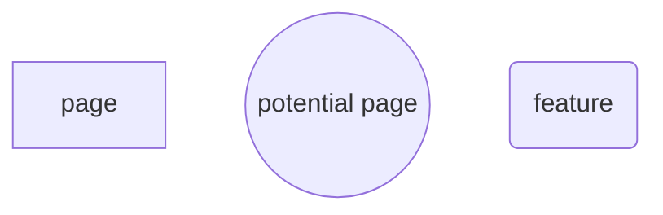
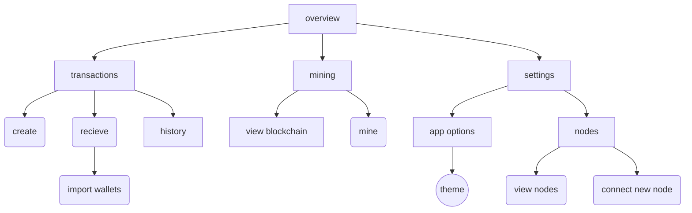
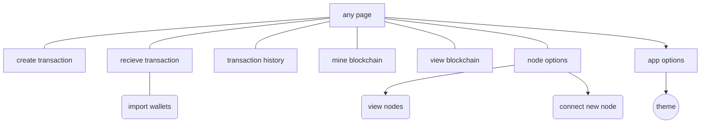
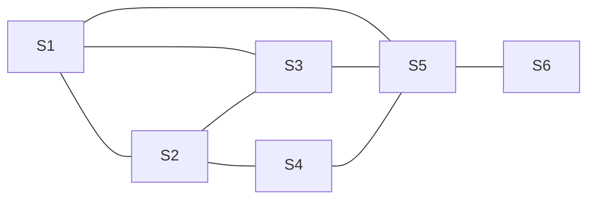

# Arbitra

An A-level Computer Science project by Samuel Newman

[TOC]

## Introduction

Arbitra is a cryptocurrency – a way of performing transactions that are guaranteed by the rules of mathematics rather than a central bank or some other 3rd party. A blockchain shared amongst a decentralized peer-to-peer network is used to verify transactions.

### Project Aims

1. **Describe in detail how the cryptocurrency would work.**
   As well as this document there needs to be detailed documentation on how a client application would work, and the protocols which the network would work. It must be in sufficient detail such that a fully-compliant client could be built by a third party using only the documentation as reference.
2. **Implement a client application with which one would interact with the network.**
   This includes:
   -- Hashing
   -- Public-key cryptograph
   -- Blockchain technology
   -- Peer-to-peer networking
   -- Electron desktop application
3. **Use the client on a small network of computers, creating a network and thus creating a cryptocurrency.**

### Languages and software

The initial plan is to use the Electron framework. This means that the frontend will be using HTML/CSS, and the backend will use Javascript with a bit of Node.js, the Javascript runtime that is usually used for web server backends. This is helpful because the nature of cryptocurrencies involves a lot of peer-to-peer communication, which Node should excel at.

https://electron.atom.io

https://nodejs.org/en/

The reason I chose Javascript and Electron is that I have a lot of experience with web development, but next to no experience in the GUI systems of any other of the languages I know. Given the time constraints, having to learn a new language could be risky because of how long it would take. Electron will allow me to work with HTML and CSS, which I am very comfortable with, and using Javascript has turned out to have other benefits. With access to the Node Package Manager (npm), I should have no problem finding a cryptography package or anything else I might need.

Something to consider is that Bitcoin and Litecoin were made in C++ and Ethereum was made in Golang. However, since I have no experience in either of those languages I thought it would be safer to stick with what I am comfortable with. If performance with Javascript turns out to be too much of an issue I could potentially write the performance-critical parts of the application in a lower-level language like C++ but still use Javascript for the UI/networking/other logic.

### Names

The cryptocurrency is called Arbitra. However, the unit of currency is an Arbitrary Unit, or au.

The reason it is called Arbitra is because I thought it would be funny to have the unit of currency be an arbitrary unit. It  also happens that using the shortened term is the same as the chemical symbol for gold, which has an amusing juxtaposition between something worthless (an arbitrary unit) and something valuable (gold).

#### Usage

> I really like Arbitra. I have over 100 arbitrary units!
>
> That will cost you 50au.

## Analysis

### Research

The Bitcoin whitepaper (https://bitcoin.org/bitcoin.pdf) was used to understand much of how a cryptocurrency works.
"Ever wonder how Bitcoin (and other cryptocurrencies) actually work?" (https://www.youtube.com/watch?v=bBC-nXj3Ng4) by 1Brown3Blue was also very helpful.
"Building a desktop application with Electron" (https://medium.com/developers-writing/building-a-desktop-application-with-electron-204203eeb658) was useful as reference when building the Electron app, as well as the Electron Quick Start Guide (https://electron.atom.io/docs/tutorial/quick-start/).

### A brief introduction to Cryptocurrencies

A transaction, most simply, is a message that says "I want to send this person x arbitrary units". The idea of a cryptocurrency is that rather than having a physical unit that you hand over to someone, you instead have a list of all transactions ever made and determine your account balance from that. This means that everyone can be certain that no-one is forging money or faking transactions - everyone can see the list and validate it. It also removes trust out of the equation - you don't have to just hope that your bank is keeping your money safe. 

To create a transaction, you must have a “wallet” that has some currency in, and use a public/private key pair to cryptographically “sign” your transaction. Public/private key pairs are a cryptographic function that allows a private key to create a message with which one can use the public key to mathematical verify that the message was created with its paired private key. You would then submit your transaction to a node on the network. If your transaction is valid, the node will send it to all other nodes in the network who will add it to a “block” of transactions.

A block consists of all transactions submitted since the previous block, the timestamp, the hash of the block that came before, and a nonce (which I’ll get to). Having the hash of the previous block irrevocably links the block to the one that came before it, and since it is easy to check, it is impossible to change the previous block’s contents without changing all the blocks that have come after. It also ensures that they are ordered. These blocks thereby form a chain from the genesis block, hence “blockchain”.

```json
{
	id: "cad944434a29dcfcfb4080cec264396fd23d73c1708db39bd780e7e30ef9072f",
    sender: "4a57bd2226eb76cceddf0cfe0baa2a1391b4952db4610dc3762845cedffdff62",
    recipient: "aed1fe98cda4ba5a1681a19aa768f73b9d707c5621c7effdf2938e242080505e",
    amount: 50.0,
    timestamp: "1505052733",
    signature: "5773487d221545d26fd0f57fdb3a7d986bc479a850d7b0d762e8c7f4772790a0"
}
```
This is an example of a transaction, represented in JavaScript Object Notation (JSON).  A block would be a collection of these.

A blockchain is the equivalent of a bank's ledger - all transactions are recorded to keep track of everyone's balance. The difference between a ledger and a blockchain is that a ledger is kept secret by the banks, whereas the blockchain is held by anyone who wants it. This guarantees that the transactions cannot be messed with.

Anyone can download the blockchain and see if it is valid. But how do you stop someone adding a malicious yet technically valid block to the chain? This is what the nonce is for. In order to be added to the blockchain, the block is hashed using SHA-256 and if the hash meets some criteria, it is sent to all the other nodes in the network. Otherwise, the nonce is changed over and over until the right hash is found. This means that it takes a lot of work to find a valid block, and this work can be verified almost instantly.

This means that if someone wants to submit a malicious block, they will have to either get impossibly lucky, or have more computing power at their disposal than the rest of the network, which is infeasible. Furthermore, even if you do manage to validate a malicious block, nodes will always accept the longest chain, so you would have to keep adding to your malicious chain effectively forever, which gets exponentially harder.

This means, to become a node in the network, you (or your computer) would need to:

1. Collect transactions until the next block is added to the chain.
2. Start iterating the nonce and hashing the block, while collecting transactions for the next block.
   a. If you find the right hash, broadcast it to the network.
   b. If a completed block is sent to you, check if it is valid. If so, accept it.
3. Start hashing the next block.

Hashing the block in order to find the correct nonce is called “mining”.

In order to incentivize mining, each block contains a transaction at the top that gives some amount of currency to whoever mines the block. This means that a miner can recoup the cost of the electricity and equipment spent mining the block. It also means that, if you had 51% of the CPU power of the network, it could well be more profitable to play by the rules and get the mining rewards rather than stealing coins.

Unlike in Bitcoin and most other cryptocurrencies, Arbitra will not reduce the mining rewards over time to cap the number of coins. This is to avoid the issue of requiring transaction fees, as this penalizes poorer users. It does mean that Arbitra will inflate over time, but unlike fiat currencies it will be completely predictable.

Something else to consider is that once a block is added it does not mean that it is there to stay. Even if a block is mined, if another block is also found at the same time (a "branch") it depends on which one ends up having the longer chain follow it. Having multiple competiting blocks is intentional, to ensure legitimacy, but this also means that the "top layer" of the blockchain is not necessarily trustworthy.

However, since it becomes exponentially harder to keep up with the main chain if a branch starts lagging behind. This should ensure that smaller branches die off quickly

A client application, which is what most ordinary people would use, does not do any mining. It simply checks the blockchain to see how much money is attributed to it, and it can sign and send transactions to the network. In this project I will make both a client and a node, but wrapped into one application for simplicity's sake.

As you can see, there is no need to trust any one central authority in the network once it starts. For as long as the cryptographic principals hold, the currency is effectively a democracy based on computing power - the blockchain is controlled by those who hold the majority of computing power, and this will almost certainly never be controlled by one party.

#### More on wallets

Something that must be cleared up - a wallet is not like a bank account. All that is needed for a wallet is a private key, which can be created freely. You also don't need to register your wallet with any central authority, once again ensuring the honesty and security of the network. All a wallet is is a random number. It also solves the problem of everyone seeing every transaction - it doesn't matter because your balance is split up amongst a bunch of anonymous keys.

### Objectives

These objectives estimate what must happen for the project must be a success.

- The user should be able to construct and send a valid transaction.
- The program should be able to automatically parse, validate, and deal with messages.
- The user should be able to mine the blockchain.
- Users should be rewarded for mining the blockchain.
- All transactions should be secured through the Elliptic Curve Digital Signature Algorithm.
- The user should be able to see sent transactions, their wallets, and the blockchain.
- The user should be able to change basic settings.
- The program should connect to other clients automatically, and default to a IP that is running the program.
- The program should be able to detect and reject invalid messages.
- The blockchain should function as described by the previous section.
- The user should be able to interact with the program through an easy-to-use UI.
- The user should be able to save their wallets.

### Basic Protocol

From the description of the cryptocurrency, we can determine the format of the most important types messages that would be sent in the Arbitra network. 
Most simply, the basic message types and their contents are:

- Transaction

  -- Transaction ID

  -- Recipient

  -- Amount

  -- Signature

  -- Timestamp

- Block

  -- Previous block’s hash
  
  -- Timestamp
  
  -- Nonce
  
  -- Number of transactions
  
  -- List of transactions
  
  -- It's own hash (added after the nonce is found)

- Recognise Request

  This is effectively a ping asking a node to add them to it's list of known nodes

- Latest Block Request

  Node will send back all the blocks at the top of the chain

- Block Request
  -- Hash of requested block
     Node will send back a block with the requested Hash

- Error
  -- Type of error
  This is what a client replies with if it receives an invalid message

When a new node joins the network, it will send a Latest Block Request to a few nodes, and will use the previous block’s hash to fill in the chain from the top. If the Latest Block Request returns a few different blocks, the system should default to the longest chain, and only use the other blocks if no other nodes recognize that block. The specific details on how that process should work needs investigation.

### Prototyping Core Functions

In order to working out the specifics of how this is going to work, I decided to use Python to implement some of the functions that a real client would use. The final client will be an Electron app made with Node.js, but due to the ease of iteration in Python I think that using Python for testing purposes would be easier and simpler.

#### Hashing and Blocks

First off, I needed to make a simple hashing function. I created a wrapper around the SHA256 function from the `hashlib` library so that I could easily get the SHA256 hash of a string.

```python
import hashlib

def sha256(inputstr):
    h = hashlib.sha256()
    h.update(inputstr.encode("utf-8"))
    return h.hexdigest()
```

First, I import hashlib at the top of the program.
Then, I define a function called `sha256()`, which takes in a variable called `inputstr`.
`sha256()` creates a `hashlib.sha256()` object, which we can use to create a hash.
We then `update()` the hashlib object with the string we want to hash. Notice we encode `inputstr`, which is because `hashlib` can only hash bytes, not characters, so we call `encode("utf-8")` on it.
Finally, we return the `hexdigest()` of the object. This converts the object into a hex string.

This produces the following result:

```
>>> sha256("something")
'3fc9b689459d738f8c88a3a48aa9e33542016b7a4052e001aaa536fca74813cb'
```

It worked! We now can hash any string. Therefore, the next step is to prototype mining. 
The next program should then, while the output does not fit a criteria, repeatedly hash a random string with a nonce.
To fit the criteria, the string must begin with a certain number of zeros.

```python
def mine(inputstr):
    DIFFICULTY = 4
    nonce = 0
    fail = False
    while(True):
        hashed = sha256(str(inputstr)+str(nonce))
        for i in range(DIFFICULTY):
            if hashed[i] != "0":
                fail = True
        if not fail:
            print("INPUT:", inputstr)
            print("NONCE:", nonce)
            print("HASH:", hashed)
            break
        else:
            print(nonce)
            fail = False
            nonce += 1
```

`mine()`, like the other function, takes an input called `inputstr`.
It then sets up the constant `DIFFICULTY` and the initial variables, `nonce` and `fail`.
`DIFFICULTY` is the number of zeros that need to be at the beginning of the hash for it to pass.
`nonce` is (obviously) the nonce. This iterates each time the hash does not pass.
`fail` is a boolean that is false, and will set to true if any one of the first 4 (or whatever the difficulty is) characters of the hash is not zero.

There is then a while loop that will loop forever until it is broken.
Then, `inputstr` and `nonce` are hashed using the `sha256` function we made earlier, and the hash is assigned to `hashed`
When the hash is found, a for loop is used to see if the any of the first few characters of the hash are not zero. If so, fail is set to `True` so that when the loop is over it fails the test if any one of the first few characters are zero.

If the test did not fail, it prints out the input, the final nonce and the final hash, then breaks the while loop, ending the function. If it were a proper function, it would return these values instead of printing them
If it did fail, it iterates the nonce and resets `fail`. It also prints the nonce so that you can see the progress.

```
>>> mine("something")
0
1
2
...
54392
54393
54394
INPUT: something
NONCE: 54395
HASH: 00001d711101fe4555b9e644cbf85ad205db46d052d4b7af4f28b80d9476c391
```

It found a hash that begins with 4 zeros in only 54395 iterations! This took quite a long time (9 minutes 30 seconds).
This is way too long - the target time is (currently) 5 minutes. However, this was only one laptop. With a network of computers around the world checking random nonces and a different difficulty, this can be achieved. In fact, as the overall computing power of the network increases, the difficulty will need to increase with it.
To confirm that it works, I changed the difficulty to 2 and made it so that it also prints the hash as well as the nonce when it fails.

```
>>> mine("something")
cad944434a29dcfcfb4080cec264396fd23d73c1708db39bd780e7e30ef9072f 0
aed1fe98cda4ba5a1681a19aa768f73b9d707c5621c7effdf2938e242080505e 1
5773487d221545d26fd0f57fdb3a7d986bc479a850d7b0d762e8c7f4772790a0 2
...
4925d66314281301618fffc8d1b262f94910aab08c748710a7d736abbe266799 342
4a57bd2226eb76cceddf0cfe0baa2a1391b4952db4610dc3762845cedffdff62 343
35bc236517ea9d427e0fcd912e267b4fb11d7b1364b00224b632944b5852236a 344
5e5ea76515cac322cb94794eec77f9ef1969df95e4c1dcb7dd55d7fa0b3db0d3 345
INPUT: something
NONCE: 346
HASH: 0083dde42af5cb39d72decae7004c18d11b34969faa70d2d5a6ce3e167a6edf9
```

As you can see, with the difficulty reduced to 2 it only took 346 iterations, which took about 5 seconds. In this way, we can dynamically set the difficulty so that as the computing power of the network increases we can make sure that the time to mine each block stays about the same. If we want more granular control of the difficulty, we could make it so that it requires, for example, 2 zeros and 3 numbers less than 5.

At this early stage, statements like these are guesswork, but I think that there will be a target time (5 minutes) and if a block is significantly earlier than that the target time the number of zeros increases by one and vice versa if it takes too long.

### Elliptic Curve Digital Signature Algorithm

To sign messages in Arbitra, we are going to use the Elliptic Curve Digital Signature Algorithm, or ECDSA. As previously explained, Digital Signatures  are a way of verifying that a message was sent from someone, by including a private key that can only have been generated by the private key, which only the sender should know. We can use a mathematical concept called *Elliptic Curves* to sign the messages in Arbitra.

Rather than using the Node.js `crypto` module's implementation, I decided to implement it myself, so I understand what's happening behind the scenes. I found a paper called *Implementation of Elliptic Curve Digital Signature Algorithm*, which provides some insight into the mathematics behind ECDSA, as well as an article called *Understanding How ECDSA Protects Your Data*. The best article I found was called *Elliptic Curve Cryptography: a gentle introduction*, as it covers the mathematics in depth enough to implement, but not assuming prior knowledge as the majority of other articles did, as well as providing Python examples of some algorithms.

https://pdfs.semanticscholar.org/c06a/d6512775be1076e4abd43e3f2928729da776.pdf

http://www.instructables.com/id/Understanding-how-ECDSA-protects-your-data/

http://andrea.corbellini.name/2015/05/17/elliptic-curve-cryptography-a-gentle-introduction/

##### Disclaimer

The reason I decided to implement ECDSA myself is that I could not figure out how to do it in the `crypto` module, and when I realised how to do it by that point I'd already done way too much research to back down. Still, it has proved a valuable learning experience.

#### Elliptic Curves

Elliptic curves are curves of the form $y^2=ax^3+bx+c$.


But how does this relate to cryptography?

From http://wstein.org/edu/2007/spring/ent/ent-html/node89.html:

> Suppose $E$ is an elliptic curve over $\mathbb{F}_p$ and $P\in E(\mathbb{F}_p)$. Given a multiple $Q$ of $P$, the *elliptic curve    discrete logarithm problem* is to find $ n\in\mathbb{Z}$ such that $nP=Q$.

This means that it's really hard to find $n$ when you only have $Q$ and $P$- so hard, that we can use this problem to prove mathematically that $Q$ has been generated by $n$. This is how we sign messages in Arbitra - it shows that the message has to have been signed by the person who has the secret key.

However, before we start that we need to understand the operations we can perform on points on the curve, which is different to normal arithmetic. There are some operations we can perform:

- point addition
- point doubling

##### Point Addition

Point addition is the process of adding two points together to find a third. This is best shown by this interactive Desmos graph:
https://www.desmos.com/calculator/ialhd71we3


To add two points, you draw a straight line between them, and then find the negative of the third root when this line meets the curve.

This is very simple to calculate graphically, and relatively simple to calculate with pen and paper. However, to create a function we will need to create a formula using $x_1, y_1$ and $x_2, y_2$. 

It would be easier to just have to input $x_1$ and $x_2$ and for the function to calculate the corresponding $y$ values. Using the curve $y^3 = x^3 + 7$, we can find them using:
$$
y = \sqrt{x^3 + 7}
$$

###### Finding the line between a and b

To find the equation of the line between the points, we need to find the gradient of the line, which is given by:
$$
m = \frac{y_2 - y_1}{x_2 - x_1}
$$
The equation of the line is of the form $y = mx + c$, and since we have values for $x_1$, $y_1$, and $m$, we can rearrange to find $c$:
$$
c = y_1 - mx_1
$$
This is the $y$-intercept of the straight line.

###### Finding the third point

$y_3$ is given by:
$$
y_3 = mx_3 + c
$$
We need to find $x_3$. We can use:
$$
x_3 = m^2 - x_1 - x_2
$$
The point we are trying to find is therefore given by:
$$
(x_3, -y_3)
$$

###### Python Implementation

I wrote this into a Python function, where the curve is $y^2 = x^3 + 7$

```python
import math

def addPoints(x1, x2):
    # adding two points on an elliptic points
    y1 = math.sqrt(x1**3 + 7)
    y2 = math.sqrt(x2**3 + 7)
    # m is the gradient of the line between the points
    m = (y1-y2)/(x1-x2)
    # c is the y intercept
    c = y1 - m*x1
    x3 = m**2 - x1 - x2
    y3 = m*x3 + c
    return x3, -y3
```

From the interactive Desmos graph, inputting $x$ values of 1 and 3 gave $(-1.746,1.294)$.

```
>>> addPoints(1,3)
(-1.7462112512353212, 1.2943565281332712)
```

The function works! It doesn't handle edge cases yet, but we'll cover that later.

##### Point Doubling

The second operation we can perform is point doubling. From this graph:


It looks as if point $2P$ is the negative of the second intercept of the tangent from point $P$. This makes sense, as $2P = P + P$, and doing point edition with the same point will result in the tangent of that point. Unfortunately, since we find the gradient of the line using $m = \frac{y_2 - y_1}{x_2 - x_1}$, if $(x_1,y_1)=(x_2,y_2)$ that would divide by zero. Therefore we need to differentiate $y = \sqrt{x^3 + 7}$ using the chain rule:
$$
\frac{dy}{dx} = \frac{1}{2} \times 3x^2 \times (x^3+7)^{-\frac{1}{2}}
$$

$$
m = \frac{3x^2}{2 \sqrt{x^3+7}}
$$

We can now implement this in Python - I just used the same `addPoints()` function for simplicity. Also more comments.

```python
import math

def addPoints(x1, x2):
    # for the line y^2 = x^3 + 7
    y1 = math.sqrt(x1**3 + 7)
    y2 = math.sqrt(x2**3 + 7)
    # m is the gradient of the line between them
    if x1 == x2: # if points are the same, find the tangent
        m = (3*(x1**2))/(2*math.sqrt((x1**3)+7))
    else: # otherwise find gradient normally
        m = (y1-y2)/(x1-x2)
    # y-intercept
    c = y1 - m*x1
    # finding 3rd point
    x3 = m**2 - x1 - x2
    y3 = m*x3 + c
    return x3, -y3
```

```
>>> addPoints(1,1)
(-1.71875, -1.386592203732996)
```

We can verify this result using this tool, from *Elliptic Curve Cryptography: a gentle introduction*, since it takes this into account while the other tool doesn't.

https://cdn.rawgit.com/andreacorbellini/ecc/920b29a/interactive/reals-add.html?px=1&py=2&qx=1&qy=2

Therefore this function works! Before we finish, I wanted to make sure we could easily change the curve, by changing it to $y = x^3 +ax + b$. This means that we have to recalculate some of the maths, most notably the tangent equation:
$$
m = \frac{3x^2 + a}{2 \sqrt{x^3+ax+b}} = \frac{3x^2 + a}{2y}
$$
I also noticed we could simply the tangent equation given we know $y$ already. All the changes that were necessary to the python function were changing the differential and changing how it finds `y1` and `y2`.

```python
import math

def addPoints(x1, x2):
    # for the line y^2 = x^3 + 7
    a = 0
    b = 7
    y1 = math.sqrt(x1**3 + a*x1 + b)
    y2 = math.sqrt(x2**3 + a*x2 + b)
    # m is the gradient of the line between them
    if x1 == x2: # if points are the same, find the tangent
        m = (3*(x1**2)+a)/(2*y1)
    else: # otherwise find gradient normally
        m = (y1-y2)/(x1-x2)
    # y-intercept
    c = y1 - m*x1
    # finding 3rd point
    x3 = m**2 - x1 - x2
    y3 = m*x3 + c
    return x3, -y3
```

When `a = 0` and `b = 7` it gives the same results:

```
>>> addPoints(1,3)
(-1.7462112512353212, 1.2943565281332712)
>>> addPoints(1,1)
(-1.71875, -1.386592203732996)
```

With `a = -7` and `b = 10`, it gives:

```
>>> addPoints(1,3)
(-3.0, 2.0)
>>> addPoints(1,1)
(-1.0, -4.0)
```

Which can be verified with the tool:

https://cdn.rawgit.com/andreacorbellini/ecc/920b29a/interactive/reals-add.html?px=1&py=2&qx=1&qy=2

###### Point at Infinity

> What happens if the line doesn't intersect with the curve

If the line does not intersect, we say that it intersects the point at infinity, $O$. This only happens if you try to double $P$ where $y_P = 0$. However, this is not critically important at this phase, although we will have to add this in as an exception when creating the real function later on, as it will break the function (which is not good).

##### Point Multiplication

Now that we can do the basic function, we need to be able to multiply points, as we need to get to the stage where we can calculate $nP = Q$. The obvious way would be to double $P$, and then calculate $\text{Ans} + P$ for $n$ number of times. However, as *Elliptic Curve Cryptography: a gentle introduction* points out, this equation has an efficiency of $O(n)$, which is not particularly fast. However, they suggest using the **double and add** method to multiply points.

http://andrea.corbellini.name/2015/05/17/elliptic-curve-cryptography-a-gentle-introduction/#scalar-multiplication

In summary, if you repeatedly double $P$, you would get the pattern:
$$
P, 2P, 2^2P, 2^3P, 2^4P, 2^5P...
$$
And we can can represent a decimal number in the following form:
$$
20_{10} = 10100_2
$$

$$
20 = 1 \times 2^5 + 0 \times 2^4 + 1 \times 2^3 + 0  \times 2^2 + 0  \times 2^0
$$

$$
20 = 2^5 + 2^3
$$

Therefore:
$$
20P = 2^5P + 2^3P
$$
Since we can find $2^nP$ using point doubling, and since we can represent a large number very easily using binary, we can massively cut down on the calculations needed to multiply a point. In our example, five doublings and one addition is needed to find $20P$ and in the article, they show that only seven doublings and four additions are needed to find $151P$. This brings the complexity down to $O(\log n)$, which is much faster for larger numbers.


We can implement this in python (note that this is without looking at the given example code):

```python
def multiPoints(n,P):
    a = 0
    b = 7
    # find binary equivlent of n
    # and take the first 3 digits off
    nb = str(bin(n))[3:]
    total = P
    # and reverse it
    for bit in nb[::-1]:
        P,y = addPoints(P,P)
        if bit == "1":
            total,y = addPoints(total,P)
    return total, math.sqrt(total**3 + a*total + b)
```

The reason that it takes the first three digits off of the binary string is that they firstly are not of fixed length, so always start with 1, and secondly begin with `0b`. Knowing this, we can remove the first 3 digits and set total to start with the value $2^0P$.

This gives:

```
>>> multiPoints(5,5)
(-1.562727156221965, 1.7842754133340577)
```

We can verify this with this calculator:

https://cdn.rawgit.com/andreacorbellini/ecc/920b29a/interactive/reals-mul.html

Unfortunately it does not work, and it turns out the reason is that I made a logical error in the code. Even though the first digit of the binary sequence is always $1$, because that is the most significant bit it is actually the last number we want. The least significant bit, $2^0P$, can be $1$ or $0$, and so the corrected code looks like this (with total now initialising to $0$ and the loop rearranged):

```python
def multiPoints(n,P):
    a = 0
    b = 7
    # find binary equivlent of n
    # and take the first 2 and last digits off
    # first 2 are "0b" and last is definitly a 1
    nb = str(bin(n))[2:]
    total = 0
    # and reverse it
    for bit in nb[::-1]:
        if bit == "1":
            if total:
                total,y = addPoints(total,P)
            else:
                total = P
        P,y = addPoints(P,P)
    return total, math.sqrt(total**3 + a*total + b)
```

Strangely enough, this doesn't work for some numbers, but still does for others - looping though 0 to 24 produces the correct answers for 1, 2, 3, 4, 8, 9, 10, 11, 16, 17, 18, 19, and 24 (with the caveat that the y value is always positive because of the square root), but incorrect answers for the rest. Why is that? For 0 it is because there is starts at zero when it should start at infinity - that will be fixed. But the rest are strange, especially considering that it starts getting numbers incorrect, but then starts being correct again, which should not be possible considering each number relies on the previous one.

On top of this, it forms a sequence of 4 correct, 3 wrong, 4 correct, 4 wrong, which is very odd.

I decided to map out 1 to 10, with their binary equivalent, the answer the function gave, and the answer the calculator gave.

| Decimal | Binary | Function            | Calculator | Correct? |
| ------- | ------ | ------------------- | ---------- | -------- |
| 1       | 1      | 5                   | 5          | Yes      |
| 2       | 10     | 0.6534090909090917  | 0.6534     | Yes      |
| 3       | 11     | -1.562727156221965  | -1.56275   | Yes      |
| 4       | 100    | -1.250473444973121  | -1.25046   | Yes      |
| 5       | 101    | -1.5627271562219653 | 1.07934    | No       |
| 6       | 110    | 0.6534090909090918  | 7.3407     | No       |
| 7       | 111    | 5.000000000000002   | 169.37407  | No       |
| 8       | 1000   | 3.5915053505509373  | 3.59139    | Yes      |
| 9       | 1001   | 0.24372294383777238 | 0.24367    | Yes      |
| 10      | 1010   | -1.7888421516340784 | -1.78888   | Yes      |

Some observations:

- When it becomes incorrect, it repeats previous values. I have not seen a pattern in how it repeats itself.
- With some exceptions, when it breaks one of the correct values is often greater than about 12.

###### The Pattern

I noticed that when it started to go wrong, it was after the previous `x` value was negative, which I confirmed using the calculator. What could cause this? Of course, the usual answer is something to do with square roots. If we look at the `addPoints()` function:

```python
def addPoints(x1, x2):
    # for the line y^2 = x^3 + 7
    a = 0
    b = 7
    y1 = math.sqrt(x1**3 + a*x1 + b)
    y2 = math.sqrt(x2**3 + a*x2 + b)
    # m is the gradient of the line between them
    if x1 == x2: # if points are the same, find the tangent
        m = (3*(x1**2)+a)/(2*y1)
    else: # otherwise find gradient normally
        m = (y1-y2)/(x1-x2)
    # y-intercept
    c = y1 - m*x1
    # finding 3rd point
    x3 = m**2 - x1 - x2
    y3 = m*x3 + c
    return x3, -y3
```

There it is - calculating `y1` and `y2` uses `math.sqrt()`. This effectively means that it only adds points above the line $y=0$. We need to work around the square root in order for the algorithm to work in all cases.

###### The Solution

The solution is probably to not calculate the `y` values in this function. Instead both the `x` value and the `y` value should be passed to the function. The best way to do this is to group points into a tuple like so: `point = (4,6)`. Then when we want to get those variables back:

```python
x, y = point
# x is 4, y is 6
```

Alternatively we could use a list or even an object, but this is probably the simplest way.

Since I will soon be rewriting this function, I won't make changes here. As shown previously, the algorithm gets back on course after encountering a negative x value, so the `multiPoint()` function itself seems to work pretty well. All that is left to do is to add exceptions for multiplying by $0$, which I will do later on.

At this point, we can now find $nP = Q$. However, notice that we have no "point subtraction" or "point division". What if we wanted to find $n$ (the private key) from $Q$ and $P$? That is the *logarithm problem*, and the point of doing all this is to make that as hard as possible - the harder it is, the more secure the algorithm is. The next step is to make it even more difficult to find $n$.

#### Finite Fields

The way that ECDSA makes it harder is by using finite fields, which limits the number of elements we have. This makes the curve into a finite number of discrete points, and should make it much harder to find $n$. The problem, as stated at the beginning of the ECDSA section, is the *discrete logarithm problem*.

To restrict to a finite field, we use modular arithmetic.

In summary, the modulus operation finds the remainder when dividing one number by another. There are five different operations we can do:

- $(A+B)\bmod C = (A\bmod C + B\bmod C)\bmod C$
- $(A-B)\bmod C = (A\bmod C - B\bmod C)\bmod C$
- $(A \times B)\bmod C = (A\bmod C \times B\bmod C)\bmod C$
- $(A^B)\bmod C = ((A\bmod C)^B)\bmod C$
- $(A \times A^{-1})\bmod C = 1$

The last one is called the modular inverse, and is the most important. It is the equivalent of a modular division, because multiplying by an inverse number is the same as dividing by a non-inverse number.
$$
\frac ab = a \times b^{-1}
$$
Modular addition, subtraction, multiplication and exponentiation can all be calculated using Python's modulus operator `%`. We can also find the quotient without the remainder using `//`.

```
>>> 20/7
2.857142857142857
>>> 20//7
2
>>> 20%7
6
```

However, there is no built-in find the inverse mod of a number, so we need to implement our own algorithm. The naïve approach would be to iterate through possible values of $A^{-1}$ (also known as $k$).

```python
def slow_inv_mod(n,p):
    for i in range(p):
        if (n*i)%p == 1:
            return i
    raise ValueError(str(p)+" is not prime")
```

Unfortunately that runs slowly at $O(p)$. We need a more efficient algorithm, and for that we need to implement the Extended Euclidean Algorithm, which has a complexity of $O(\log (p)^2)$. It takes in two numbers $a$ and $b$, and returns $x$ and $y$ that satisfy the equation:
$$
ax + by = gcd(a,b)
$$
Where $gcd(a,b)$ is the greatest common divisor of the two numbers.

##### Implementing Modular Inverse 

We can calculate the $gcd$ easily using recursion:

```python
def gcd(a, b):
    if a and b:
        return gcd(b,a%b)
    else:
        return a or b
```

For example:

```
>>> gcd(270,192)
6
```

However, the algorithm itself works differently.

Implementing the pseudocode found on Wikipedia:

https://en.wikipedia.org/wiki/Extended_Euclidean_algorithm#Pseudocode

```python
def eec(a,b):
    x, old_x = 0, 1
    y, old_y = 1, 0
    r, old_r = b, a

    while r != 0:
        quot = old_r // r
        old_r, r = r, old_r - quot * r
        old_x, x = x, old_x - quot * x
        old_y, y = y, old_y - quot * y
	
    # ax + by = gcd(a,b)
    # returns (gcd, x, y)
    return old_r, old_x, old_y
```

Since [Wikipedia was kind enough to provide a trace table](https://en.wikipedia.org/wiki/Extended_Euclidean_algorithm#Example) of the algorithm, we can confirm that it works. For the input $240$, $46$, we expect the values $2$, $-9$, $49$.

```
>>> eec(270,192)
(2, -9, 47)
```

We can further confirm that the $gcd$ is 2 using the `gcd()` function.

```
>>> gcd(270,192)
2
```

Now for the actual inverse modulus function. Something to mention at this point is that $p$ must be a prime number. This is because $gcd$ must be equal to $1$ so  that it can be used in the modular inverse function - in fact, $N$ *only* has an inverse if $gcd = 1$.

```python
def invMod(n,p):
    gcd, x, y = eec(n,p)
    if gcd == 1:
        return x%p
    else:
        raise ValueError(str(p)+" isn't prime (or n = 0)")
```

Whilst this seems too simple to be correct, as far as I can tell that is all that is needed, since if $k$ is the inverse of $N$:
$$
(N \times k)\bmod p = 1
$$
and we know that this equation is equal to $1$ if $p$ is prime:
$$
Nx + py = gcd(N,p) = 1
$$
therefore if we find the $\bmod p$ of all values:
$$
(N \times x)\bmod p + (p \times y)\bmod p = 1\bmod p
$$
and since $1\bmod p = 1$ and $(n\times C)\bmod C = 0$:
$$
(N \times x)\bmod p = 1
$$
This is the same form as the modular inverse. Now all we need to do is find $x\bmod p$ so that we can then later use it in the form $(A \times B)\bmod C = (A\bmod C \times B\bmod C)\bmod C$ (or similar).

Now we have this algorithm down, it is time to explore the implications of $\bmod p$.

##### mod p

If you were to find the modulus of all real numbers - $\mathbb{R}\bmod n$ - you would be splitting up $\mathbb{R}$ into $n$ groups.

Here is $\mathbb R \bmod 5$:


Image from Khan Academy: https://www.khanacademy.org/computing/computer-science/cryptography/modarithmetic/a/congruence-modulo

When we do that, it is known as a Finite Field, and is represented as $\mathbb F_n$. It contains all integers from $0$ to $n$. In the above example, that is the finite field $\mathbb F_5$, and contains $0$, $1$, $2$, $3$, $4$. Whilst this doesn't seem too useful, we can still do maths on it - except instead of normal arithmetic, we use the modular arithmetic. For example, if we wanted to do $3+4$ in $\mathbb F_5$, we would have to do $5+4 \pmod 5$, which is $4$.

###### Side note regarding notation

Whilst previously I had been using $(A+B)\bmod C$, I will now be switching to $A+B \pmod C$, because it indicates that it's all modulus $C$, which will be the case from now on.

###### Graphs and mod p

The most important thing about curves in $\mathbb F_p$ is that instead of being a continuous line, they become a bunch of discrete points. The bigger that $p$ is, the more points there are. The axis also only goes from $0$ to $p-1$ (therefore "finite field").

Something else important to understand about modulus is how it "wraps around". If we were to find $65536\pmod 5$, it doesn't matter that $65536>5$ as it just removes $5$ over and over until the resulting number is less than $5$, which is the remainder. That is why it is know as "clock arithmetic", because if you wanted to find the time 50 hours after 2pm, you would go around the clock until the resulting number is less than 24. We can therefore represent this problem as $2+50\pmod{24}$, which is $4$, and therefore 4am.

This means that a plane in the $x,y$ axis in the finite field $\mathbb F_p$ would only go from $0$ to $p-1$, but when a line in the graph reaches the edge of the plane it wraps around to the other side.

This means that we can still add and multiply points, as visually demonstrated in this calculator:

https://cdn.rawgit.com/andreacorbellini/ecc/920b29a/interactive/modk-add.html

However, we now need to update our point adding function. Instead of adding points on the curve $y^2 = x^3 +ax +b$, it now needs add points on the curve $y^2 = x^3 +ax +b \pmod p$. This basically includes adding `%p` to the end of all our functions, but we need to make some deeper changes (for example to account for the point at infinity)

Before we start, two things:

1. $p$ is a prime number. This is because when $p$ isn't prime, some points can often overlap, and we also can't find the modular inverse.
2. $p$ is very, very big when doing cryptography. In the `secp256k1` curve, for example, $p = 2^256 - 2^32 - 977$.

$p$ can just be an argument passed to the function in this case.

Since we will need to remake most of the functions that we've made so far, I decided to take this opportunity to clean up the code a bit. To start, I made a `elliptic_curve` class so that we can define $a$, $b$ and $p$ once, and then use `ec.p` (for example) if we wanted $p$.

```python
class elliptic_curve():
    def __init__(self,a,b,p):
        self.a = a
        self.b = b
        self.p = p

ec = elliptic_curve(0,7,97)
```

In this example, we have made the curve $y^2 = x^3 + 7 \pmod{97}$ .

Next, we need to think about how the `addPoints()` function works. First of all, we need to take into account the changes mentioned in the point multiplication section - passing both co-ordinates of the points.

```python
def addPoints(P1,P2):
    x1,y1 = P1
    x2,y2 = P2
```

Second of all, we need to make sure that the points are actually on the curve - previously, we dealt with that by only requiring one value. Now, we have to make sure the inputs make sense. To do this, we will make a new function that makes sure that $y^2 - x^3 - ax -b = 0 \pmod p$ by raising a `ValueError` if it doesn't:

```python
def onCurve(point):
    x,y = point
    if (y**2 - x**3 - ec.a*x - ec.b) % ec.p != 0:
        raise ValueError("({},{}) is not on the curve".format(x,y))
```

Now `addPoints()` looks like this:

```python
def addPoints(P1,P2):
    # make sure they're on the curve
    onCurve(P1)
    onCurve(P2)
    
    x1,y1 = P1
    x2,y2 = P2
```

Now we need to account for the $\pmod p$. This is simple enough.

```python
	...    
    # need to define m
    
    x3 = (m**2 - x1 - x2) % ec.p
    y3 = (y1 + m*x3 - m*x1) % ec.p
```

However, we need to find the gradient, and there we have a problem.
$$
m = \frac{y_2 - y_1}{x_2 - x_1} \text{ or } m = \frac{3x^2 + a}{2y}
$$
Both these equations have a division in them, and we can't do that!

We need to rearrange them like so:
$$
m = (y_2 - y_1)(x_2 - x_1)^{-1} \text{ or } m = (3x^2 + a)(2y)^{-1}
$$
Now we can use our inverse modulus algorithm.

```python
def addPoints(P1,P2):
	...
	# finding gradient
	if x1 == x2:
		m = ((3*(x1**2)+3)*invMod(2*y1,ec.p))
	else:
		m = ((y2 - y1)*invMod(x2-x1,ec.p))
    
	x3 = (m**2 - x1 - x2)
	y3 = (y1 + m*x3 - m*x1)
```

Finally, we can the resultant point.

```python
def addPoints(P1,P2):
	# make sure they're on the curve
    onCurve(P1)
    onCurve(P2)
    
    x1,y1 = P1
    x2,y2 = P2
	# finding gradient
	if x1 == x2:
		m = ((3*(x1**2)+3)*invMod(2*y1,ec.p))
	else:
		m = ((y2 - y1)*invMod(x2-x1,ec.p))
    
	x3 = (m**2 - x1 - x2) % ec.p
	y3 = -(y1 + m*x3 - m*x1) % ec.p
    P3 = (x3,y3)
    onCurve(P3)
    
    return P3
```

This should work in most cases, but we're missing something - the point at infinity.

###### Things we know about the point at infinity

- It's the third point if the line between two points doesn't intersect a third time
- $O + \text{point} = \text{point}$
- $O = -O$
- $\text{point} + -\text{point} = O$ (which can be visualized by drawing a straight vertical line line through the curve)

The most important point here is $O + \text{point} = \text{point}$ - that means we can just return `P1` if `P2 == O`, and vice versa. It also means that if `x1 == x2` but `y1 != y2`, the third point is $O$.

The thing to notice in all these points is that none of these require $O$ to be an actual number, as if it is passed to the function, it returns something before the maths starts. Therefore, I have decided for $O$ to be the string `"infinity"`, so it definitely cannot be confused, and will throw a `TypeError` if I make a mistake and it manages to get through to the maths.

With this in mind, I created the final function:

```python
def addPoints(P1,P2):
    # make sure they're on the curve
    onCurve(P1)
    onCurve(P2)

    if P1 == "infinity":
        return P2
    elif P2 == "infinity":
        return P1

    x1,y1 = P1
    x2,y2 = P2

    # finding gradient
    if x1 == x2:
        if y1 != y2:
            return "infinity"
        else:
            m = ((3*(x1**2)+ec.a)*invMod(2*y1,ec.p))
    else:
        m = ((y2 - y1)*invMod(x2-x1,ec.p))

    x3 = (m**2 - x1 - x2) % ec.p
    y3 = -(y1 + m*x3 - m*x1) % ec.p
    P3 = (x3,y3)
    onCurve(P3)

    return P3
```

 I tested it out with the points $(5,36)$ and $(20,21)$, which I knew were on the curve thanks to the calculator:

```
>>> addPoints((5,36),(20,21))
(73, 32)
```

We can verify it with this calculator:

https://cdn.rawgit.com/andreacorbellini/ecc/920b29a/interactive/modk-add.html


It worked! It should now be simple to convert the point multiplication function.

```python
def multiPoints(n,P):
    onCurve(P)
    if P == "infinity":
        return P
    # find binary equivlent of n
    # and take the first digits off
    nb = str(bin(n))[2:]
    total = "infinity"
    # and reverse it
    for bit in nb[::-1]:
        if bit == "1":
            total = addPoints(total,P)
        P = addPoints(P,P)
    onCurve(P)
    return total
```

`multiPoints()` is now much simpler, because of two things:

1. Now that we properly support $O$, it starts `total` as $O$ which will give the correct answer, rather than manually setting `total` to the correct answer after the first run.
2. Passing points rather than $x$ values eliminates the problem we were having with negative values.

Now for testing:

```
>>> multiPoints(20,(20,21))
(62, 54)
```

Which we can verify with the calculator:

https://cdn.rawgit.com/andreacorbellini/ecc/920b29a/interactive/modk-mul.html

It worked! This is all of the functions that we need to actually create signatures.

##### Objectifying

I decided to move all the functions into one class (`elliptic_curve()`), to make it simpler.

Here is the class in it's entirety:

```python
class elliptic_curve():
    def __init__(self,a,b,p):
        self.a = a
        self.b = b
        self.p = p
        
    def onCurve(self,point):
        if point != "infinity":
            x,y = point
            if (y**2 - x**3 - self.a*x - self.b) % self.p != 0:
                raise ValueError("({},{}) is not on the curve".format(x,y))
    
    def eec(self,a):
        x, old_x = 0, 1
        y, old_y = 1, 0
        r, old_r = self.p, a

        while r != 0:
            quot = old_r // r
            old_r, r = r, old_r - quot * r
            old_x, x = x, old_x - quot * x
            old_y, y = y, old_y - quot * y
        
        # ax + by = gcd(a,b)
        # returns (gcd, x, y)
        return old_r, old_x, old_y

    def invMod(self,n):
        gcd, x, y = self.eec(n)
        if gcd == 1:
            return x % self.p
        else:
            raise ValueError(str(p)+" isn't prime (or n = 0)")

    def addPoints(self,P1,P2):
        # make sure they're on the curve
        self.onCurve(P1)
        self.onCurve(P2)

        if P1 == "infinity":
            return P2
        elif P2 == "infinity":
            return P1

        x1,y1 = P1
        x2,y2 = P2

        # finding gradient
        if x1 == x2:
            if y1 != y2:
                return "infinity"
            else:
                m = ((3*(x1**2)+self.a)*self.invMod(2*y1))
        else:
            m = ((y2 - y1)*self.invMod(x2-x1))

        x3 = (m**2 - x1 - x2) % self.p
        y3 = -(y1 + m*x3 - m*x1) % self.p
        P3 = (x3,y3)
        self.onCurve(P3)
        return P3

    def multiPoints(self,n,P):
        self.onCurve(P)
        if P == "infinity":
            return P
        # find binary equivlent of n
        # and take the first digits off
        nb = str(bin(n))[2:]
        total = "infinity"
        # and reverse it
        count = 0
        for bit in nb[::-1]:
            if bit == "1":
                total = self.addPoints(total,P)
            P = self.addPoints(P,P)
        self.onCurve(P)
        return total
```

We don't even need to import `math` anymore.

All we need to do to interact with this class is create a curve:

```python
ec = elliptic_curve(0,7,97)
```

Then call the functions from that object:

```python
print(ec.multiPoints(5,(20,21)))
```

#### Back to Cryptography

Now that we have all the functions we need, we can soon start actually creating and verifying signatures!

However first, we need some finally things.

##### Picking a curve

I found the very useful website [http://safecurves.cr.yp.to]() (which has a very cool domain name) that has a list of many of the elliptic curves that have been found. It also rates their security based on several different factors. Interestingly `secp256k1`, the curve Bitcoin uses, is not rated as safe.

However, before we pick a curve, there is something that needs to be mentioned about curves - there are different kinds. All the work so far has been for **Weierstrass curves** - curves with the equation $y^2 = x^3 +ax +b$ that satisfy the equation $4a^3+27b^2 \neq 0$.

Elliptic curves can take other forms, such as the **Edwards curves** of the form $x^2 + y^2 = 1 + dx^2y^2$

Since using other curve forms would require redoing a lot of our maths, and converting from one curve type to another is very complex (I tried), I decided just to use a Weierstrass curve. Although none were deemed safe by [http://safecurves.cr.yp.to/](), I decided on `secp256k1`, which is defined as:
$$
y^2 = x^3+7 \pmod {115792089237316195423570985008687907853269984665640564039457584007908834671663}
$$
I chose `secp256k1` for several reasons:

- It is the curve that both Bitcoin, Ethereum, and Litecoin use
- The $a$ and $b$ values are very easy to remember
- Due to it's aforementioned popularity, there is far more resources for `secp256k1` than other curves, for example I was not able to find the subgroup order when trying to implement a different curve

##### Curve Characteristics

The characteristics of the curve are specified in this document, from the *Standards of Efficient Cryptography* group:

http://www.secg.org/sec2-v2.pdf

We don't just need the the $a$ and $b$ values for the curve, we also need some other values. First of all, we need the **Base Point** $G$. There is a specific value for each curve, and it's just a static number you can look up. So for `secp256k1` the base point is:
$$
x_G = 55066263022277343669578718895168534326250603453777594175500187360389116729240
$$

$$
y_G = 32670510020758816978083085130507043184471273380659243275938904335757337482424
$$

But what is the base point? A base point generates a subgroup - a subsection of the points on the curve. If you find the multiples of a point, it generates a group of coordinates that eventually loops back on itself.

The **order** of a group is the number of points in it. The number of points in the curve as a whole is it's order, $N$.

Therefore the **subgroup order** $n$ is the number of points in the subgroup created by our base point. For `secp256k1`:
$$
n = 115792089237316195423570985008687907852837564279074904382605163141518161494337
$$
Finally there is the subgroup cofactor, which is just $h = 1$. I don't believe this will come up in the calculations.

We can add these characteristics to our Python class:

```python
ec = elliptic_curve(0,7,115792089237316195423570985008687907853269984665640564039457584007908834671663,(55066263022277343669578718895168534326250603453777594175500187360389116729240,32670510020758816978083085130507043184471273380659243275938904335757337482424),115792089237316195423570985008687907852837564279074904382605163141518161494337)
```


##### Creating a signature

Finally, we have all the information to start signing stuff!

First off, what we're signing needs to be the same bit length as $n$, the subgroup order. Since we hash the messages using `sha256`, and we're using the curve `secp256k1`, they both have the same big length of, unsurprisingly, 256. The message we're signing is denoted as $z$.

We also need a public key and a private key. The private key $w$ is a random integer chosen from $\{1,...,n-1\}$, and the public key $q = wG$ using the scalar multiplication function. I created a Python function to create these:

```python
    def createKeys(self):
        private = randrange(1,self.n)
        public = self.multiPoints(private,self.g)
        return (private,public)
```

`randrange()` is from the `random` module, which I imported at the top of the program using `from random import randint`.

To create a signature, we need to follow these instructions:

1. Choose a random integer $k$ chosen from $\{1,...,n-1\}$
2. Calculate  the point $P = kG$
3. Calculate $r = x_P \pmod{n}$ where $x_P$ is the $x$ value of $P$
4. If $r = 0$, start again with a different value of $k$
5. Calculate $s = k^{-1} (z + rw) \pmod{n}$
6. If $s = 0$, start again with a different value of $k$

From http://andrea.corbellini.name/2015/05/30/elliptic-curve-cryptography-ecdh-and-ecdsa/

The signature is then $(r,s)$.

Implementing that in Python, as a part of the `elliptic_curve()` class:

```python
    def signMsg(self,msg,w):
        z = sha256(msg)
        while True:
            k = randrange(1,self.n)
            P = self.multiPoints(k,self.g)
            xP,yP = P
            r = xP % self.n
            if r != 0:
                s = (self.invMod(k)*(z + r*w) ) % self.n
                if s != 0:
                    return (r,s)
```

##### Verifying a signature

We also can now verify a signature.

From the same source, the method to verify a secret key is:

1. Calculate $u_1 = s^{-1} z \pmod{n}$
2. Calculate $u_2 = s^{-1} r \bmod{n}$
3. Find the point $P = u_1 G + u_2 H_A$
4. Find $x_P \pmod n$

If $r = x_P \pmod n$, then the signature is valid.

We can implement this in Python as well:

```python
    def verifyMsg(self,msg,signature,q):
        r,s = signature
        z = sha256(msg)
        u1 = (self.invMod(s)*z) % self.n
        u2 = (self.invMod(s)*z) % self.n
        x,y = self.addPoints(self.multiPoints(u1,self.g),self.multiPoints(u2,q))
        return r == x % self.n
```

##### Verifying the program

We need to test the program. At first, we will sign the string `"hello"`, and then verify it.

```python
public,private = ec.createKeys()

signature = ec.signMsg("hello",private)

print(ec.verifyMsg("hello",signature,public))
```

Unfortunately, this doesn't work.

```
Traceback (most recent call last):
  File "c:\Users\Mozzi\Documents\Programming\arbitra\ec.py", line 121, in <module>
    signature = ec.signMsg("hello",private)
  File "c:\Users\Mozzi\Documents\Programming\arbitra\ec.py", line 103, in signMsg
    s = (self.invMod(k)*(z + r*w))
OverflowError: cannot fit 'int' into an index-sized integer
```

It's a strange error that I've never had before.

It then occurred to me that this is the first time that `z` is operated on, and `z` is $z$, the hash. The hash, if you remember the function, returns the hash as a hex string. Presumably, this is what the error is referring to. I replaced the decimal inputs with hexadecimal inputs:

```python
# secp256k1
ec = elliptic_curve(
    0,
    7,
    0xfffffffffffffffffffffffffffffffffffffffffffffffffffffffefffffc2f,
    (0x79be667ef9dcbbac55a06295ce870b07029bfcdb2dce28d959f2815b16f81798,
    0x483ada7726a3c4655da4fbfc0e1108a8fd17b448a68554199c47d08ffb10d4b8),
    0xfffffffffffffffffffffffffffffffebaaedce6af48a03bbfd25e8cd0364141)
```

It still didn't work. [I looked up the error](https://stackoverflow.com/questions/4751725/python-overflowerror-cannot-fit-long-into-an-index-sized-integer), and apparently it's an issue converting Python `int`s to a C integer. Since the change makes the code more readable, I decided to keep it regardless.

I split up the offending line to see which operation causes the error.

```python
                one = (z + r*w)
                two = self.invMod(k)
                s = (one*two) % self.n
```

```
Traceback (most recent call last):
  File "c:\Users\Mozzi\Documents\Programming\arbitra\ec.py", line 128, in <module>
    signature = ec.signMsg("hello",private)
  File "c:\Users\Mozzi\Documents\Programming\arbitra\ec.py", line 103, in signMsg
    one = (z + r*w)
OverflowError: cannot fit 'int' into an index-sized integer
```

Even more:

```python
                rw = r*w
                one = z + rw
```

```
Traceback (most recent call last):
  File "c:\Users\Mozzi\Documents\Programming\arbitra\ec.py", line 129, in <module>
    signature = ec.signMsg("hello",private)
  File "c:\Users\Mozzi\Documents\Programming\arbitra\ec.py", line 103, in signMsg
    rw = r*w
OverflowError: cannot fit 'int' into an index-sized integer
```

So clearly, `r * w` is causing an overflow error. I printed both values, and it turns out the `w` is `(105339730627913794384744097333103439091751005834042565437622273746527120460296, 57526216366140097205440521137091723264218019353485851044212924740410855711206)` - a point. This is probably the cause of the error. I looked at the `createKeys()` function, and it returns `(private,public)`. However, when we call it:

```python
public,private = ec.createKeys()
```

They're the wrong way round! We were passing the public key (a point) as the private key. Once I fixed it:

```
Traceback (most recent call last):
  File "c:\Users\Mozzi\Documents\Programming\arbitra\ec.py", line 129, in <module>
    signature = ec.signMsg("hello",private)
  File "c:\Users\Mozzi\Documents\Programming\arbitra\ec.py", line 104, in signMsg
    one = z + rw
TypeError: Can't convert 'int' object to str implicitly
```

Now we have a new error, and it was the error that I thought caused the other one. `z` is the wrong type - we need it to be an integer. At the moment, it's just a string. I replaced all instances of `z = sha256(msg)` with:

```python
z = int(sha256(msg),16)
```

This should work:

```
False
```

Whilst it's not throwing errors anymore, it is also not the answer we want.

After a lot of checking, I realised that when we need to find $s = k^{-1} (z + rw) \pmod{n}$, we use the `invMod()` function. However, if we look at `invMod()`:

```python
    def invMod(self,n):
        gcd, x, y = self.eec(n)
        if gcd == 1:
            return x % self.p
        else:
            raise ValueError(str(p)+" isn't prime (or n = 0)")
```

It returns `x % self.p`, whereas we want `x % self.n`. To fix this, I changed both `invMod()` and `ecc()` to take both `n` and `p`, where `p` is the value we want for the modulus. The new code looks like this:

```python
    def eec(self,a,p):
        x, old_x = 0, 1
        y, old_y = 1, 0
        r, old_r = p, a

        while r != 0:
            quot = old_r // r
            old_r, r = r, old_r - quot * r
            old_x, x = x, old_x - quot * x
            old_y, y = y, old_y - quot * y
        
        # ax + by = gcd(a,b)
        # returns (gcd, x, y)
        return old_r, old_x, old_y
    def invMod(self,n,p):
        gcd, x, y = self.eec(n,p)
        if gcd == 1:
            return x % p
        else:
            raise ValueError(str(p)+" isn't prime (or n = 0)")
```

This new code is more correct. Unfortunately, the verify function still fails.

```
False
```

This is very inconvenient to debug, as it is almost impossible to tell what the correct answers should be.

After hours of debugging, checking every single function - and rewriting half of them - I found the issue.

The problem was... a typo.

```python
    def verifyMsg(self,msg,signature,q):
        r,s = signature
        z = int(sha256(msg),16)
        u1 = (self.invMod(s,self.n)*z) % self.n
        u2 = (self.invMod(s,self.n)*r) % self.n # r used to be z
        x,y = self.addPoints(self.multiPoints(u1,self.g),self.multiPoints(u2,q))
        return r % self.n == x % self.n
```

I forgot to change `u2` to take `r` instead of `z`. Finally, the function works:

```
True
```

We can check that it rejects incorrect messages:

```python
private,public = ec.createKeys()
signature = ec.signMsg("hello",private)
print(ec.verifyMsg("hello",signature,public))
print(ec.verifyMsg("bean",signature,public))
```

```
True
False
```

#### Conclusion

In this section, I built a working Elliptic Curve Digital Signature Algorithm in Python. This should allow me to easily convert to Javascript in the implementation phase.

I learnt a lot about the mathematics behind not just ECDSA, but also about finite fields and modular arithmetic.

From here, we need to design the application serves as an interface to Arbitra's functions.

### Networking

We need to figure out how to ensure that the client can connect to the network. The way most other cryptocurrencies handle this is firstly maintaining a list of recent connections, and reconnecting to them. However, the client needs to connect to it's first node. Bitcoin, for example, solves this by having a few trusted nodes hardcoded into  the client, which in turn maintain a list of a few trusted nodes. What I believe would be best for Arbitra is to create and maintain our own list, but of course allow the client the option of adding their own nodes. Bitcoin then also has some websites that maintain their own list of trustworthy nodes, which clients can connect to.

We also need a system of node discovery. The client is never going to expand it's list of nodes if it only connects to the default nodes. A way that we could implement it is by having mined blocks optionally include their address, so that whenever a new block is mined, a new IP is broadcast eventually to the entire network so that client's list of nodes can expand over time. However, having everyone connect to the same node if the manage to mine a block is probably not the best idea.

Bitcoin, for a time used to run an IRC server where nodes could broadcast their IP for people to connect to. However, this feature was removed as it was not scalable and provided a single point of failure to an aspect of the network. Whilst it clearly is not the best idea (as they got rid of it) it could be a stop-gap solution if clients are having difficulty connecting to enough nodes.

For Arbitra, I am probably going to have the websites with a list of trusted nodes, and then also have some hardcoded nodes in the client. The client will then remember nodes that it connects to. Then, most importantly, it will have a message type that will allow clients to ask other clients to share their list of nodes. This way, a client can expand their list 

### Application planning

Not only does the network need to be described in detail, but the application as well, as that is what will be used to interface with it. As previously mentioned, Electron will be used to create the application. Electron is a technology that embeds a webpage within a chromium instance, and also allows access to lower level OS functions.

This means that the UI is implemented in HTML/CSS, and the backend is done using Javascript.

There are three main parts of the application - **creating transactions**, **viewing and interpreting the blockchain**, and **mining the blockchain**. Therefore, the application should focus on these areas.

Something not yet mentioned is the ability to import and export wallets - users should be able to transfer their wallets from one computer or application to another.

#### Concept

The first thing I decided to do was to roughly sketch out how I wanted the application to look.

##### Concept 1

This concept was designed to be striking, with the purple backdrop drawing the eye. This was made thinking about how cryptocurrency wallet apps look like on mobile devices.


##### Concept 2

This concept was inspired by this redesign of Windows File Explorer, by Frantisek Mastil.


##### Concept 3

This is a purple/grey version of concept 2.


#### Pages

##### Key



The first concept would be quite minimal, therefore there would only be three or so buttons that could be accessed from the main page. Therefore the structure of this app would be quite hierarchical.



However, the other two concepts are different. Since they both have a big menu on the left, most parts of the application can be accessed from every page. This makes the structure of the application much flatter.



## Documented Design

### How the network system works

The idea behind how I've structured the protocol is that there are different types of messages, each of which has a different specific reply. Each message is meant to stand alone by itself, and there is no 'conversation' between nodes. For example, if a node want's to check that it's blockchain is up to date, it will send out a message asking for the top block. If someone replies with their top block and it's different to what they have on disk, instead of replying to the same node asking for the blockchain, it will instead send out a chain request to all the nodes it is in contact with. This greatly simplifies complexity of the messaging system, allowing me to develop each function separately from each other.

### A closer look at the Protocol

So that messages in the network can be understood by everyone in it, we need to make sure that there are strict definitions on message types. If a node receives an invalid message, it will reject it.

Since this project will be written in Javascript, each packet will use the JavaScript Object Notation (JSON). A rough example of a JSON object looks like this:

```json
{
	id: "cad944434a29dcfcfb4080cec264396fd23d73c1708db39bd780e7e30ef9072f",
    sender: "4a57bd2226eb76cceddf0cfe0baa2a1391b4952db4610dc3762845cedffdff62",
    recipient: "aed1fe98cda4ba5a1681a19aa768f73b9d707c5621c7effdf2938e242080505e",
    amount: 50.0,
    timestamp: "1505052733",
    signature: "5773487d221545d26fd0f57fdb3a7d986bc479a850d7b0d762e8c7f4772790a0"
}
```

This means that it will be much easier to parse the messages as they are already in a format that Javascript can use.

However, it would be strange to have all of the info in one blob - for example, when checking a hashed block, you would have to remove some of the block's values and then hash it which, while possible, is inefficient and weird. The solution to this is separating each message into a header and a body. The header contains info about the block - who it was send by, what it's hash is, what kind of message it is etc. The body contains the actual message.

This system is far better because it means that the system can simply check the standardised header to find out what the message is, rather than parse each type of message separately. Also, since a lot of the messages are hashed, we can simply hash the content and put the hash into the header, which makes a lot more sense than having to remove elements from the message before you can confirm the hash.

A message with a header would look like this:

```json
{
    header: {
        type: "block"
      	sender: "168.123.421.9",
      	hash: "0000000d221545d26fd0f57fdb3a7d986bc479a850d7b0d762e8c7f4772790a0"
    }
    body: {
         id: "cad944434a29dcfcfb4080cec264396fd23d73c1708db39bd780e7e30ef9072f",
         sender: "4a57bd2226eb76cceddf0cfe0baa2a1391b4952db4610dc3762845cedffdff62",
         recipient: "aed1fe98cda4ba5a1681a19aa768f73b9d707c5621c7effdf2938e242080505e",
         amount: 50.0,
         timestamp: "1505052733",
         signature: "5773487d221545d26fd0f57fdb3a7d986bc479a850d7b0d762e8c7f4772790a0"
    }
}
```


#### Data types

So that it is easier to determine if a message is valid or not, we need to determine not only what the different messages are, but also the different formats that each part of the message will be (i.e. integer, hex string, enum). The way that I'll do this is with a table with the name, the type, and the maximum length.

The size does not apply to all types, mainly numbers. JS numbers are all 64bit double-precision floats, so it assumed they are that size.

The JSON object used in the first example above in this format would look like this:

| name      | type       | size |
| --------- | ---------- | ---- |
| id        | hex string | 64   |
| sender    | hex string | 64   |
| recipient | hex string | 64   |
| amount    | float      |      |
| timestamp | timestamp  |      |
| signature | hex string | 64   |

Please note this is an example and not the final definition of a transaction message.

#### Header

Each message has a header. It has the following attributes:

| name    | type       | size |
| ------- | ---------- | ---- |
| type    | string     | 2    |
| size    | integer    |      |
| hash    | hex string | 64   |
| version | string     |      |
| time    | timestamp  |      |

`size` is the size of the body in bytes. `hash` is the SHA256 hash of the body, and acts as both an identifier and as a checksum. If size becomes a concern, it may become necessary to truncate the hash. The `version` is the version number of the client.

However, not all message types have unique contents, and therefore their hashes would be the same, making the usage of the hash as a unique identifier. I initially though that this can be fixed by appending the timestamp onto the end of the `body` before hashing it.

```pseudocode
hash = sha256(msg.body+msg.header.time)
```

However, this does not work for message types where they are relayed (block and transaction). This is because the timestamp is in the header, which changes each time that it's sent, as well as other complications that I ran into. I realised that a better solution was to move the time into the `body`. This way, the body is always unique, and the hash can always be found by just hashing the body.

The message type is a string, and is one of:

| message type              | string |
| ------------------------- | ------ |
| Transaction               | tx     |
| Block                     | bk     |
| Latest block hash request | hr     |
| Chain request             | cr     |
| Ping                      | pg     |
| Node request              | nr     |

#### Message types

For each of the message types, I not only wanted to document it's attributes, but also what the client will do when it receives it, so I made flowcharts.

##### Transaction

A transaction, as mentioned earlier, has the sender, the recipient, the amount, the signature, and the time. However, it needs to be decided how to support multiple senders, so that in the case that someone need to send a large amount of Arbitrary Units, but had multiple wallets with that amount split between them, they would not need to clutter the blockchain consolidating funds before sending the transaction.

One way could be to have two lists, one with the recipient's names and one with the value they are given:

```json
{
    sender: "0980192830198019",
    amounts: [10, 4]
    signatures: ["19321092","12301932019"]
  	recipient: "1239817320812033987193",
    ...
}
```

This is a good method as it allows you to clearly see the list of recipients.

Unfortunately, this is not very clear which amount is being taken from each wallet. It could also be vulnerable to the list's order being confused. It also does not support transaction fees (unless, for example, if the list of amounts is great than the list of recipients, the remaining amounts are given to the miner).

Another way of doing it could be to have a list of object literals:

```json
{
    to: "109230918093"
  	from: [{person:"091230192012", amount:10, signature:"123129"}, {person:"109127981737", amount:4,signature:"792873928"}],
}
```

A benefit of doing it this way is that it saves putting the total amount as a separate value. However, this then means that the ability to add a transaction fee is lost without having it as a different value.

Between the two, I would say that the second method is better, because it explicitly binds the recipients to the amounts they get. However, the other option is still available if, for whatever reason, I can't use the preferred method. I also aim to get rid of transaction fees, so not being able to implement that is fine.

Finally, a wallet is a public key, which is a point on the curve. We can convert them to hex and concatenate them into a big hex string, which should be 128 bytes long.

From this, we can make our table for transactions:

| name | type       | size |
| ---- | ---------- | ---- |
| to   | hex string | 128  |
| from | array      |      |
| time | timestamp  |      |

The `from` array would contain objects of the form:

| name      | type       | size |
| --------- | ---------- | ---- |
| wallet    | hex string | 128  |
| amount    | integer    |      |
| signature | hex string | 128  |

The signing mechanism, as covered earlier, takes an input string and a private key, and produces a signature. However, the input string can't just be the amount, as then the signature can be reused. It also can't just be the amount plus the public key it's addressed to, otherwise an attacker could repeatedly send the same transaction. Therefore, we need to sign the amount concatenated with the public key concatenated with the current time. Since all of these are available in the transaction message itself, the signature can still be verified, but it also can't be duplicated.

Something to note about floating-point operations is that they're not very accurate.

```javascript
>>> 0.1+0.2
0.30000000000000004
```

This is not good for handling transactions like this. We can circumvent this, however, using integers, and then multiplying them by a fixed amount. I decided that the smallest unit an arbitrary unit could be split up into is a micro-Arbitrary unit, or $1\times 10^{-6}$. Then, we don't have to deal with floating point operations, as we can just use integers to define the number of $\mu$au, which we can then convert back to au. For example, to send 50au, the `amount` would be written as `5000000`.

The flowchart looks like this:

```flow
st=>start: Receive Message
end=>end: Send "ok"
er=>end: Send "er"
ver=>condition: Is valid?
txpool=>condition: Is in chain/txpool?
sta=>operation: Send to all


st->ver
ver(yes)->txpool
txpool(yes)->sta->end
txpool(no)->end
ver(no)->er
```

##### Block

Blocks contain transactions, which are objects. We also need to determine the method whereby the miner receives their reward, and the simplest way of doing that is to have a `miner` attribute in the body in which the person who mined the block can put any public key they desire, and it will be rewarded 50au.

| name         | type       | size |
| ------------ | ---------- | ---- |
| transactions | array      |      |
| miner        | hex string | 128  |
| nonce        | string     |      |
| difficulty   | integer    |      |
| parent       | hex string | 64   |
| time         | timestamp  |      |
| height       | integer    |      |

The `transactions` array would contain the `body` of transaction messages. The `nonce` can be any string that makes the hash of the body meet the required difficulty. The difficulty is determined by how long it took to mine the previous block, but the mechanisms behind that works will have to be determined by testing once block mining is implemented. `parent` is the hash of the block that comes before it in the chain. `height` is the number of blocks it is away from the genesis block.

```flow
st=>start: Receive Message
end=>end: Send "ok"
er=>end: Send "er"
ver=>condition: Is valid?
chain=>condition: Is in chain?
sta=>operation: Send to all
parent=>condition: Is parent in chain?
add=>operation: Add to blockchain
cr=>operation: Send "cr"

st->ver
ver(yes)->chain
chain(yes)->e
chain(no)->parent
parent(yes)->add->sta->end
parent(no)->cr->end
ver(no)->er
```

##### Ping

The ping message is a critical part of the network. Sending a ping signals that the node wants to be sent messages that other nodes receive. It also has a Boolean value `advertise`, which means that, if set to true, the node that received the ping will send the IP address of the node that sent it to nodes that send a node request. This should be a toggle that the client can switch if they receive too many messages.

| name      | type      | size |
| --------- | --------- | ---- |
| advertise | boolean   |      |
| time      | timestamp |      |

On receiving a ping, a client will reply with a ping. This shows that they acknowledge each other.

```flow
st=>start: Receive Message
end=>end: Send "pg"
ver=>condition: Is IP in connections?
add=>operation: Add to connections

st->ver
ver(yes)->end
ver(no)->add->end
```

##### Node Request

Sending a node request asks for the list of recent connections that each client maintains, provided that the connection has marked itself as willing in the ping message. A node request has an optional value defining the maximum number of nodes that it wants to receive (blank for all). 

| name | type      | size |
| ---- | --------- | ---- |
| max  | integer   |      |
| time | timestamp |      |

```flow
st=>start: Receive Message
end=>end: Send "nd"
gtb=>operation: Get connections where "advertise" = true

st->gtb->end
```

##### Latest Block Hash Request

This is a small message that a client sends out to check that it's blockchain is up to date.

| name | type      | size |
| ---- | --------- | ---- |
| time | timestamp |      |

```flow
st=>start: Receive Message
end=>end: Send "bh"
gtb=>operation: Get top block

st->gtb->end
```

##### Chain Request

This function asks other nodes for the chain beneath the hash listed in the body. This is typically sent after a hash request.

| name | type       | size |
| ---- | ---------- | ---- |
| hash | hex string | 64   |
| time | timestamp  |      |

```flow
st=>start: Receive Message
end=>end: Send "cn"
er=>end: Send "er"
chain=>operation: Get chain below hash
ver=>condition: Is hash in chain?

st->ver
ver(yes)->chain->end
ver(no)->er
```

#### Reply types

Not only are there messages that are sent out by the client, but there are also the different types of message that are sent back in reply to these messages. Some we have already touched on, such as the block and the ping. However, some messages don't need a specific reply, so they have a generic "received" message. Each reply corresponds to a message:

| name       | reply to | string |
| ---------- | -------- | ------ |
| Ping       | pg       | pg     |
| Chain      | cr       | cn     |
| Block Hash | hr       | bh     |
| Node       | nr       | nd     |
| Received   | tx, bk   | ok     |

##### Ping reply

The ping reply is just another ping.

##### Chain

In reply to a chain request. It is just an array of blocks block and it's associated hash.

| name  | type      | size |
| ----- | --------- | ---- |
| chain | array     |      |
| time  | timestamp |      |

When a client receives this message, it verifies each one and if it passes, it adds it to the blockchain.

##### Block hash

In reply to a block hash request. It is simply the hash from the top of the blockchain.

| name | type       | size |
| ---- | ---------- | ---- |
| hash | hex string | 64   |
| time | timestamp  |      |

When a client receives a block hash, it checks it to see if it is the same as their top block. If it is not, it sends a chain request to all connections.

##### Node

In reply to a node request. This is simply an array of nodes from the list of recent connections that the client maintains that have marked themselves as willing to be broadcast across the network.

| name  | type      | size |
| ----- | --------- | ---- |
| nodes | array     |      |
| time  | timestamp |      |

The array is just an array of strings.

When a client receives this message, it sends a ping to each of the IP listed in the message.

##### Received

The received message type is just a confirmation that the message had been received and accepted. Therefore, the only thing in the body is the timestamp.

| name | type      | size |
| ---- | --------- | ---- |
| time | timestamp |      |

#### Error Message

As well as correct replies, we need to messages that a client will reply with if the messages received is incorrect in some way. The message will have type `er`, for error. It also contains the hash of the failed message, if available.

| name  | type       | size |
| ----- | ---------- | ---- |
| error | string     | 20   |
| hash  | hex string | 64   |

The `error` can be one of several strings, that correspond to different errors.

| error string | description                                      |
| ------------ | ------------------------------------------------ |
| parse        | Failed to parse JSON - message is not valid JSON |
| hash         | Hash does not match                              |
| signature    | Signature is invalid                             |
| type         | The type of the message is invalid               |
| amount       | Transaction invalid due to not enough funds      |
| transaction  | Transaction in a block is invalid                |
| notfound     | Requested block/data not found                   |

#### Network diagrams

In order to gain an understanding about how the network would function, I decided to model a network with a limited number of nodes, manually.



I set up the network in this way so that network traffic has to disperse through the network through multiple nodes. This simulates a real network, where not every node will be connected to every other node.

The rule is that when a node receives a message, it passes it on to every node that it is connected to.

The arrows indicate that the message is passed from the node on the left to the node on the right, and the lines indicate a step. The nodes listed after the line are the nodes that have received the message

##### Simulation 1: From S1

```
1 ---------- S1
S1 > S2
S2 > S3
S1 > S5
2 ---------- S1, S2, S3, S5
S2 > S1
S2 > S3
S2 > S4
S3 > S1
S3 > S2
S3 > S5
S5 > S1
S5 > S3
S5 > S4
S5 > S6
```

I'm going to stop the simulation at the second state, because I can see a loop is starting to form. Since S2 is connected to S1, it will send the message back, which in turn will send the message back, forever.

This can be fixed with a single rule: *No passing messages back to the node that sent it*.

However, there is another issue - in a loop of three nodes like S1, S2, and S3, the can still be a loop if a message gets passed from S1 to S3 via S2. Since S3 doesn't know that S1 sent the message, it can send it to S1 which will send it around the loop again. Therefore, we need a second rule: *Never send the same message to the same node twice*. This, in the actual network, would probably mean keeping track of the list of messages that have passed through the node via their hash, and not repeating an incoming message if it's hash is on this "blacklist".

##### Simulation 2: From S1

```
1 ---------- S1
S1 > S2
S2 > S3
S1 > S5
2 ---------- S1, S2, S3, S5
S2 > S1
S2 > S3
S2 > S4
S3 > S2
S3 > S5
S5 > S3
S5 > S4
S5 > S6
3 ---------- S1, S2, S3, S4, S5, S6
```

### User Interface Design

Since the application will use Electron, the frontend is made with HTML/CSS. Because I have experience with web design I decided to prototype the UI using a static HTML page.

The code used to create the UI is located at the bottom of this section.

#### Concept 1

I decided to go with concept 1.


This first pass, while it captures the aesthetics that I'm going for, does not have the functionality I want. There are no buttons, and I want a visually striking graph or other graphic to fill the space beneath the current balance and the important buttons.


In this updated prototype, I remove the placeholder text, as there is no need for text anyway, and moved the existing information boxes to the bottom. I then added the most important buttons - making a transaction, mining the blockchain, and settings. Beneath those is a temporary graph (which can be found [here](https://blog.cex.io/wp-content/uploads/2015/03/market-price.png)). The proper graphic, whatever it turns out being, will be the same grey colour with purple highlights.

This update is an improvement, but it is still missing some features. The most important being a way to access the transaction history and other minor features. However, I don't want to clutter the top of the page. In a normal website, this would probably be hidden in a sidebar menu or something similar, but since this is pretending to be a desktop app that would be out of place.

The solution I came up with was to create a preview list of previous transactions. Through this approach, there is more information available at a glance to the user, it adds more functionality to the homepage, and it creates a non-intrusive way to add the link to the list of previous transactions.


I think it works quite well. You would be able to switch between all recent transactions, all recent outbound transactions, and all recent inbound transactions, and also be able to navigate to a more in-depth page.

I also made some slight adjustments to the spacing to make it more consistent, as well as adding a 0.5 second easing animation effect to all background transitions using `transition: background-color 0.5s ease`.

Something that occurred to me when using other cryptocurrencies is that it is often unclear when the application is downloading the blockchain. I therefore had the idea to turn the purple banner at the top of the application into a huge loading slider, like so (mockup):


I had to manually position the `45%` as it was a child of the progress bar itself, so this is obviously a temporary solution. However, if I have time it would be a cool way to incorporate the banner into the functionality of the application.

##### Redesign

I really don't like the way this it turning out. It feels more like a website than an app, and with this in mind I decided to try to rearrange it into concept 2, from the analysis. With this second attempt I took into consideration:

- Ease of navigation
- More sensible colour scheme
- Position of the drag region


I think that this is a vast improvement. It now looks much more like a traditional desktop application. The colours are much more professional and the way you navigate through the app is much more streamlined and easy to understand.

I also made the drag region a separate `div`. I highlighted it here in red:


After some minor polish, this is the final concept:


#### Source code

##### HTML - index.html

```html
<html>
	<head>
		<meta charset="utf-8">
		<title>Arbitra Client</title>
		<link rel="stylesheet" href="style.css"/>
		<script src="https://use.fontawesome.com/c7895c8683.js"></script>
	</head>
	<body>
		<div class="left">
			<h1 class="money">10000</h1>
			<ul>
				<li><i class="fa fa-rss" aria-hidden="true"></i> 5 connections</li>
				<li><i class="fa fa-link" aria-hidden="true"></i> 11832 chain length</li>
				<li><i class="fa fa-clock-o" aria-hidden="true"></i> 5 seconds since last block</li>
			</ul>
			<div class="subsec">Overview</div>
			<div class="subsec">Transactions</div>
			<div class="items">Make Transactions</div>
			<div class="items">Recieve Transactions</div>
			<div class="items">Transaction History</div>
			<div class="subsec">Blockchain</div>
			<div class="items">View Blockchain</div>
			<div class="items">Mine for Arbitrary Units</div>
			<div class="subsec">Settings</div>
			<div class="items">Network Settings</div>
			<div class="items">Application Settings</div>
		</div>
		<div class="right">
			<div class="dragbar"></div>
			<div class="closebox">
				<i id="min" class="fa fa-window-minimize" aria-hidden="true"></i>
				<i id="max" class="fa fa-window-restore" aria-hidden="true"></i>
				<i id="close" class="fa fa-window-close" aria-hidden="true"></i>
			</div>
			<div id="body">
				<h1>Overview</h1>
			</div>
		</div>
	</body>
</html>
```

The HTML structure is split into three parts - the left menu, the drag bar, and the main section. They are given the class names `.left`, `.dragbar`, and `#body`, respectively. `#body` and `.dragbar` are grouped into a `div` called `.right`, to ensure that they are kept together.

The menu in `.left` is made up of a series of `div`s called `.subsec` and `.items`. There is probably a better way of doing this, but I was struggling to align list elements so I decided to use `div`s. `.subsec` describes the menu subsections, and `.items` describes the different links - these will have to be buttons eventually, but for now they are fine.

The drag bar is made of two elements - `.dragbar`, which is what you can use to drag the window around, and `.closebox`, which contains minimise, maximise, and close buttons - they are now [Font Awesome](http://fontawesome.io/) icons. This is because if the entire top section is a draggable region, you are not able to click the close buttons. To solve this, I made sure that the two elements do not overlap.

#####CSS - style.css

```css
* {
	font-family: Segoe UI, Helvetica, sans-serif;
	margin: 0;
	padding: 0;
	transition: background-color 0.5s ease;
}

body {
	height: 100vh;
	overflow: hidden;
}

.money::after {
	content: "au";
	font-size: 0.65em;
}

.left {
	width: 300px;
	height: 100%;
	float: left;
	padding-top: 20px;
	background-color: #333;
}

.left > * {
	color: #fdfdfd;
	list-style: none;
	padding-left: 25px;
}

.left > .items:hover {
	background-color: rgba(43, 43, 43, 0.5);
}

.left > .subsec:hover {
	background-color: rgba(43, 43, 43, 0.5);
}

.left > h1 {
	font-size: 3em;
}

.subsec {
	font-size: 1.5em;
	padding: 3px;
	padding-left: 25px;
	margin-top: 15px;
}

.items {
	font-size: 1.2em;
	padding: 3px;
	padding-left: 35px;
}

.right {
	width: calc(100vw - 300px);
	height: 100vh;
	background-color: #fdfdfd;
	float: left;
}

.dragbar {
	width: calc(100% - 150px);
	height: 50px;
	float: left;
}

.closebox {
	width: 140px;
	height: 40px;
	float: left;
	padding: 5px;
}

.closebox > i {
	font-size: 2em;
	padding-left: 11px;
	color: #333;
	cursor: pointer;
}

#close:hover {
	color: red;
}

#body {
	width: calc(100% - 20px);
	padding: 10px;
	color: #333;
}

#body > h1 {
	font-size: 2.5em;
	border-bottom: 2px solid #333;
}
```

For the CSS, I made use of some cascading, for example making all the icons in the  `.closebox` div have the same colour, size and padding, without having to give them their own class.

I also used the `calc()` function a lot as it allowed me to, for example, make the `.dragbar` full width minus the size of the close buttons.

To get the "au" suffix on the number on the top, I used a `::after` tag with `content: "au";` and a different size. This meant that every element with the `.money` class is automatically followed by "au", which is very useful as if I have a text element that I know will contain an amount of currency, I can give it this class rather than having to manually append "au" in the backend.

For the colours, I generally used `#333` (grey) and `#fdfdfd` (off-white). The font is Segoe UI.

#### Generic Page Template

Now that we have the overall style decided upon, we now need to flesh out all the UI elements that we need. This includes:

- Buttons & Fields
- Highlighted areas
- Pop-ups
- Inline lists
- Full-page lists
- Fonts and sizes

Since the page is pretty much already blank, all I did was create a new file and copy the HTML code over.

To start, I listed out most of the HTML elements that we might need.

```html
			<div class="body">
				<h1>Testing Page</h1>
				<h2>Subheading</h2>
				<h3>Subsubheading</h3>
				<h4>Subsubsubheading</h4>
				<h5>Subsubsubsubheading</h5>
				<h6>Subsubsubsubsubheading</h6>
				<p>Lorem ipsum dolor sit amet, consectetur adipiscing elit. Fusce nec ex congue ligula pretium vulputate sit amet vel enim. Proin tempor lacinia dui, sit amet maximus velit commodo ut. Etiam nulla justo, cursus eu risus in, interdum convallis nibh. Phasellus non rutrum tortor. Pellentesque habitant morbi tristique senectus et netus et malesuada fames ac turpis egestas. Donec viverra nec est vitae mollis. Donec pharetra nisl enim, vitae efficitur arcu rutrum non. Phasellus id congue mi. Integer sagittis diam sed luctus dapibus. Proin at feugiat sapien. Nam ac mauris vitae massa placerat ultrices in eget odio. Nunc vehicula neque ut neque molestie, a tempor massa viverra.</p>
				<p>Aliquam efficitur cursus sollicitudin. Nulla eu diam in ex commodo aliquet in sit amet augue. Cras maximus auctor dui eu imperdiet. Suspendisse et sem est. Nunc lectus dui, accumsan nec lacus in, auctor pharetra purus. Nullam eu nisi porttitor, tempor nibh nec, accumsan velit. Vestibulum posuere erat et placerat lacinia. Nulla eget fermentum arcu. Quisque aliquam tellus id felis pharetra sagittis. Donec venenatis ligula nibh, nec dignissim magna lobortis mattis. Aliquam ultrices orci et pretium feugiat.</p>
				<ul>
					<li>Unordered</li>
					<li>List</li>
				</ul>
				<ol>
					<li>Ordered</li>
					<li>List</li>
				</ol>
				<form>
					<input type="text" placeholder="Text field"><br>
					<select name="dropdown">
						<option>Dropdown</option>
						<option>List</option>
						<option>Options</option>
					</select><br>
					<input type="radio"> Radio<br>
					<input type="checkbox"> Checkbox<br>
					<input type="submit" value="Submit">
				</form>
				<button>Button</button>
				<div class="highlight">Highlighted area</div>
			</div>
```


As you can see, since I removed all padding and margins from every element at the start of the CSS page, the `p` elements lack any separation between paragraphs, and the lists are not indented as they should be.

Furthermore, the buttons are very ugly by default in Chrome, and do not fit with the style at all.

However, they all inherit the correct colours from the `#body` div, which is what we want.

My first attempt to fix this was to add back the default padding and margins.


This completely broke it, as many HTML elements have default margins that I was relying on not existing. However, if the margin is set to 0 but we don't change the padding, it fixes the unordered and ordered lists.


The next step is to fix the `p` tags.

```css
p {
	margin-top: 2px;
	margin-bottom: 5px;
}
```


At this point, I think that basic elements like headings and paragraphs are fine, so I will remove them from the testing page. The next thing to do is to try to style the buttons, as they are an important part of the visual theme of the application.

```css
button, input[type=submit] {
	background-color: #fdfdfd;
	font-weight: 400;
	margin: 2px 0;
	min-width: 70px;
	padding: 3px 10px;
	border: 1px solid #333;
	border-radius: 15px;
}

button:hover, input[type=submit]:hover {
	background-color: #333;
	color: #fdfdfd;
}

h1 {
	margin-bottom: 8px;
}
```


I decided upon a capsule-shaped button with very rounded corners and a thin, `1px` thick border. The second button is what it looks like when hovered over - it transitions to a dark background to signify to the user that it is a button. The transition is achieved by applying `transition: background-color 0.5s ease` and `transition: color 0.2s ease` to `*` (all elements).

I also applied `margin-bottom: 8px` to `h1` as it was touching the text field.

```css
input[type=text], input[type=number] {
	background-color: #fdfdfd;
	font-weight: 400;
	margin: 2px 0;
	width: calc(100% - 20px);
	max-width: 300px;
	padding: 3px 10px;
	border: 1px solid #333;
	border-radius: 15px;
}

input[type=text]:focus, input[type=number]:focus {
	border-radius: 5px;
	outline: none;
}
```


I found that much of the styles applied to the buttons could be also applied to the text field. As with the buttons, the second field ("Number field") has been focus. As you can see, the focused field as slightly less rounded corners, so that it is clear which field has been selected.

I am not 100% happy with how it has turned out, but it is fine for a first pass.

It turns out that to create custom radio buttons and checkboxes requires replacing them completely, and since I don't think that I'll use them much they are fine having the default look.

At this point I added a hyperlink to the testing page, and changed the `max-width` of the text fields to `278px` so that they are the same size as the dropdowns.

```css
.highlight {
	background-color: #333;
	display: inline;
	color: #fdfdfd;
	border-radius: 3px;
	padding: 1px 3px 3px;	
}

p > a {
	color: #666;
}
```


For the highlighted area I decided to go with a `#333` background and rounded edges, and for the hyperlink I decided to just lighted it slightly and keep the underline to differentiate it from the rest of the text. I also used `p > a` to select it, as it then only selects hyperlinks that are in text as otherwise it could accidently apply the background and padding to a div or button that is wrapped in a hyperlink, which would cause issues.

```css
p > a:hover {
	color: #fdfdfd;
	background-color: #333;
	padding: 0 2px 2px;
	margin: 0 -2px -2px;
	text-decoration: none;
	border-radius: 3px;
}
```


Using the `:hover` pseudo-class, the hyperlink has a dark background when hovered over with the mouse. I used negative margins to ensure that the increased padding did not change the size of the element, as otherwise it would shift around on the page when hovered over.

##### Lists

There are multiple instances in the application where we will need to display a list of information. I decided to implement this using HTML tables. Here is a basic table with some arbitrary data:

```html
<h2>Sent Transactions</h2>
<table>
    <tr>
        <td>Recipient</td>
        <td>Hash</td>
        <td>Amount</td>
        <td>Timestamp</td>
    </tr>
    <tr>
        <td>3fc9b689459d738f8c88a3a48aa9e33542016b7a4052e001aaa536fca74813cb</td>
        <td>3fc9b689459d738f8c88a3a48aa9e33542016b7a4052e001aaa536fca74813cb</td>
        <td>200</td>
        <td>1505052733</td>
    </tr>
    <tr>
        <td>3fc9b689459d738f8c88a3a48aa9e33542016b7a4052e001aaa536fca74813cb</td>
        <td>3fc9b689459d738f8c88a3a48aa9e33542016b7a4052e001aaa536fca74813cb</td>
        <td>200</td>
        <td>1505052733</td>
    </tr>
    <tr>
        <td>3fc9b689459d738f8c88a3a48aa9e33542016b7a4052e001aaa536fca74813cb</td>
        <td>3fc9b689459d738f8c88a3a48aa9e33542016b7a4052e001aaa536fca74813cb</td>
        <td>200</td>
        <td>1505052733</td>
    </tr>
    <tr>
        <td>3fc9b689459d738f8c88a3a48aa9e33542016b7a4052e001aaa536fca74813cb</td>
        <td>3fc9b689459d738f8c88a3a48aa9e33542016b7a4052e001aaa536fca74813cb</td>
        <td>200</td>
        <td>1505052733</td>
    </tr>
</table>
```

As you can see, the hashes are very large. We need to make sure that it doesn't push the rest of the contents off of the screen. In this case, tables may not be the best option. Perhaps it would be better to simply do it using `div`s, as then we can make sure it is responsive.


There is also the issue that transactions can have multiple recipients. To account for this, I created a list object that would be repeated. I also used wallets instead of transactions, but we can reuse the same styles on the transaction page.

```html
<h2>Wallets</h2>

<div class="highlight-box">
    <h3>My wallets</h3>
    <button>Create new wallet</button>
    <div class="list">
        <div class="list-item">
            <p>Wallet name</p>
            <p>3fc9b689459d738f8c88a3a48aa9e33542016b7a4052e001aaa536fca74813cb</p>
            <p><span class="money">0</span></p>
        </div>
        <div class="list-item">
            <p>Wallet name</p>
            <p>3fc9b689459d738f8c88a3a48aa9e33542016b7a4052e001aaa536fca74813cb</p>
            <p><span class="money">0</span></p>
        </div>
        <div class="list-item">
            <p>Wallet name</p>
            <p>3fc9b689459d738f8c88a3a48aa9e33542016b7a4052e001aaa536fca74813cb</p>
            <p><span class="money">0</span></p>
        </div>
        <div class="list-item">
            <p>Wallet name</p>
            <p>3fc9b689459d738f8c88a3a48aa9e33542016b7a4052e001aaa536fca74813cb</p>
            <p><span class="money">0</span></p>
        </div>
    </div>
</div>
```

This produces:


This is much better looking, and much more flexible than the table approach. It is much simpler than the table, consisting of an outer div, then the `.list` div which contains all the `.list-item`s. `.list-item` is very simple, as it just contains three `p` tags on top of each other.

```css
.highlight-box {
    margin-top: 20px;
    width: calc(100% - 20px);
    position: relative;
    border-radius: 5px;
    padding: 10px 10px 5px;
    max-height: 70vh;
    background-color: #ececec;
    border: 1px solid #333;
}

.highlight-box > button {
    position: absolute;
    top: 5px;
    right: 10px;
}

.list {
    overflow-y: auto;
    overflow-x: hidden;
}

.list-item {
    overflow-x: auto;
    width: calc(100% - 12px);
    background-color: white;
    margin: 5px 0;
    padding: 5px;
    border: 1px solid #333;
    border-radius: 5px;
}
```

### Creating the Electron app

In order to start we need to create the Electron app. Since this is the first time I have used Electron, I followed the [Electron Quick Start guide](https://electron.atom.io/docs/tutorial/quick-start/).

First, we need to create the `package.json` file. This contains information about the application and where the main Javascript file is, in order to run it.

```json
{
  "name": "arbitra-client",
  "version": "0.1.0",
  "main": "main.js",
}
```

We then need to make the `main.js` files in order to create the window. This is taken verbatim from the quick start guide so that I can get the client up and running, I will document it later.

```javascript
const {app, BrowserWindow} = require('electron')
const path = require('path')
const url = require('url')

// Keep a global reference of the window object, if you don't, the window will
// be closed automatically when the JavaScript object is garbage collected.
let win

function createWindow () {
  // Create the browser window.
  win = new BrowserWindow({width: 1280, height: 720})

  // and load the index.html of the app.
  win.loadURL(url.format({
    pathname: path.join(__dirname, 'index.html'),
    protocol: 'file:',
    slashes: true
  }))

  // Open the DevTools.
  //win.webContents.openDevTools()

  // Emitted when the window is closed.
  win.on('closed', () => {
    // Dereference the window object, usually you would store windows
    // in an array if your app supports multi windows, this is the time
    // when you should delete the corresponding element.
    win = null
  })
}

// This method will be called when Electron has finished
// initialization and is ready to create browser windows.
// Some APIs can only be used after this event occurs.
app.on('ready', createWindow)

// Quit when all windows are closed.
app.on('window-all-closed', () => {
  // On macOS it is common for applications and their menu bar
  // to stay active until the user quits explicitly with Cmd + Q
  if (process.platform !== 'darwin') {
    app.quit()
  }
})

app.on('activate', () => {
  // On macOS it's common to re-create a window in the app when the
  // dock icon is clicked and there are no other windows open.
  if (win === null) {
    createWindow()
  }
})
```

Then we need to include the HTML and CSS files. For this I used the HTML and CSS code from the concept in the UI Design section. I named these files `index.html` and `style.css`, respectively, and placed them in the same directory as the other two files.

Finally, we need to install Electron. Since I already had Node.js installed, I used the Node Package Manager to install it. After navigating to the directory where the rest of the project was using `cd <filename>`, I used the command `npm install --save electron`. Using the `--save` tag ensures that it is saved in the `node_modules` directory it creates.


It successfully installed! That image is just the top section of the install process as it outputs a large amount of irrelevant data. All that is left is to start up Electron. According to the Electron Quick Start Guide, the command to do this (from the directory) is `.\node_modules\.bin\electron .`.


A few seconds later, the window appeared!


#### Removing the Frame

The default "chrome look" of the window is quite ugly. Luckily, it is quite simple to remove. We simply change

```javascript
function createWindow () {
  // Create the browser window.
  win = new BrowserWindow({width: 1280, height: 720})
  ...
```

to

```javascript
function createWindow () {
  // Create the brower window.
  win = new BrowserWindow({width: 1280, height: 720, frame: false})
  ...
```

This changes the window to look like this, which is a vast improvement.


However, we now can't drag the window around, or close it. We need to be able to use the top area to move the window, and implement our own minimise and close buttons. For the time being, I will just implement the close button to avoid needing to find icons etc.

Luckily, dragging the window is easy - we add a property to the CSS called `-webkit-app-region`.

We want to make the purple area draggable, so we add `-webkit-app-region: drag` to `.dragbar`. This works, but I can't really demonstrate this with an image.

We now need it to close when it is clicked. My first attempt was to add the function call `onclick="closeWindow()"` to the HTML, and in `main.js` add the `closeWindow()` function:

```javascript
function closeWindow () {
    win.close()
}
```

However, this does not work. It turns out that, because Electron is based on the Google Chrome browser, there are two types of process: the **main process** and the **renderer processes**. The main process is like Chrome itself - it is a kind of background process. Then, each tab has it's own renderer process. This is why when you close a Chrome tab it doesn't close down Chrome itself. In our app, `main.js` is the main process, and in order to interact with the window to close it and do other functions, we need to create a renderer process for the main page. This file is the equivalent of the client-side Javascript that it normally used in front-end web development.

Therefore, I created `renderer.js`, and imported into the HTML at the bottom of the `body`.

```html
<script src="renderer.js"></script>
```

In renderer.js, we need to import a module in Electron called `remote`. `remote` is how to interface with the window. Then, we make the document call a function when the "ready state" changes. This function checks if the ready state is ready - effectively, this means that everything inside the if statement will only be called when the document is ready. This is necessary as if we try to select an element before it is ready, it would not work, meaning that it could leave the close button without an event listener

```javascript
const remote = require('electron').remote

document.onreadystatechange = function () {
  if (document.readyState == "complete") {

  }
}
```

With that done, we can add the event listener, which uses `remote` to get the current window, and then closes it.

```javascript
const remote = require('electron').remote

document.onreadystatechange = function () {
  if (document.readyState == "complete") {
    document.getElementById("close").addEventListener("click", function (e) {
      const window = remote.getCurrentWindow()
      window.close()
    })
  }
}
```

This works - we can now close the app using the `x`.

We can use this to create minimise and maximise functions:

```javascript
const remote = require('electron').remote

document.onreadystatechange = function () {
  if (document.readyState == "complete") {
    document.getElementById("min").addEventListener("click", function (e) {
      const window = remote.getCurrentWindow()
      window.minimize()
    })
    document.getElementById("max").addEventListener("click", function (e) {
      const window = remote.getCurrentWindow()
      if (window.isMaximized()) {
        window.unmaximize()
      } else {
        window.maximize()
      }	
    })
    document.getElementById("close").addEventListener("click", function (e) {
      const window = remote.getCurrentWindow()
      window.close()
    })
  }
}
```

The minimise function is simple, as it simply calls `window.minimize()` to minimise it, which is a function already in Electron. However, it is less simple for maximising the window, as the same button must also return the window to its old size. For this we call `window.isMaximized()`  to see if the window is maximised. If it is, we call `window.unmaximize()`, otherwise we call `window.maximize()`.

The solution to this problem used this site:
[http://mylifeforthecode.com/making-the-electron-shell-as-pretty-as-the-visual-studio-shell/](http://mylifeforthecode.com/making-the-electron-shell-as-pretty-as-the-visual-studio-shell/)

#### Changing pages

We obviously need to be able to change pages in the app, and so for this we will be creating a testing page. I copied the HTML code to a new page called `testing.html`. I then added to `.left` the following code:

```html
<a href="testing.html"><div class="subsec">Testing</div></a>
```

This should, when clicked, change the page from `index.html` to `testing.html`.

And it does. However, there is a problem, in that the app freezes and goes completely white for a second while the new page loads, which is unacceptable. This is because Electron is intended to host **Single Page Applications**, which load all the content at once then swap pieces out instead of completely reloading the page. This means that we need to create a system for doing this. Luckily, the app is set up in such a way that we have a div that we can change, and then keep everything else the same.

As it would be a real pain to keep everything in the `index.html` file and hide/unhide sections as we need them, I think that the best way of doing this would be to keep each page in a separate HTML file and then import them into `index.html` as needed using Javascript.

We can use the `innerHTML()` function in Javascript to do this. It takes a string, and when you apply it to an element it sets the children of the content to what the string is.

Before we do this, we need to set up the page we intent to change. First is the Overview - the main page. I created a new file called `overview.html`, and put it in a new directory called `pages`.

```html
<h1>Overview</h1>

<p>Welcome to Arbitra! This is placeholder text.</p>
```

I also changed `testing.html` and moved it to `pages`.

```html
<h1>Testing Page</h1>

<p>This is placeholder text for the testing page.</p>
```

Now, we need to create the function that changes pages. In `renderer.js`:

```javascript
const remote = require('electron').remote
const fs = require("fs")

function changePage(name) {
  var path = "\\pages\\"+name+".html";
  fs.readFile(path, 'utf-8', (err, data) => {
    if (err) {
      alert("An error ocurred reading the file :" + err.message)
      console.warn("An error ocurred reading the file :" + err.message)
      return
    }
    console.log("Page change: "+name)
    document.getElementById("body").innerHTML = data
  });
}

document.onreadystatechange = function () {
  if (document.readyState == "complete") {
    // Close Buttons go here

    // Changing pages
    // Default is overview
    changePage("overview")
  }
}
```

First we import the file system library, from Node.js, and set it to `fs`.

The `changePage()` function takes in the name of the page it changes to. It then creates the path name of where the pages are kept. It then uses `fs.readFile` to attempt to read the file.

If there's an error, it prints the error both in an alert and in the console. Otherwise, it prints that the page is changing, and then sets the `innerHTML` of `#body` to the data that that `fs.readFile` read.

However, there is a problem. When I tried to run this code, it threw an error.


This is because it tried to read the file `C:\pages\overview.html` rather than `arbitra-client\pages\overview.html` . We can fix this by changing

```javascript
var path = "\\pages\\"+name+".html"
```

to

```javascript
var path = "pages\\"+name+".html"
```

This makes it a relative path rather than an absolute path, and so should now link to the correct file.


Trying again, the application loads properly. This means the function works! We now need to turn the `.items` in the menu to buttons that change the pages. We can implement this using `document.getElementById()`. `() => {...}` is "arrow notation" for a function - it is a shorter way of writing `function() {...}`.

```javascript
    // Changing pages
    // Default is overview
    changePage("overview")

    document.getElementById("overview").addEventListener("click", () => {
      changePage("overview")
    })
    document.getElementById("testing").addEventListener("click", () => {
      changePage("testing")
    })
```

I gave every menu item an ID, so that they can be selected.

```html
			<div class="subsec" id="overview">Overview</div>
			<div class="subsec">Transactions</div>
			<div class="items" id="make">Make Transactions</div>
			<div class="items" id="receive">Receive Transactions</div>
			<div class="items" id="history">Transaction History</div>
			<div class="subsec">Blockchain</div>
			<div class="items" id="view">View Blockchain</div>
			<div class="items" id="mine">Mine for Arbitrary Units</div>
			<div class="subsec">Settings</div>
			<div class="items" id="network">Network Settings</div>
			<div class="items" id="app">Application Settings</div>
			<div class="subsec" id="testing">Testing</div>
```

When we click the Testing button, it changes page! This means that the navigation works, and we can massively simplify the process of creating and changes pages.


I also created a folder called `js`, where we can keep per-page Javascript files. Then in the `changePage` function, it imports the page's JS file, then calls a function which initialises the page. We use `exports` to expose functions in the file, in this case `init()`. In each per-page JS file (for example `testing.js`):

```javascript
function init() {
    console.log("Hello world!")
}

exports.init = init
```

Then in `changePage()`:

```javascript
function changePage(name) {
    var path = "pages\\" + name + ".html"
    fs.readFile(path, 'utf-8', (err, data) => {
        if (err) {
            alert("An error ocurred reading the file :" + err.message)
            console.warn("An error ocurred reading the file :" + err.message)
            return
        }
        console.log("Page change: " + name)
        document.getElementById("body").innerHTML = data
        const pageJS = require("./js/" + name + ".js")
        pageJS.init()
    })
}
```

```
Page change: testing
Hello world
```

It works. This means that we can properly separate the Javascript code into files.

##### Highlighting Menu Links

I noticed when implementing the menu that the highlighting on the menu items was inconsistent, as it only applies to the `.item`s and not the `.subsec`s. However, not all the `.subsec`s are divs, which means that we can't just apply the highlighting to them as well. We can simply fix these problems by giving all the `.item`s and `.subsec`s that are meant to be divs a new class, called `.link`. We then give the highlighting properties to the `.link` class.

Replacing `.left > .items:hover`:

```css
.link:hover {
	background-color: rgba(43, 43, 43, 0.5);
	cursor: pointer;
}
```

I also added `cursor: default` to `.subsec`. This means that the cursor when hovering over the menu items is consistent depending on whether it is a link or not.

### The crypto Module

`crypto` is a default module within Node.js that provides cryptographic functions, similar to Python's `hashlib`. They both provide wrappers around OpenSSL, which means that translating Python code from the experimentation phase should be fairly simple.

The first test is to hash a string using SHA-256. In order to do this in Javascript we need to first import `crypto` into the project. In `main.js`:

```javascript
const crypto = require('crypto')
```

This imports the `crypto` object and sets it as a constant.

The next step is to hash a string. Using the [documentation](https://nodejs.org/api/crypto.html#crypto_crypto), I wrote this code to hash the string `"something"`:

```javascript
// crypto testing

var data = "something"

var hash = crypto.createHash('sha256')
hash.update(data)
console.log(hash.digest("hex"))
```

According to the experimentation code in Python, this should yield the hash `3fc9b689459d738f8c88a3a48aa9e33542016b7a4052e001aaa536fca74813cb`

```comman
C:\Users\Mozzi\Documents\Programming\arbitra\arbitra-client>.\node_modules\.bin\electron .

3fc9b689459d738f8c88a3a48aa9e33542016b7a4052e001aaa536fca74813cb
```

It produced the same hash, which means that it works. Now, it would be good to put that into a function so that we can call it whenever we need to hash something. I also moved the function to `renderer.js`, as that is where it would be called.

```javascript
function sha256(data) {
  	// creates a sha256 hash, updates it with data, and turns it into a hexadecimal string
    var hash = crypto.createHash('sha256').update(data).digest("hex")
    return hash
}
```

As you can see, I've compacting the hashing to one line - it is still quite readable, and of course produces the same output.

### Networking

A fundamental part of Arbitra is the Arbitra Network - the application by itself means nothing if it cannot connect to others. This means that we need to implement a reliable peer-to-peer networking system.

The way Arbitra will implement this is using the `net` Node.js module. From it's documentation:

> The `net` module provides you with an asynchronous network wrapper. It contains methods for creating both servers and clients (called streams).

Because the internet is centered on a client-server model, where clients request and receive data from a central server, most of the Node.js documentation and functions were focused on this.

However, even though we want a peer-to-peer network, we can still use this model. The client can run a server, and when another client wants to send it data it can connect to the server as a client. The first client can reply in this connection, but it will then be cut off. If the first client wants to send something else to the second client it connects using their server.

We can simulate this over `localhost`, the computer's local network. We don't even need to run the client and server in a separate file in order to simulate the model. The two upcoming snippets are in `renderer.js`.

#### Server Example

```javascript
const net = require("net")
var server = net.createServer(function(socket) {
    console.log("Server created")
    socket.on("data", function(data) {
        console.log("Server received: " + data)
        var hashed = sha256(data)
        socket.write(hashed)
    })
    socket.on("end", socket.end)
})

server.listen(80)
```

First, it imports the `net` module.

It then creates a server. The server has a callback function which adds event listeners to the socket.

> A socket is the term for the endpoint of a communication stream across a network. If it is bi-directional (this one is), it can send data down the stream both ways.

The socket is how we interface with the data that the server receives. We can add an event listener using the `.on()` function. When the socket receives data, it will call the callback function applied to the `data` event listener, which in this case prints to the console whatever data that it receives, then hashes the data and sends it back down the stream to the client. In actual use, it would pass the data on to be processed. It sends the data back using `socket.write(hashed)`.

There is a second event listener that ends the socket when it detects an end, to make sure the socket on the sever side ends when the .

Finally, we call `server.listen()`, which starts the server listening on port `80`. We give it the parameter `80`, which is the HTTP port (to ensure traffic is not blocked). This means that the server will reply to all traffic on the network that is in port `80`.

#### Client Example

```javascript
var client = new net.Socket();
client.connect(80, "127.0.0.1", function() {
    client.write("Hash this string please")
    client.on("data", function(data) {
        console.log("Client received: " + data)
        client.destroy()
    });
    client.on("close", function() {
        console.log("Connection closed")
    })
})
```

The client creates a socket which we connect to the same port as our server, and the IP `127.0.0.1`, which is the loopback address, meaning it connects to itself without leaving the machine. When it connects, it sends to the server "hash this string please" using `client.write()`. Using an event listener once again, it prints to the console whatever data that it receives, then destroys the socket. It then uses another event listener to detect that event and print "Connection closed" to the console.

Running the program creates this output:


This simply model clearly demonstrates how we can use the `net` module in order to send data from client to client.

However, we need a system that determines what messages need to be sent. I made some flowcharts to map the logic that the program should follow:

```flow
st=>start
end=>end
con1=>condition: Are there any nodes
in the connection list?
op1=>operation: Attempt connection
con2=>condition: Did it
connect?
op2=>operation: Get nodes from
hardcoded server
con3=>condition: Did any
connect?
io=>inputoutput: Throw error
sub=>subroutine: Remove node

st->con1
con1(yes)->op1
con1(no)->op2
con2(no)->sub
sub(right)->con1
op2->con3
con3(yes)->end
con3(no)->io
io(right)->op2
op1->con2
con2(yes)->end
```

When it connects, it will then go through this flowchart:

```flow
st=>start
end=>end
io1=>inputoutput: Ask for latest
block hash
con1=>condition: Is local copy
up to date?
io2=>inputoutput: Ask for for missing block

st->io1
io1->con1
con1(no)->io2
io2(right)->con1
con1(yes)->end
```

Then there are also the other message functions that the client can receive, which are:

- Receive a transaction - verify, add to block and send it on
- Receive a block - verify, add to the local blockchain and send it on
- Receive a block request - reply with block
- Receive a latest block hash request - reply with latest block hash
- Receive a ping - add to list of connections


### Data Files

The is a lot of data that we will need to store. The way that we do this is by storing it in the applications' `%APPDATA%` folder, which we can access using the `remote` module.

```javascript
var path = remote.app.getPath('appData')+'/arbitra-client/
```

We can then store data using the `fs` (File System) module, which will be covered during the Technical Solution phase.

Files will be in JSON (JavaScript Object Notation), because as the name suggests it is directly compatible with  

#### File Planning

There are several different files that we need to have. The obvious ones are listed here:

| Name                      | Description                                           | Type |
| ------------------------- | ----------------------------------------------------- | ---- |
| `blockchain.json`         | The blockchain                                        | `{}` |
| `connections.json`        | List of nodes that are currently connected            | `[]` |
| `recent-connections.json` | Nodes that have been connected to                     | `[]` |
| `sent.json`               | Sent messages so they aren't resent                   | `[]` |
| `network-setting.json`    | Settings options                                      | `{}` |
| `error-log.json`          | Stores error messages                                 | `[]` |
| `txpool.json`             | Pending transactions that are used to generate blocks | `[]` |
| `wallets.json`            | Stores wallets                                        | `[]` |

The type indicates if the file will be in Array form or in Object literal form.

## Technical Solution

### Converting Python Code

#### ECDSA

First, we need to work out some of the differences between Python and Javascript. First of all, and most importantly, Javascript only supports numbers up to $2^{53}$, which is an issue considering $\log_2n = 256$, a significantly larger number. Whereas Python handles this automatically, we need to use a library to handle the large numbers that we have to use. I chose [https://www.npmjs.com/package/big-integer](https://www.npmjs.com/package/big-integer), as it has a `mod()` function, which others that I looked at lacked.

Installing via `npm`:

```shell
C:\Users\Mozzi\Documents\Programming\arbitra\arbitra-client>npm install --save big-integer
arbitra-client@0.1.1 C:\Users\Mozzi\Documents\Programming\arbitra\arbitra-client
`-- big-integer@1.6.26

npm WARN arbitra-client@0.1.1 No description
npm WARN arbitra-client@0.1.1 No repository field.
npm WARN arbitra-client@0.1.1 No license field.
```

We then `require()` it at the top of the document.

```javascript
const bigInt = require('big-integer')
```

 Secondly, JS has no tuples. Therefore, we need to represent points as an object literal.

```javascript
var point = {x=20,y=21}
```

We can then get the $x$ value by calling `point.x` to get `20`. JS also has support for `Infinity`, which we can use as the point at infinity.

Thirdly, while JS does have classes, it would probably be better to just have the curve characteristics as a `const` and not have the functions in a class. The curve therefore looks like:

```javascript
// elliptic curve secp256k1
const curve = {
    a: bigInt('0'),
    b: bigInt('7'),
    p: bigInt('115792089237316195423570985008687907853269984665640564039457584007908834671663'),
    g: {
        x: bigInt('55066263022277343669578718895168534326250603453777594175500187360389116729240'),
        y: bigInt('32670510020758816978083085130507043184471273380659243275938904335757337482424')
    },
    n: bigInt('115792089237316195423570985008687907852837564279074904382605163141518161494337')
}
```

When we want $p$, for example, we would call `curve.p`.

I put `curve` and `sha256()` into a new file called `ecdsa.js`, in the `/js/` folder, which will contain all our ECDSA code.

Fourthly, we want to make sure that this code runs **asynchronously**. This means that that the rest of the client can do whatever it wants, while this signature code runs for as long as is wants without disrupting the rest of the program. To do this, we use callback functions. These work by instead of returning a value at the end of a function, we instead pass a different function to the the first function which it then passes values to.

Finally, we need random numbers

In Python, we used `random.randrange` to generate the private key and $k$. However, there is no equivalent function in `crypto`.  We could use `crypto.randomBytes()` to determine the secret key, as it claims to be cryptographically strong. However, since it needs to be less than $n$, a naïve approach might be to `% curve.n`.

```javascript
var random = bigInt(crypto.randomBytes(256).toString(10))
// make sure it's less than n
var private = rand.mod(curve.n)
```

However, values more than $n$ would wrap around to be small numbers again, which produces an uneven distribution of random numbers, which is not random. While there are modules to do this, we're going to have to simply generate random numbers until they are less than $n$.

```javascript
function randomNum(min=1,max=curve.n) {
    var randomValue = max.add(1)
    while (randomValue.greater(max) || randomValue.lesser(min)) {
        // 32 bytes = 256 bits
        var buffer = crypto.randomBytes(32).toString('hex')
        randomValue = bigInt(buffer,16)
    }
    return randomValue
}
```

Note this function can be passed minimum and  maximum values, but default to $1$ and $n$, as that is all we need the function for.

##### sha256

We need to convert the `sha256()` function we made earlier to return `bigInt`s. This is relatively easy.

```javascript
function sha256(data) {
    // creates a sha256 hash, updates it with data, and turns it into a bigint
    var hash = crypto.createHash('sha256').update(data).digest('hex')
    return bigInt(hash,16)
}
```

##### onCurve

This one is pretty simple to translate. However, we have to use `big-integer`, so that means using `.minus()` instead of simply `-` etc.

```javascript
function onCurve(point) {
    // sees if point is on the curve y^2 = x^3 + ax + b
    if (point !== Infinity) {
        ysq = point.y.square()
        xcu = point.x.pow(3)
        ax = curve.a.multiply(point.x)
        if (ysq.minus(xcu).minus(ax).minus(curve.b).isZero()) {
            throw new Error('not on curve')
        }
    }
}
```

##### invMod

`big-integer` has an `modInv()` function which is identical, but is designed to work specifically with `bigInt`s, so I decided to use that instead.

##### addPoints

Now we have the other functions, we can implement `addPoints()`. Due to `big-integer`, it looks incredibly messy, although I tried to separate out the expressions a bit

```javascript
function addPoints(P1,P2) {
    onCurve(P1)
    onCurve(P2)
    var m,x,y
    // Point + Infinity = Point
    if (P1 === Infinity) {
        return P2
    } else if (P2 === Infinity) {
        return P1
    }
    if (P1.x === P2.x) {
        if (P1.y !== P2.y) {
            return Infinity
        } else {
            // finding gradient of tangent
            var t1 = bigInt(3).times(P1.x.square())
            var t2 = bigInt(2).times(P1.y)
            m = bigInt(t1.plus(curve.a)).times(t2.modInv(curve.p))
        }
    } else {
        // finding gradient of line between 2 points
        var t1 = P2.y.minus(P1.y)
        var t2 = P2.x.minus(P1.x)
        m = t1.times(t2.modInv(curve.p))
    }
    // calculating other interception point
    x = bigInt(m.square().minus(P1.x).minus(P2.x)).mod(curve.p)
    y = bigInt(bigInt(m.times(P1.x)).minus(P1.y).minus(m.times(x))).mod(curve.p)
    var P3 = {
        x: x,
        y: y
    }
    onCurve(P3)
    return P3
}

```

##### multiPoints

With `multiPoints()`, we need to convert a number to binary then iterate through it. First of all, we need to get the binary number. Luckily, when we use `.toString()`, we can specify the base, in this case `.toString(2)`. Otherwise, the function is very similar to the Python version. `yranib` is the word "binary" reversed.

```javascript
function multiPoints(n, P) {
    if (P === Infinity) {
        return P
    }
    var total = Infinity
    var binary = n.toString(2)
    // reversed binary
    var yranib = binary.split('').reverse()
    // see documentation if confused, it's a bit mathsy
    // to explain in comments
    yranib.forEach(function(bit) {
        if (bit == 1) {
            total = addPoints(total, P)
        }
        P = addPoints(P, P)
        onCurve(P)
    })
    onCurve(total)
    return total
}
```

##### createKeys

Now for the key creation function. Here is where we use `randomNum()`.

```javascript
function createKeys() {
    var rand = randomNum(1,curve.n)
    var private = rand % curve.n
    var public = multiPoints(private,curve.g)
    return {private = private, public = public}
}
```

However, `createKeys()` itself should be an asynchronous function, since `createKeys()` takes time to run and things rely on it. Therefore, I restructured it.

```javascript
function createKeys(callback) {
    var err
    try {
        var private = randomNum(1, curve.n)
        var public = multiPoints(private, curve.g)
    } catch (e) {
        err = e
    } finally {
        callback(public, private, err)
    }
}
```

This is now much simpler and should work much better down the road.

##### signMsg

`signMsg()` also uses callbacks. It also catches any errors in the `multiPoints()` function, which would appear if `w` was an invalid number, and return a error to the callback. I also restructured the function around a while loop which is much easier to understand.

```javascript
function signMsg(msg,w,callback) {
    var err
    console.log("Signing: "+msg)
    var z = hash.sha256(msg)
    var r,s
    r = s = bigInt.zero
    while (r.isZero() && s.isZero()) {
        var k = randomNum(1, curve.n)
        try {
            var P = multiPoints(k,curve.g)
        } catch(e) {
            err = e
            callback(0,0,err)
            return
        }
        r = P.x.mod(curve.n)
        s = bigInt(bigInt(w.times(r).plus(z)).times(k.modInv(curve.n))).mod(curve.n)
    }
    callback(r,s,err)
}
```

##### verifyMsg

`verifyMsg()` is also similar to it's Python equivalent

```javascript
function verifyMsg(msg,r,s,q,callback) {
    var result = false
    var z = hash.sha256(msg)
    u1 = bigInt(z.times(s.modInv(curve.n))).mod(curve.n)
    u2 = bigInt(r.times(s.modInv(curve.n))).mod(curve.n)
    try {
        P = addPoints(multiPoints(u1,curve.g),multiPoints(u2,q))
    } catch(e) {
        callback(result)
        return
    }
    result = bigInt(r.mod(curve.n)).equals(P.x.mod(curve.n))
    callback(result)
}
```

Finally, we can export the functions that the rest of the program will interact with: `createKeys()`, `signMsg()`, and `verifyMsg()`, as well as `curve` in case we need to reference the curve attributes somewhere else in the program.

```javascript
exports.curve = curve
exports.createKeys = createKeys
exports.signMsg = signMsg
exports.verifyMsg = verifyMsg
```

##### Testing

In `testing.js`, I added the following to `init()`:

```javascript
function init() {
    console.log("testing.js loaded")
    ecdsa.createKeys((public,private,err) => {
        if (err) {
            alert("Error: "+err)
            throw err
        } else {
            console.log(private.toString(16))
            console.log(public.x.toString(16))
            console.log(public.y.toString(16))
        }
    })
}
```

This returns:

```console
renderer.js:13 Page change: testing
C:\Users\Mozzi\Documents\Programming\arbitra\arbitra-client\js\testing.js:5 testing.js loaded
C:\Users\Mozzi\Documents\Programming\arbitra\arbitra-client\js\testing.js:11 64287b362b58ca40853292540e93d6233426d7113dd3e8eac7e4fa3bbf587c27
C:\Users\Mozzi\Documents\Programming\arbitra\arbitra-client\js\testing.js:12 dc07c1ba078ad9cd4231ed0d5b75a8cf2f7db601e665fe25e425d475b0737226
C:\Users\Mozzi\Documents\Programming\arbitra\arbitra-client\js\testing.js:13 155b51fdbb9207cbf6dc9904a6056412ccd8c62fd2bfbdecf1ba6e8942af65086
```

This appeared to work. We now need to test the message signing/verification to confirm that. I changed `init()` to this:

```javascript
function init() {
    console.log("testing.js loaded")
    ecdsa.createKeys((public,private,err) => {
        if (err) {
            alert("Error: "+err)
            throw err
        } else {
            console.log(private.toString(16))
            console.log(public.x.toString(16))
            console.log(public.y.toString(16))
            ecdsa.signMsg("bean",private,(r,s,err) => {
                if (err) {
                    alert("Error: "+err)
                    throw err
                } else {
                    console.log(r.toString(16))
                    console.log(s.toString(16))
                    ecdsa.verifyMsg("bean",r,s,public,(result) => {
                        console.log(result)
                    })
                }
            })
        }
    })
}
```

This creates keys, signs the message `"bean"`, then verifies the message, throwing any errors it picks up along the way. This returns:

```console
renderer.js:13 Page change: testing
C:\Users\Mozzi\Documents\Programming\arbitra\arbitra-client\js\testing.js:5 testing.js loaded
C:\Users\Mozzi\Documents\Programming\arbitra\arbitra-client\js\testing.js:11 2648d426958d128260e3b76934a54287119acb24d00f371d91fc354406cf7ac
C:\Users\Mozzi\Documents\Programming\arbitra\arbitra-client\js\testing.js:12 fff20f5fd4128e6f21cf5e344f9879bd92533e9e2c30ab841ce6732425d9fa98
C:\Users\Mozzi\Documents\Programming\arbitra\arbitra-client\js\testing.js:13 -5a430f49825fb7fde918327ed5d9618778ff9d48c5ab18277a2273695d18d923
C:\Users\Mozzi\Documents\Programming\arbitra\arbitra-client\js\ecdsa.js:110 Signing: bean
C:\Users\Mozzi\Documents\Programming\arbitra\arbitra-client\js\testing.js:19 998af03e55c252ee98144208c3e06e0c788065ad6a39f170943d5d577acddb4
C:\Users\Mozzi\Documents\Programming\arbitra\arbitra-client\js\testing.js:20 30f855da1ec7fe114e52ab4a0f9373893ded2801d151f5152daf4462a08af6dc
C:\Users\Mozzi\Documents\Programming\arbitra\arbitra-client\js\testing.js:22 true
```

This means that it works! We can now use `ecdsa.js` to sign and verify messages.

##### Simplifying Functions

While the mathematical aspect of the  function works, it is inconvenient to call from other parts of the program, since all the keys are in `bigInt` format within `ecdsa.js`, and are as hexadecimal strings everywhere else. Therefore, we need to change these functions so that they take in and return values that are compatible with the rest of the program. I started with `createKeys()`.

```javascript
function createKeys(callback) {
    var err
    try {
        var private = randomNum(1, curve.n)
        var public = multiPoints(private, curve.g)
        var x = public.x.toString(16)
        var y = public.y.toString(16)
        public = x+y
        private = private.toString(16)
    } catch (e) {
        err = e
    } finally {
        callback(public, private, err)
    }
}
```

Now it returns hexadecimal strings, so the rest of the program can take that output and use it without conversion.

Next we need to convert `signMsg()`. This is relatively simple, as it only took one `bigInt` as an argument. However, we also need to turn the signature into one hexadecimal string.

```javascript
function signMsg(msg,private,callback) {
    var err
    var w = bigInt(private,16)
    ...
```

Finally, the last outward-facing function is `verifyMsg()`. This is more complex, as we need to parse the signature, 

#### Hashing

We have already converted the `sha256()` function from Python in the ECDSA section of this document. However, since it is an important function, I put it in it's own file, `hashing.js`, which is located in the `/js/` directory. I then created two functions, one which returns a `bigInt`, and another which returns a hexadecimal string, and also set up the exports function.

```javascript
const crypto = require('crypto')
const bigInt = require('big-integer')

function sha256(data) {
    // creates a sha256 hash, updates it with data, and turns it into a bigint
    var hash = crypto.createHash('sha256').update(data).digest('hex')
    return bigInt(hash,16)
}

function sha256hex(data) {
    return sha256(data).toString(16)
}

exports.sha256 = sha256
exports.sha256hex = sha256hex
```

Now we can import our hashing function from all over the application.

### File

As mentioned previously, to avoid messages going in circles we need to store the hashes of received messages so that we don't resend it to people. For this, we will store in a JSON file the hash of the sent messages, along with the IP addresses that it has sent them to. The file will be in the following format:

```json
{
    "b3fa55f98fcfcaf6a15a7c4eb7cdd1b593693d3fef2fb7aec3b6768fd7c6a4ce": ["168.12.143.1","168.991.125.6"],
    "2cf24dba5fb0a30e26e83b2ac5b9e29e1b161e5c1fa7425e73043362938b9824": ["127.0.0.1"]
}
```

By using the hash as a key, we can simply use `file[hash]` to retrieve the array of addresses that that message was sent to, which is far easier and more efficient than having to search for it.

The method by which you read and write to files in Node.js is using the `fs`  (file system) module, a default library. However, it is powerful but quite clumsy, so I created some functions that wrap around `fs`' functions that are better adapted to this project's needs. These are stored in `file.js`.

#### store

First we need to import `fs` and `electron.remote` into `file.js`, since we need `remote` to get the file path of the `%APPDATA%` folder where the JSON files will be located.

```javascript
const remote = require('electron').remote
const fs = require('fs')
```

Then we make a new function called `store()`. This will open the JSON file, append a new hash, and then save it. We get the correct file path using `remote.app.getPath('appData')`. I had originally designed this function to just work for `sent.json`, but this is changed later.

```javascript
function store(key,data) {
    // put data in file
    var path = remote.app.getPath('appData')
    fs.readFile(path+'sent.json','utf-8',(err,contents) => {})  
}
```

Then we need to get the contents and `JSON.parse()` it, then add our new data.

```javascript
function store(key,data) {
    // put data in file
    var path = remote.app.getPath('appData')+'sent.json'
    fs.readFile(path,'utf-8',(err,content) => {
        if (err) throw err
        var jsondata = JSON.parse(content)
        jsondata.push(data)
        content = JSON.stringify(jsondata)
    })
}
```

We then rewrite `content` to the file.

```javascript
function store(key,data) {
    // put data in file
    var path = remote.app.getPath('appData')+'\\arbitra-client\\sent.json'
    fs.readFile(path,'utf-8',(err,content) => {
        if (err) {
            throw err
        } else {
            var jsondata = JSON.parse(content)
            jsondata[key] = data
            content = JSON.stringify(jsondata)
            fs.writeFile(path,content,'utf-8',(err) => {
                if (err) throw err
            })
        }
    })
}

```

However, this will throw an error if `sent.json` doesn't exist. We can fix this by catching the corresponding error (`ENOENT`) and creating a new file if that's the case. We do however have to put `content` into an array so it is in the correct format.

```javascript
function store(key,data) {
    // put data in file
    var path = remote.app.getPath('appData')+'\\arbitra-client\\sent.json'
    fs.readFile(path,'utf-8',(err,content) => {
        if (err) {
            if (err.code === 'ENOENT') {
                console.log('Creating sent.json')
                var content = {key:data}
                content = JSON.stringify(content)
                fs.writeFile(path,content,'utf-8',(error) => {
                    if (error) throw error
                })
            } else {
                console.log(err.code)
                throw err
            }
        } else {
            var jsondata = JSON.parse(content)
            jsondata.push(data)
            content = JSON.stringify(jsondata)
            fs.writeFile(path,content,'utf-8',(err) => {
                if (err) throw err
            })
        }
    })
}
```

However, this doesn't quite work, when we call the function with the following input:

```javascript
var key = 'b3fa55f98fcfcaf6a15a7c4eb7cdd1b593693d3fef2fb7aec3b6768fd7c6a4ce'
var data = ['168.12.143.1','168.991.125.6']
store(key,data)
```

It creates `sent.json`, as expected...

```console
C:\Users\Mozzi\Documents\Programming\arbitra\arbitra-client\js\file.js:10 Creating sent.json
renderer.js:13 Page change: overview
C:\Users\Mozzi\Documents\Programming\arbitra\arbitra-client\js\overview.js:2 overview.js loaded
```

However, the actual contents of `sent .json` looks like this:

```json
[object Object]
```

This is an easy fix, as I simply forgot to `JSON.stringify(content)` when creating the file. However, it does raise the issue about how to deal with invalid data when opening `sent.json`. I decided restructure the function so that it would deal with unexpected errors better.

```javascript
function store(key,data) {
    // put data in file
    var path = remote.app.getPath('appData')+'\\arbitra-client\\sent.json'
    fs.readFile(path,'utf-8',(err,content) => {
        if (err) {
            // if the file doesn't exist, it sets content to an array
            // it will then continue on and create the file later
            if (err.code === 'ENOENT') {
                content = '{}'
            } else {
                alert('Error opening sent.json')
                throw err
            }
        }
        // try to parse content to js then push the data
        try {
            var jsondata = JSON.parse(content)
            jsondata[key] = data
        } catch(e) {
            console.warn(e)
            var jsondata = {key:data}
        }
        // writes the contents back to the file
        // or makes the file if it doesn't exist yet
        content = JSON.stringify(jsondata)
        fs.writeFile(path,content,'utf-8',(err) => {
            if (err) throw err
        })
    })
}
```

Now, the function opens `sent.json`, checks if there's an error, and if there's not it tries to parse the content. If it doesn't work, it uses an empty object. Finally, it puts the data into the object, turns it back into a string and writes this new string back into the file. If there is an error when reading the file, it checks to see if the error corresponds to the file not existing - if that's the case, it sets the content to `'{}'`, an empty object. Otherwise, it will throw an error.

It was at this point I realised that we will want to use this in other situations as well, such as to store wallets or the blockchain. I therefore made it take a third argument, `file`.

```javascript
const remote = require('electron').remote
const fs = require('fs')

function store(key,data,file) {
    // put data in file
    // no callbacks because it's a subroutine
    var path = remote.app.getPath('appData')+'\\arbitra-client\\'+file+'.json'
    fs.readFile(path,'utf-8',(err,content) => {
        if (err) {
            // if the file doesn't exist, it creates an empty object literal
            // it will then continue on and create the file later
            if (err.code === 'ENOENT') {
                content = '{}'
            } else {
                alert('Error opening '+file+'.json')
                throw err
            }
        }
        // try to parse content to js then push the data
        try {
            var jsondata = JSON.parse(content)
            jsondata[key] = data
        } catch(e) {
            console.warn(e)
            var jsondata = {key:data}
        } finally {
            // writes the contents back to the file
            // or makes the file if it doesn't exist yet
            content = JSON.stringify(jsondata)
            fs.writeFile(path,content,'utf-8',(err) => {
                if (err) throw err
            })
        }
    })
}

exports.store = store
```

Finally, we need to consider what happens when there the key already exists. We need to add the new data to the old data. To do this, we need to merge to two arrays. To do this, I found the best method was to first concatenate the arrays, then them into a set turn it into a `Set` then back into Javascript. We turn them into a `Set` in order to remove duplicates, as a `Set` will only accept unique values.

https://gist.github.com/telekosmos/3b62a31a5c43f40849bb#gistcomment-1826809

```javascript
        // try to parse content to js then push the data
        try {
            var jsondata = JSON.parse(content)
            if (jsondata.hasOwnProperty(key)) {
                // if the key exists it concatenates the two arrays, creates a new set
                // which removes duplicates, then turns it back to an array
                // https://gist.github.com/telekosmos/3b62a31a5c43f40849bb#gistcomment-1826809
                var set = new Set(jsondata[key].concat(data))
                jsondata[key] = Array.from(set)
            } else {
                // otherwise sets the key to the data
                jsondata[key] = data
            }
        } catch(e) {
            console.warn(e)
            var jsondata = {key:data}
        } finally {
            // writes the contents back to the file
            // or makes the file if it doesn't exist yet
            content = JSON.stringify(jsondata)
            fs.writeFile(path,content,'utf-8',(err) => {
                if (err) throw err
            })
        }
```

##### Removing arrays

If we want to make it truly generic, we need to get rid of the code relating to arrays, or at least put it in a separate function. I decided to solve this by adding a check to see what type `data` is. If it's an array, we do the concatenation thing with `Set`, otherwise we just replace it. I originally tried to do this using `typeof`, however upon testing, it simply returns `"object"` for arrays, which is a problem given that we want to differentiate between array objects and other objects.

```javascript
typeof ['hi']
"object"
```

However, I found out that we can simply use `Array.isArray()`, which returns a simple Boolean. I put this in the if statement with `jsondata.hasOwnProperty(key)`, so that it only does the concatenation thing if both the key exists and the data is an array.

```javascript
if (jsondata.hasOwnProperty(key) && Array.isArray(data)) {
    // if the key exists it concatenates the two arrays, creates a new set
    // which removes duplicates, then turns it back to an array
    // https://gist.github.com/telekosmos/3b62a31a5c43f40849bb#gistcomment-1826809
    var set = new Set(jsondata[key].concat(data))
    jsondata[key] = Array.from(set)
} else {
    // otherwise sets the key to the data
    jsondata[key] = data
}
```

Finally, I added an optional callback that is called when the file is written to. I did this by giving `callback` the default value of `()=>{}`, which is ES6 arrow notation for a function, meaning that if no argument is passed for callback an empty function is called instead.

```javascript
function store(key,data,file,callback=()=>{}) {
    // put data in file
    var path = remote.app.getPath('appData')+'/arbitra-client/'+file+'.json'
    fs.readFile(path,'utf-8',(err,content) => {
        if (err) {
            // if the file doesn't exist, it creates an empty object literal
            // it will then continue on and create the file later
            if (err.code === 'ENOENT') {
                content = '{}'
            } else {
                alert('Error opening '+file+'.json')
                throw err
            }
        }
        // try to parse content to js then push the data
        try {
            var jsondata = JSON.parse(content)
            if (jsondata.hasOwnProperty(key) && Array.isArray(data)) {
                // if the key exists it concatenates the two arrays, creates a new set
                // which removes duplicates, then turns it back to an array
                // https://gist.github.com/telekosmos/3b62a31a5c43f40849bb#gistcomment-1826809
                var set = new Set(jsondata[key].concat(data))
                jsondata[key] = Array.from(set)
            } else {
                // otherwise sets the key to the data
                jsondata[key] = data
            }
        } catch(e) {
            console.warn(e)
            var jsondata = {}
            jsondata[key] = data
        } finally {
            // writes the contents back to the file
            // or makes the file if it doesn't exist yet
            content = JSON.stringify(jsondata)
            fs.writeFile(path,content,'utf-8',(err) => {
                if (err) throw err
                callback()
            })
        }
    })
}
```

##### Testing

I tested this by calling `store('test',['data1','data2'],'test')`. This returned:

```json
{"test":["data1","data2"]}
```

In the file `C:\Users\Mozzi\AppData\Roaming\arbitra-client\test.json`.

Next I called `store('test2','hello','test')`.

```json
{"key":["data1","data2"],"test2":"hello"}
```

Strangely, the key `'test'` has been replaced by `'key'`. I guessed that it was an error relating to using `{key:data}` if there was an exception, so I replaced all instances of that with:

```javascript
var jsondata = {}
jsondata[key] = data
```

 and ran the same tests again. This ended up with:

```json
{"test":["data1","data2"]}
```

and then:

```json
{"test":["data1","data2"],"test2":"hello"}
```

We can now test the array concatenation. Calling `store('test',['data2','data3'],'test')` gave:

```json
{"test":["data1","data2","data3"],"test2":"hello"}
```

It worked!

#### get

Now we need to retrieve data. This function is very similar, except instead of writing to the file at the end, it just calls the callback with the data it retrieved.

It also returns `null` if either the file or the key doesn't exist, which can be dealt with in the callback.

```javascript
function get(key,file,callback) {
    var path = remote.app.getPath('appData')+'\\arbitra-client\\'+file+'.json'
    fs.readFile(path,'utf-8',(err,content) => {
        if (err) {
            // if the file doesn't exist, return null
            if (err.code === 'ENOENT') {
                callback(null)
                return
            } else {
                alert('Error opening '+file+'.json')
                throw err
            }
        }
        // try to parse content to js then push the data
        try {
            var jsondata = JSON.parse(content)
            var result = jsondata[key]
        } catch(e) {
            // if the key doesn't exist, return null
            console.warn(e)
            var result = null
        } finally {
            callback(result)
            return
        }
    })
}
```

However, I noticed later on that returning `null` if no data is found was awkward to work around. I therefore added `fail`, which is an optional parameter which is returned if no data is found.

```javascript
function get(key,file,callback,fail=null) {
    var path = remote.app.getPath('appData')+'/arbitra-client/'+file+'.json'
    fs.readFile(path,'utf-8',(err,content) => {
        if (err) {
            // if the file doesn't exist, return null
            if (err.code === 'ENOENT') {
                console.warn(file+'.json not found')
                console.trace()
                callback(fail)
                return
            } else {
                alert('Error opening '+file+'.json')
                throw err
            }
        }
        // try to parse content to js then push the data
        try {
            var jsondata = JSON.parse(content)
            var result = jsondata[key]
        } catch(e) {
            // if the key doesn't exist, return null
            console.warn(e)
            var result = fail
        } finally {
            callback(result)
        }
    })
}
```

I also now exported the functions, so they can be used in other files.

```javascript
const remote = require('electron').remote
const fs = require('fs')

// functions go here

exports.store = store
exports.get = get
```

I realised that it would be helpful to add some more functions to deal with other problems. These ended up being:

- `getAll()`, a wrapper around `fs.readFile()`
- `storeAll()`, the corresponding wrapper around `fs.writeFile()`
- `append()`, which appends data to a file which contains an array rather than an object literal.

#### getAll

This is simply stripping the complicated parts out of `get()`.

```javascript
function getAll(file,callback,fail=null) {
    var path = remote.app.getPath('appData')+'/arbitra-client/'+file+'.json'
    fs.readFile(path,'utf-8',(err,content) => {
        if (err) {
            // if the file doesn't exist, return null
            if (err.code === 'ENOENT') {
                console.warn(file+'.json not found')
                content = fail
            } else {
                alert('Error opening '+file+'.json')
                console.error('Error opening '+file+'.json')
                throw err
            }
        }
        callback(content)
    })
}

// this is at the bottom of the file with the others
exports.getAll = getAll
```

#### storeAll

`storeAll()` is even simpler.

```javascript
function storeAll(file,data,callback=()=>{}) {
    var path = remote.app.getPath('appData')+'/arbitra-client/'+file+'.json'
    content = JSON.stringify(data)
    fs.writeFile(path,content,'utf-8',(err) => {
        if (err) throw err
        callback()
    })
}
```

#### append

Append is very similar to `get()`, but rather than the stuff with `Array.isArray()`, it simply appends the data to the file using `jsondata.push()`.

```javascript
function append(file,data,callback=()=>{}) {
    // write data to a file, but where the file is an array so no key
    var path = remote.app.getPath('appData')+'/arbitra-client/'+file+'.json'
    fs.readFile(path,'utf-8',(err,content) => {
        if (err) {
            // if the file doesn't exist, it creates an empty object literal
            // it will then continue on and create the file later
            if (err.code === 'ENOENT') {
                content = '[]'
            } else {
                alert('Error opening '+file+'.json')
                throw err
            }
        }
        // try to parse content to js then push the data
        try {
            var jsondata = JSON.parse(content)
            jsondata.push(data)
        } catch(e) {
            console.warn(e)
            var jsondata = [data]
        } finally {
            // writes the contents back to the file
            // or makes the file if it doesn't exist yet
            content = JSON.stringify(jsondata)
            fs.writeFile(path,content,'utf-8',(err) => {
                if (err) throw err
                callback()
            })
        }
    })
}
```

### Message Sending/Receiving

In the design phase we figured out how to use the `net` module to set up a TCP server. Now, we need to create a system where we can send and receive messages in the background of the application, all while the rest of the app does it's own stuff. First of all, I put the code from the design stage in it's own file, `network.js`. We can them import it into `renderer.js` to run in the background of the application.

```javascript
const net = require('net')
const hash = require('./hashing.js')

function init() {
    var server = net.createServer((socket) => {
        console.log("Server created")
        socket.on("data",(data) => {
            console.log("Server received: "+data)
            var hashed = hash.sha256hex(data)
            socket.write(hashed)
        })
        socket.on("end",socket.end)
    })
    
    server.listen(2018)
}

function sendMsg(message,ip) {
    var client = new net.Socket()
    client.connect(2018,ip,() => {
        client.write(message)
        client.on("data",(data) => {
            console.log("Client received: "+data)
            client.destroy()
        })
        client.on("close",() => {
            console.log("Connection closed")
        })
    })
}

exports.init = init
exports.sendMsg = sendMsg
```

Then in `renderer.js`, after it calls the `changePage()` function, I put this:

```javascript
const network = require('./js/network.js')

...

network.init()
network.sendMsg("hello","127.0.0.1")
```

This produced:

```console
C:\Users\Mozzi\Documents\Programming\arbitra\arbitra-client\js\network.js:6 Server created
C:\Users\Mozzi\Documents\Programming\arbitra\arbitra-client\js\network.js:8 Server received: hello
C:\Users\Mozzi\Documents\Programming\arbitra\arbitra-client\js\network.js:23 Client received: 2cf24dba5fb0a30e26e83b2ac5b9e29e1b161e5c1fa7425e73043362938b9824
C:\Users\Mozzi\Documents\Programming\arbitra\arbitra-client\js\network.js:27 Connection closed
renderer.js:13 Page change: overview
C:\Users\Mozzi\Documents\Programming\arbitra\arbitra-client\js\overview.js:2 overview.js loaded
```

This is promising. We can run the `sendMsg()` function from anywhere and the server will reply. Now we need to structure the server so that it can reply as we want it to.

```javascript
var server = net.createServer((socket) => {
        console.log("Server created")
        socket.on("data",(data) => {
            console.log("Server received: "+data)
            parseMsg(data,(reply) => {
                socket.write(reply)
            })
        })
        socket.on("end",socket.end)
    })
```

This passes received data to the `parseMsg()` function, which should return a reply which the server then sends back. This will be created later. For testing purposes, it simply returns a hash of the input message.

```javascript
function parseMsg(data,callback) {
    callback(hash.sha256hex(data))
}
```

Since we'd never be sending one message at a time, I created a function that opens `connections.json` and sends a message to each of the IPs within, `sendToAll()`. It uses a function `file.getAll()` which I haven't created yet, but in summary it opens the file with the name passed to it, and returns the data in that file. This function calls `file.getAll()` to get `connections.json`, then iterates through the objects in the file using `forEach()`, and sends a message to each of them.

```javascript
function sendToAll(msg) {
    file.getAll('connections',(data) => {
        // doesn't do anything if there's no connections
        if (data !== null || data === '' || data === '[]') {
            nodes = JSON.parse(data)
            // go through connections and send a message to each
            nodes.forEach((node) => {
                sendMsg(msg,node.ip)
            })
        }
    })
}
```

But what causes clients to start sending messages in the first place? We need to make the system where it figures out the data it needs and starts asking for it without prompting. When the app starts up, it needs to do the following:

- try to connect to previously connected to nodes
- calculate account balance for the counter in the top left
- calculate the number of nodes we are connected to
- start a loop to continually check for nodes

I decided the best place for this is within the `network.init()` function, after we set the server running. First of all, we need to wipe `connections.json`, as this is meant to contain current connections and it is unknown if those connections are still there. Therefore, we remove it's contents when the application starts. This uses `file.storeAll()`, which again is a function that we have not defined, but stores the second parameter's data in the file with the name of the first parameter. In this case, it stores an empty array.

```javascript
    // wipe connections
    // this will be populated with connections that succeed
    file.storeAll('connections',[])
```

Next, we need to connect to the nodes listed in `recent-connections.json`, to reaffirm that they are still around. I decided to put this in a function called `connect()`.

#### connect


### Message Parsing/Processing

Once a message has been received, we need to parse it and send it's information on into the system. We also need to ensure that a message is valid, as one of the critical parts of a cryptocurrency is ensuring that all messages are correct and valid.

First, I created an example message, that is a transaction.

```javascript
var message = {
  header: {
    type: "tx",
    hash: "b3fa55f98fcfcaf6a15a7c4eb7cdd1b593693d3fef2fb7aec3b6768fd7c6a4ce",
    size: 10
    version: "0.0.1"
    time: 12931802
  },
  body: {
    sender: "2cf24dba5fb0a30e26e83b2ac5b9e29e1b161e5c1fa7425e73043362938b9824",
    reciever: "b3fa55f98fcfcaf6a15a7c4eb7cdd1b593693d3fef2fb7aec3b6768fd7c6a4ce",
    amount: "12",
    time: 1516831879816
  }
}
```

This is  a JSON object that represents a transaction. Whilst it is not at all correct, we can use it for testing the system as we build it. The function that the server calls is called `parseMsg()`, and it takes the received data and a callback function. First of all, we need to be able to store sent transactions.

#### parseMsg

The best way of doing this that I can think of is having a function for each message type. First, we need to create the if statement that handles this. First, it creates an object literal for the reply. It then attempts to parse the message into JSON. If it doesn't parse, it catches the error and calls the `er()` function, which takes the error message, which should set the reply to an error message. Otherwise, it checks the header type and calls the corresponding function. After the reply has been constructed, the header is created and then the reply is turned back to a string. Finally, it is passed to the callback function where it will be sent back to the sender.

```javascript
function parseMsg(data,callback) {
    var reply
    try {
        var msg = JSON.parse(data)
        if (msg.header.type === 'tx') {
            reply = tx(msg)
        } else if (msg.header.type === 'bk') {
            reply = bk(msg)
        } else if (msg.header.type === 'hr') {
            reply = hr(msg)
        } else if (msg.header.type === 'br') {
            reply = br(msg)
        } else if (msg.header.type === 'pg') {
            reply = pg(msg)
        } else if (msg.header.type === 'nr') {
            reply = nr(msg)
        } else {
            reply = er('type')
        }
    } catch(e) {
        if (e.name === 'SyntaxError') {
            console.warn(e)
            er('parse')
        } else {
            throw e
        }
    } finally {
        reply.header.time = Date.now()
        reply.header.hash = hash.sha256hex(JSON.stringify(reply.body))
        var replystr = JSON.stringify(reply)
        callback(replystr)
    }
}
```

First however, we can simplify this system slightly. Every message has a hash, so we can verify that once before we start parsing the messages. Therefore, I added the check before the if statements. If it fails, it will call `er()` with the error message of `'hash'`.

```javascript
    try {
        var msg = JSON.parse(data)
        if (msg.header.hash === hash.sha256hex(JSON.stringify(msg.body))) {
            if (msg.header.type === 'tx') {
                tx(msg)
            } else if (msg.header.type === 'bk') {
                ...
            } else {
                er('type')
            }
        } else {
            er('hash')
        }
    }
```

I also realised that we could use the `try...catch` statement to set the error reply, rather than using `er()`. If it runs into an error, it simply `throw`s the error, which will then be caught by the catch statement. By throwing what we want the return message to say, we can simply rewrite the `try...catch` statement like so:

```javascript
    try {
        var msg = JSON.parse(data)
        if (msg.header.hash === hash.sha256hex(JSON.stringify(msg.body))) {
            if (msg.header.type === 'tx') {
                tx(msg)
            } else if (msg.header.type === 'bk') {
                ...
            } else {
                throw 'type'
            }
        } else {
            throw 'hash'
        }
    } catch(e) {
        console.warn(e)
        reply.header.type = 'er'
        if (e.name === 'SyntaxError') {
            reply.body.err = 'parse'
        } else {
            reply.body.err = e
        }
    }
```

We also need to find the size of the body. I found an answer on [StackOverflow](https://stackoverflow.com/a/27377098) that answered this question, using Node.js' `Buffer` - `Buffer.byteLength(string,'utf8')`. We put this at the end of the function.

```javascript
    finally {
        reply.body.time = Date.now()
        reply.header.hash = hash.sha256hex(JSON.stringify(reply.body))
        reply.header.size = Buffer.byteLength(JSON.stringify(reply.body,'utf8'))
        var replystr = JSON.stringify(reply)
        callback(replystr)
    }
```

#### Parsing Different Message Types

To make things a bit clearer, I decided to split these functions into a new file, `parse.js`, so that `parseMsg()` is more readable. However, this means that each of the functions like `tx()` will be converted to `parse.tx()`.

I imported the following files, as all are needed.

```javascript
const network = require('./network.js')
const hash = require('./hashing.js')
const ecdsa = require('./ecdsa.js')
const blockchain = require('./blockchain.js')
const file = require('./file.js')
```

The first of these functions is `pg()`. Since we need the IP of the node that sent it, we pass the IP as well as the message.

##### pg

What we need to achieve with this function is:

- Add to `connections.json`, the file which contains active connections.
- Reply with a ping

However, since we need to do the first part again when we receive a ping as a reply, I decided to split it up into two functions, one which adds it to `connections.json`, and the other which replies with the ping. `pgreply()` adds the IP to `connections.json`, and `pg()` calls `pgreply()` and then returns the reply message.

First, I created `pgreply()`. First, it creates the object which it will store later on. Then, it gets all the connections using the `getAll()` function I made. It then iterates through the connections, and sets `repeat` to `true` if the IP that sent the message is already in connections. If `repeat` is false, meaning that it is not already connected to that node, then it appends the `store` object, which contains the IP and whether or not the node wants to be advertised.

```javascript
function pgreply(msg,ip) {
    var store = {}
    store['ip'] = ip
    store['advertise'] = msg.body.advertise
    file.getAll('connections',(data) => {
        var repeat = false
        // checks to see if the ip is already in connections.json
        nodes = JSON.parse(data)
        nodes.forEach((node) => {
            if (node.ip === ip) {
                repeat = true
            }
        })
        // stores it if not
        if (!repeat) {
            file.append('connections',store,() => {
                console.log('Connection added: '+ip)
            })
        }
    },'[]')
}
```

However, since we don't want to connect to ourselves, I decided to install the `ip` module and check if our IP is the same as the one we would be adding.

```shell
>npm install --save ip
```

We then check if it's the same

```javascript
        // stores it if not and if it is not our ip
        const ourip = require('ip').address
        if (!repeat && ip !== ourip()) {
            file.append('connections',store,() => {
                console.log('Connection added: '+ip)
            })
        }
```

Back to `pg()`. I created a new file in `%APPDATA%` called `network-settings.json`, and then added the following:

```json
{"advertise":"true"}
```

This will be automatically added later on.

We then `get()` this file, then set the reply message accordingly. It checks to see if `data` is either `'true'` or `'false'`, as I was having issues with that at an early stage.

```javascript
function pg(msg,ip,callback) {
    // store the connection
    pgreply(msg,ip)
    // send a reply
    var reply = {
        "header": {
            "type": "pg"
        },
        "body": {
            "advertise": advertise
        }
    }
    file.get('advertise','network-settings',(data) => {
        if (data === 'true' || data === 'false') {
            reply.body['advertise'] = data
        } else {
            reply.body['advertise'] = 'true'
        }
    })
    return reply
}
```

###### Testing

I decided to test the ping function by creating function in `testing.html` to ping an IP. `testing.html` looks like this:

```html
<h1>Testing Page</h1>

<input type="text" id="sendto"/>
<button id="send">Send ping</button>
```

`testing.js` is changed to this:

```javascript
const network = require('./network.js')

function init() {
    var msg = {
        "header": {
            "type": "pg",
        },
        "body": {
            "advertise": true
        }
    }
    document.getElementById('send').addEventListener('click',() => {
        network.sendMsg(msg,document.getElementById('sendto').value)
    })
}

exports.init = init
```

It creates a message, `msg`, then when the send button is clicked it sends `msg` to the value of the input box using `network.sendMsg()`.

Hopefully, if we send this ping to `localhost` we should see it print the same message twice, as the reply should be the same as what we sent.

```console
C:\Users\Mozzi\Documents\Programming\arbitra\arbitra-client\network.js:169 Sending message: {"header":{"type":"pg","version":"0.0.1","size":39,"hash":"e925d7387f58e2a27ea686946400f180e122c2b68094418241ef857ea74af151"},"body":{"advertise":true,"time":1520933329222}}
C:\Users\Mozzi\Documents\Programming\arbitra\arbitra-client\network.js:19 Received connection from: 127.0.0.1
C:\Users\Mozzi\Documents\Programming\arbitra\arbitra-client\network.js:20 Server received: {"header":{"type":"pg","version":"0.0.1","size":39,"hash":"e925d7387f58e2a27ea686946400f180e122c2b68094418241ef857ea74af151"},"body":{"advertise":true,"time":1520933329222}}
C:\Users\Mozzi\Documents\Programming\arbitra\arbitra-client\network.js:29 Sending message to 127.0.0.1: {"header":{"type":"pg","version":"0.0.1","size":39,"hash":"e0e72e4798fc24ccfc4c31178488ad7e801a80b02294024c1ae868c089be77d"},"body":{"time":1520933329271}}
C:\Users\Mozzi\Documents\Programming\arbitra\arbitra-client\network.js:178 Client received: {"header":{"type":"pg","version":"0.0.1","size":39,"hash":"e0e72e4798fc24ccfc4c31178488ad7e801a80b02294024c1ae868c089be77d"},"body":{"time":1520933329271}}
C:\Users\Mozzi\Documents\Programming\arbitra\arbitra-client\parse.js:194 Connection added: 127.0.0.1
C:\Users\Mozzi\Documents\Programming\arbitra\arbitra-client\parse.js:194 Connection added: localhost
```

This looks mostly good! However, I noticed that in the reply, it doesn't reply with a value for `advertise`, which is a problem. Looking again at the code for `pg()`:

```javascript
function pg(msg,ip,callback) {
    // store the connection
    pgreply(msg,ip)
    // send a reply
    var reply = {
        "header": {
            "type": "pg"
        },
        "body": {
            "advertise": advertise
        }
    }
    file.get('advertise','network-settings',(data) => {
        if (data === 'true' || data === 'false') {
            reply.body['advertise'] = data
        } else {
            reply.body['advertise'] = 'true'
        }
    })
    return reply
}
```

The issue lies in `file.get()` - since the data is returned in a callback, and since callbacks are asyncronous, `reply.body.advertise` is being set to `data` *after* the reply is returned. My first solution was to move the `return reply` into the callback.

```javascript
function pg(msg,ip,callback) {
    // store the connection
    pgreply(msg,ip)
    // send a reply
    file.get('advertise','network-settings',(data) => {
        if (data === 'true' || data === 'false') {
            advertise = data
        } else {
            advertise = 'true'
        }
        var reply = {
            "header": {
                "type": "pg"
            },
            "body": {
                "advertise": advertise
            }
        }
        return reply
    })
}
```

However, since the callback is itself a function, this is simply returning `reply` to where it is called in `file.get()` rather than returning it back to `parseMsg()`. I struggled with this issue for quite a while, as I didn't know how to get the data from `file.get()` to return syncronously.

###### Restructuring parseMsg

The solution, it turned out, does not use returns. Going back to `parseMsg()`, the callback is effectively a function that sends a reply. Therefore, rather than getting each file to return a reply, it is better to pass `callback()` to each of the `type` functions. Then, it creates a reply and passes it to the callback, rather than returning it back down to `parseMsg()`

In this way, the whole process is completely asyncronous as at no point is the program waiting for a function to finish.

The redesigned `parseMsg()` now catches any errors and appends the received data to a file called `error-logs` before sending a reply. It also sends `ip` to `pg()`, which will be passed to the function when it receives data.

```javascript
function parseMsg(data,ip,callback) {
    // parse incoming messages and replies
    // by calling parse functions
    try {
        var msg = JSON.parse(data)
        if (msg.header.hash === hash.sha256hex(JSON.stringify(msg.body))) {
            if (msg.header.type === 'tx') {
                // transaction
                // callback is used to send the reply
                parse.tx(msg,callback)
            } else if (msg.header.type === 'bk') {
                // block
                parse.bk(msg,callback)
            } else if (msg.header.type === 'hr') {
                // hash request
                parse.hr(msg,callback)
            } else if (msg.header.type === 'cr') {
                // chain request
                parse.cr(msg,callback)
            } else if (msg.header.type === 'pg') {
                // ping
                parse.pg(msg,ip,callback)
            } else if (msg.header.type === 'nr',callback) {
                // node request
                parse.nr(msg,callback)
            } else {
                throw 'type'
            }
        } else {
            throw 'hash'
        }
    } catch(e) {
        // catching any errors and replying with an error message
        console.warn(e)
        var error
        if (e.name === 'SyntaxError') {
            error =  'parse'
        } else {
            error = e
        }
        var reply = {
            "header": {
                "type": "er"
            },
            "body": {
                "error": error
            }
        }
        file.append('error-logs',data)
        callback(reply)
    }
}
```

`pg()` now looks like this:

```javascript
function pg(msg,ip,callback) {
    // store the connection
    pgreply(msg,ip)
    // send a reply
    file.get('advertise','network-settings',(data) => {
        if (data === 'true' || data === 'false') {
            var advertise = data
        } else {
            var advertise = 'true'
        }
        var reply = {
            "header": {
                "type": "pg"
            },
            "body": {
                "advertise": advertise
            }
        }
        callback(reply)
    })
}
```
##### tx

Much like `pg()`, we will be reusing the code to verify transactions, so I split it up into a separate function. This way, it can be used across the program and not just in this context.

###### transaction

`transaction()` will take in a message's body, then iterate through the inputs to see if they are valid, using `ecdsa.verifyMsg()`. The message is the amount plus the recipient's address plus the time. It is a subroutine and does not return anything.

```javascript
function transaction(tx) {
    var from = tx.from
    var len = from.length
    var input
    var concat
    // goes through the transaction inputs
    // and checks that they're all valid
    for (var i; i < len; ++i) {
        input = from[i]
        // this is the "message" for the ecdsa function
        concat = input.amount+tx.to+tx.time
        ecdsa.verifyMsg(concat,input.signature,input.person,(result) => {
            if (result) {
                // it worked
            } else {
                throw 'signature'
            }
        })
    }
}
```

It also needs to check that the wallets aren't overspending. To do this, I used a function that will be created later, `blockchain.checkBalance()`. We simply pass it the amount and the wallet, and it will return `true` if the wallet has enough arbitrary units to complete the transaction. However, you could bypass this by using the same wallet twice in the same transaction. Therefore, it throws a `parse` error if a wallet is repeated by adding the wallets to a list and checking each wallet against the list.

```javascript
function transaction(tx) {
    var from = tx.from
    var len = from.length
    var input
    var concat
    var repeats = []
    // goes through the transaction inputs
    // and checks that they're all valid
    for (var i; i < len; ++i) {
        input = from[i]
        if (repeats.contains(input)) {
            // wallets in a transaction must be unique
            throw 'parse'
        }
        // this is the "message" for the ecdsa function
        concat = input.amount+tx.to+tx.time
        ecdsa.verifyMsg(concat,input.signature,input.person,(result) => {
            if (result) {
                blockchain.checkBalance(input.person,input.amount,(balanceCheck) => {
                    if (balanceCheck) {
                        repeats.push(input)
                    } else {
                        throw 'amount'
                    }
                })
            } else {
                throw 'signature'
            }
        })
    }
}
```

Now, all `tx()` need to do is call that subroutine, and then add it to `txpool.json`, send it on to all the other nodes, and add it to `txpool.json`, if it's not already there.

```javascript
function tx(msg,callback) {
    var reply = {
        "header": {
            "type": "ok"
        },
        "body": {}
    }
    // verify that it works
    transaction(msg.body)
    // add to txpool
    file.getAll('txpool',(data) => {
        var txpool = JSON.parse(data)
        if (!txpool.includes(msg.body)) {
            file.append('txpool',msg.body,() => {
                // send to contacts
                sendToAll(msg)
                // reply
                callback(reply)
            })
        }
    },'[]')
}
```

##### bk

As with `tx()`, I made a separate subroutine to see if a block is valid. This iterates checks the difficulty of a block and then goes through the transactions, calling `transaction()` for each one.

```javascript
function block(body) {
    const difficulty = 6
    var txlist = body.transactions
    var len = txlist.length
    var tx
    var blockhash = hash.sha256hex(JSON.stringify(body))
    // verify all the transactions
    var pass = true
    for (var i = 0; i < body.difficulty; i++) {
        if (blockhash.charAt(i) !== 'a') {
            pass = false
        }
    }
    if (body.difficulty === difficulty && pass) {
        for (var i; i < len; ++i) {
            tx = txlist[i]
            try {
                transaction(tx)
            } catch(e) {
                if (e === 'signature' || e === 'amount') {
                    throw 'transaction'
                }
            }
        }
    } else {
        throw 'difficulty'
    }
}
```

The `bk()` function itself is very simple, as it just calls `block()` then `blockchain.addBlock()`, a function that will be covered later.

```javascript
function bk(msg,callback) {
    var reply = {
        "header": {
            "type": "ok"
        },
        "body": {}
    }
    block(msg.body)
    // if nothing has been thrown, add to local blockchain
    blockchain.addBlock(msg)
    callback(reply)
}
```

##### ok

I didn't even make an `ok()` function, I just had it print `"Message received ok"` into the console back in `parseReply()`.

##### hr

To construct a `bh`, we need to use a function that has not yet been covered, `blockchain.getTopBlock()`. This simply returns the hash of the top block of the blockchain.

```javascript
function hr(msg,callback) {
    file.getAll('blockchain',(data) => {
        if (data === null || data === "{}") {
            throw 'notfound'
        } else {
            blockchain.getTopBlock(JSON.parse(data),(top) => {
                var reply = {
                    "header": {
                        "type": "bh"
                    },
                    "body": {
                        "hash": top
                    }
                }
                callback(reply)
            })
        }
    })
}
```

##### bh

This is the reply to a hash request, and is the hash of that client's top block. In this function, we need to check if it's in the blockchain, and if not, send out chain requests. To do this, we use `!Object.keys(mainchain).includes(msg.body.hash)`, which gets all the keys from a block and checks to see if `msg.body.hash` is one of them. If it does, it returns `!true`, which is `false`.

```javascript
function bh(msg,callback) {
    file.getAll('blockchain',(data) => {
        var mainchain = JSON.parse(data)
        if (!Object.keys(mainchain).includes(msg.body.hash)) {
            // if the received top hash is not equal to the one on disk
            // and it's not in the blockchain, then send out a chain request
            var chainrequest = {
                "header": {
                    "type": "cr"
                },
                "body": {
                    "hash": msg.body.hash
                }
            }
            network.sendToAll(chainrequest)
        }
    },'{}')
}
```

##### nr

For a node request, we simply iterate through connections, and add them to an array if `"advertise"` is `"true"`.

```javascript
function nr(msg,callback) {
    var reply = {
        "header": {
            "type": "nd"
        },
        "body": {
            "nodes": []
        }
    }
    file.getAll('connections',(data) => {
        if (data === null) {
            throw 'notfound'
        } else {
            var connections = JSON.parse(connections)
            connections.forEach((connection) => {
                if (connection.advertise == "true") {
                    reply.body.nodes.push(connection.ip)
                }
            })
            callback(reply)
        }
    })
}
```

#### nd

When we receive these nodes, we need to make sure that we are not pinging nodes that we are already connected to. This means that we need to get the list of nodes and only send `pg` messages to those that aren't on both lists.

The first part of this function is simply constructing the `pg` message.

```javascript
function nd(msg) {
    // some nodes we can connect to
    file.get('advertise','network-settings',(data) => {
        if (data === 'true' || data === 'false') {
            var advertise = data
        } else {
            var advertise = 'true'
        }
        var ping = {
            "header": {
                "type": "pg"
            },
            "body": {
                "advertise": advertise
            }
        }
        file.getAll('connections',(data) => {
            // this must get connection data, as otherwise it wouldn't have received this message
            var connections = JSON.parse(data)
            msg.body.nodes.forEach((node) => {
                var send = true
                // if we are already connected to the node don't send
                connections.forEach((connection) => {
                    if (node.ip === connection) {
                        send = false
                    }
                })
                // otherwise send a ping
                if (send) {
                    network.sendMsg(ping,node.ip)
                }
            })
        })
    })
}
```

##### cr

When a client receives a chain request, there are three possibilites:

1. It asks for a hash, which it has
2. It asks for a hash, which it doesn't have
3. It does not ask for a hash

If it asks for a hash and the client does not have that hash, or if the requested hash is not a part of a complete chain, then it should throw a `"notfound"` error. If it asks for a specific hash and it has that hash, then the client will call `blockchain.getChain()` to get the desired chain.

If no hash is requested, then it uses `blockchain.mainChain()` to get the tallest chain.

```javascript
function cr(msg,callback) {
    if (msg.body.hasOwnProperty('hash')) {
        blockchain.get(msg.body.hash,(block) => {
            if (block === null) {
                throw 'notfound'
            } else {
                blockchain.getChain(msg.body.hash,(chain) => {
                    if (chain === null) {
                        throw 'notfound'
                    } else {
                        var reply = {
                            "header": {
                                "type": "cn"
                            },
                            "body": {
                                "chain": chain
                            }
                        }
                        callback(reply)
                    }
                })
            }
        })
    } else {
        blockchain.mainChain((chain) => {
            var reply = {
                "header": {
                    "type": "cn"
                },
                "body": {
                    "chain": chain
                }
            }
            callback(reply)
        })
    }
}
```

##### cn

In theory, we should just be able to iterate through the nodes and add them one by one. However, an oversight in the `blockchain.addBlock()` function means that it takes in full messages rather than just the body. I worked around this by putting each block into an object as the `"body"`, like so:

```javascript
function cn(msg) {
    for (var key in msg.chain) {
        // an oversight means we need to give it msg.body
        var block = {"body":msg.chain[key]}
        blockchain.addBlock(block)
    }
}
```

##### er

All we need to do here is append the message to `error-logs.json`.

```javascript
function er(msg) {
    file.append('error-logs',msg)
}
```

#### Exporting functions

Finally, I exported the functions.

```javascript
exports.tx = tx
exports.bk = bk
exports.hr = hr
exports.nr = nr
exports.pg = pg
exports.pgreply = pgreply
exports.nd = nd
exports.bh = bh
exports.cr = cr
exports.er = er
exports.cn = cn
exports.block = block
exports.transaction = transaction
```

### Blockchain

We now need to tackle the blockchain, which is a critical part of the project. It it basically a cool name for a linked list. We need to create the following functions to process it:

- Getting a block
- Check how many au a wallet has
- Adding a block
- Getting the top block in the chain
- Getting all the blocks between the top block and the genesis block

To aid with the first function, I decided to structure the blockchain as an object literal rather than an array, with the hash of the block as the key. In this way, we don't need to store the header, and to get a block we simply use `blockchain[hash_of_block]`.

I creates all these functions in a file called `blockchain.js`. The blockchain itself is stored in `blockchain.json`, in `%APPDATA%`. First of all, I created `getBlock()`.

#### getBlock

This simply uses `file.get()` to get the block

```javascript
const file = require('./file.js')

function getBlock(hash,callback) {
    file.get(hash,'blockchain',callback)
}
```

#### Balances

Since we don't want to have to trawl through the blockchain to check every input of every transaction, I decided to store just the balances in a new file called `balances.json`. This file is again a dictionary-style object, with the wallet as the key storing the amount assigned to them. This is much more efficient for getting the amount assigned to a block. We will only need to generate this file when the blockchain changes. To generate it, I created a function called `calcBalances()`

##### calcBalances

`calcBalances()` needs to iterate through all the inputs in each transaction in each block in the blockchain. I decided to use `forEach()` to do this, as although it is technically slower, it is much clearer to see what is happening. In each input, it sees if `balances`, the object that stores the balances, contains the wallet referred to in the input, using `hasOwnProperty()` which returns `true` if the property has a value assigned to it. If that's case, it deducts the amount defined in the input, and increases the recipient's balance by the same amount.

```javascript
function calcBalances() {
    file.getAll((data) => {
        var chain = JSON.parse(data)
        var balances = {}
        // iterate through the blocks
        for (var key in chain) {
            var block = chain[key]
            transactions = block.transactions
            // iterate through each block to find each transaction
            transactions.forEach((transaction) => {
                // iterate through the inputs
                transaction.from.forEach((from) => {
                    // deduct amounts from the inputs
                    if (balances.hasOwnProperty(from.wallet)) {
                        balances[from.wallet] -= from.amount
                    } else {
                        balances[from.wallet] = -from.amount
                    }
                    // add amount to the recipient's balance
                    if (balances.hasOwnProperty(transaction.to)) {
                        balances[transaction.to] += from.amount
                    } else {
                        balances[transaction.to] = from.amount
                    }
                })
            })
        }
        file.storeAll('balances',balances)
    })
}
```

However, we also need to accound for the mining reward. I set this as a `const` at the top of the function. Since it is in microau, it is set to 50000000. For each block, we add the mining reward to the miner's wallet.

```javascript
function calcBalances() {
    const miningreward = 50000000
    file.getAll((data) => {
        var chain = JSON.parse(data)
        var balances = {}
        // iterate through the blocks
        for (var key in chain) {
            var block = chain[key]
            transactions = block.transactions
            // iterate through each block to find each transaction
            transactions.forEach((transaction) => {
                // iterate through the inputs
                transaction.from.forEach((from) => {
                    // deduct amounts from the inputs
                    if (balances.hasOwnProperty(from.wallet)) {
                        balances[from.wallet] -= from.amount
                    } else {
                        balances[from.wallet] = -from.amount
                    }
                    // add amount to the recipient's balance
                    if (balances.hasOwnProperty(transaction.to)) {
                        balances[transaction.to] += from.amount
                    } else {
                        balances[transaction.to] = from.amount
                    }
                })
            })
            // mining rewards
            if (balances.hasOwnProperty(block.miner)) {
                balances[block.miner] += miningreward
            } else {
                balances[block.miner] = miningreward
            }
        }
        file.storeAll('balances',balances)
    })
}
```

However, we have a problem. In it's current state, it calculates the balance of *every* block rather than those under the top block, which is incorrect. What we need is a function which gets the top block then returns a subsection of the blockchain containing only blocks under the top block. This function will be called `mainChain()`, and will be defined later. For now, we will pretend that it exists (as I made these functions at the same time).

```javascript
function calcBalances() {
    const miningreward = 50000000
    // mainChain gets the longest chain, as only the blocks under the highest
    // actually count
    mainChain((chain) => {
        var balances = {}
        // iterate through the blocks
        for (var key in chain) {
            var block = chain[key]
            transactions = block.transactions
            // iterate through each block to find each transaction
            transactions.forEach((transaction) => {
                // iterate through the inputs
                transaction.from.forEach((from) => {
                    // deduct amounts from the inputs
                    if (balances.hasOwnProperty(from.wallet)) {
                        balances[from.wallet] -= from.amount
                    } else {
                        balances[from.wallet] = -from.amount
                    }
                    // add amount to the recipient's balance
                    if (balances.hasOwnProperty(transaction.to)) {
                        balances[transaction.to] += from.amount
                    } else {
                        balances[transaction.to] = from.amount
                    }
                })
            })
            // mining rewards
            if (balances.hasOwnProperty(block.miner)) {
                balances[block.miner] += miningreward
            } else {
                balances[block.miner] = miningreward
            }
        }
        file.storeAll('balances',balances)
    })
}
```

##### getTopBlock

To get the main chain, we need to know what the top block is. Initally, I iterated through them and based it off of `height`, using `time` as a tie-break. To make it more flexible, I made it so you have to pass the blockchain to the function to avoid repeating reading the file.

```javascript
function getTopBlock(fullchain,callback) {
    // get the first key in the object
    // doesn't matter if it's best it just needs to be valid
    for (var best in fullchain) {
        // this is the fastest way of getting the first key
        // even if it's kind of messy looking
        // Object.keys(fullchain)[0] puts the whole object into memory
        break
    }
    if (typeof best !== 'undefined') {
        // iterates through the fullchain
        for (var key in fullchain) {
            // larger height the better
            if (fullchain[key].height > fullchain[best].height) {
                best = key
            }
            // otherwise, if they're the same pick the oldest one
            } else if (fullchain[key].height === fullchain[best].height) {
                if (fullchain[key].time < fullchain[best].time) {
                        best = key
                    }
                }
            }
        }
    } else {
        best = null
    }
    callback(best)
}
```

However, someone could submit a phoney block that has a really high height, without actually being connected to the genesis block through the chain. Whilst it is not the most efficient solution, I decided to only consider a block as the `best` if I could iterate down to the genesis block, which has `parent` of `'0000000000000000000000000000000000000000000000000000000000000000'`.

```javascript
function getTopBlock(fullchain,callback) {
    // get the first key in the object
    // doesn't matter if it's best it just needs to be valid
    for (var best in fullchain) {
        // this is the fastest way of getting the first key
        // even if it's kind of messy looking
        // Object.keys(fullchain)[0] puts the whole object into memory
        break
    }
    if (typeof best !== 'undefined') {
        // iterates through the fullchain
        for (var key in fullchain) {
            // larger height the better
            if (fullchain[key].height > fullchain[best].height) {
                var candidate = true
                // iterate down the chain to see if you can reach the bottom
                // if the parent is undefined at any point it is not part of the main chain
                // run out of time for a more efficient method
                var current = key
                var parent
                while (fullchain[current].parent !== '0000000000000000000000000000000000000000000000000000000000000000') {
                    parent = fullchain[current].parent
                    if (typeof fullchain[parent] !== 'undefined') {
                        current = parent
                    } else {
                        candiate = false
                    }
                }
                if (candidate) {
                    best = key
                }
            // otherwise, if they're the same pick the oldest one
            } else if (fullchain[key].height === fullchain[best].height) {
                if (fullchain[key].time < fullchain[best].time) {
                    // see other comments
                    var candidate = true
                    var current = key
                    while (fullchain[current].parent !== '0000000000000000000000000000000000000000000000000000000000000000') {
                        parent = fullchain[current].parent
                        if (typeof fullchain[parent] !== 'undefined') {
                            current = parent
                        } else {
                            candiate = false
                        }
                    }
                    if (candidate) {
                        best = key
                    }
                }
            }
            document.getElementById('height').textContent = fullchain[best].height
        }
    } else {
        best = null
    }
    callback(best)
}
```

##### mainChain

`mainChain()` pretty much repeats what `getTopBlock()` does to verify that a block is a part of the chain, except it stores the blocks that it finds, to create a subsection of the chain. Only this part of the chain is valid, which is why it is so important.

```javascript
function mainChain(callback) {
    var mainchain = {}
    file.getAll('blockchain',(data) => {
        if (data === '{}') {
            callback({})
        } else {
            var fullchain = JSON.parse(data)
            getTopBlock(fullchain,(top) => {
                mainchain[top] = fullchain[top]
                var current = top
                var parent
                while (fullchain[current].parent !== '0000000000000000000000000000000000000000000000000000000000000000') {
                    parent = fullchain[current].parent
                    mainchain[parent] = fullchain[parent]
                    current = parent
                }
                callback(mainchain)
            })
        }
    },'{}')
}
```

##### getChain

`getChain()` gets a specific part of the chain under a hash passed to it as a parameter, rather than the one given by `getTopBlock()`. Other than that, it is very similar to `mainChain()`, other than it has more error handling since it is unknown if the requested chain actually reaches the bottom, unlike in `mainChain()`.

```javascript
function getChain(top,callback) {
    var mainchain = {}
    file.getAll('blockchain',(data) => {
        if (data === '{}') {
            callback(null)
        } else {
            try {
                var fullchain = JSON.parse(data)
                mainchain[top] = fullchain[top]
                var current = top
                var parent
                while (fullchain[current].parent !== '0000000000000000000000000000000000000000000000000000000000000000') {
                    parent = fullchain[current].parent
                    mainchain[parent] = fullchain[parent]
                    current = parent
                }
            } catch(e) {
                console.warn(e)
                mainchain = null
            } finally {
                callback(mainchain)
            }
        }
    },'{}')
}
```

##### checkBalance

We need a function which checks the balance of a wallet to see if it greater than or equal to some amount. This function is called `checkBalance()`.

```javascript
function checkBalance(key,amount,callback) {
    file.get(key,'balances',(balance) => {
        // returns true if the wallet's balance is
        // less than or equal to the amount requested
        callback(balance >= amount)
    },0)
}
```

#### addBlock

The `addBlock()` function is fairly simple, as all it needs to do is check if it's valid, append the block to `blockchain.json` and then call `calcBalances()`. However, we also need to remove any transactions from `txpool` that are in the block. To do this, we iterate through the transactions listed in the block and use `splice()` and `indexOf()` to remove the transaction from `txpool`, if it is there.

We then store `txpool`.

```javascript
function addBlock(msg) {
    try {
        parse.block(msg.body)
        // if it failed the test, an error will have been thrown
        file.store(hash.sha256hex(JSON.stringify(msg.body)),msg.body,'blockchain')
        console.log('Block added')
        file.getAll('txpool',(data) => {
            var txpool = JSON.parse(data)
            msg.body.transactions.forEach((tx) => {
                // remove pending transactions if they're in the received block
                txpool.splice(txpool.indexOf(tx),1)
            })
            file.storeAll('txpool',txpool)
            calcBalances()
        },'[]')
    } catch(e) {
        console.warn('Block failed:',JSON.stringify(msg))
        console.warn(e)
    }
}
```

`parse.block()` is used to make sure that it's valid, and will throw an error if it's not - this is why there is a `try...catch` statment.

Finally, I exported all the functions.

```javascript
exports.get = getBlock
exports.checkBalance = checkBalance
exports.calcBalances = calcBalances
exports.updateBalances = updateBalances
exports.addBlock = addBlock
exports.getTopBlock = getTopBlock
exports.mainChain = mainChain
```

### Pages

Before we start creating the pages, I decided to restructure the application slightly. I moved all the Javascript files relating to any of the pages - `overview.js`, `wallets.js` etc - to a subfolder in `js`, `pages`. I also moved the `changePage()` function from `renderer.js` to it's own file, then imported it back into `renderer.js`. I also modified it to account for the new location of the Javascript files.

```javascript
const remote = require('electron').remote
const fs = require('fs')

function changePage(name) {
    var path = 'pages/' + name + '.html'
    fs.readFile(path,'utf-8',(err, data) => {
        if (err) {
            alert('An error ocurred reading the file: '+name)
            console.warn('An error ocurred reading the file: '+err.message)
            return
        }
        document.getElementById('body').innerHTML = data
        try {
            const pageJS = require('./pages/'+name+'.js')
            pageJS.init()
        } catch(e) {
            console.error(e)
        }
    })
}

exports.changePage = changePage
```

I imported it back into `renderer.js` like so:

```javascript
const changePage = require('./js/changepage.js').changePage
```

Now that the Javascript files for pages are a folder deeper than the other files, we have to import these other files like so:

```javascript
const file = require('../file.js')
```

#### Transactions

##### Wallets

The Wallets page will contain a list of all the wallets that the user has stored. The user can interact with each one. The options they will have will be:

- Create transaction from wallet
- View private key
- Copy key

First, we need to store the wallets. Each wallet has four attributes:

- User-defined name
- Public key
- Private key
- Amount

The first three are static. However, the money in the wallet is dependent on the blockchain, which we do not want to have to trawl through every time to find the value of each wallet. Therefore, I decided to update the wallets every time `calcBalances()` is called. It iterates through `wallets.json`, which is where the wallets will be found, and finds the total amount for each wallet. While doing this, I realised that we could take this opportunity to calculate the balance counter in the corner of the application. For each wallet that is iterated through, the amount calculated for each wallets is added to a counter, and the total in the corner is set to this amount.

Finally, the new wallet's values are stored in `wallets.json`.

```javascript
function calcBalances() {
    const miningreward = 50000000
    // mainChain gets the longest chain, as only the blocks under the highest
    // actually count
    mainChain((chain) => {
        var balances = {}
        // iterate through the blocks
        // removed in this example as nothing has changed
        for (var key in chain) {...}
        // calculating the balance in the corner
        file.getAll('wallets',(data) => {
            var wallets = JSON.parse(data)
            var newWallets = []
            var balance = 0
            wallets.forEach((wallet) => {
                if (balances.hasOwnProperty(wallet.public)) {
                    amount = balances[wallet.public]
                } else {
                    amount = 0
                }
                // add the au in the wallet to the total balance
                balance += amount
                // and set the balance in the wallet
                newWallets.push({
                    "name": wallet.name,
                    "public": wallet.public,
                    "private": wallet.private,
                    "amount": amount
                })
            })
            // change microau to au and set the textcontent of the top left thing
            document.getElementById('current-balance').textContent = balance / 100000
            // save balances
            file.storeAll('wallets',newWallets)
            file.storeAll('balances',balances)
        },'[]')
    })
}
```

Finally, we can start displaying the wallets in `wallets.html`. The HTML structure of the page is like so:

```html
<h1>Transactions</h1>

<h2>Wallets</h2>

<div class="highlight-box">
    <h3>My wallets</h3>
    <button id="create">Create new wallet</button>
    <div class="list" id="wallet-list"></div>
</div>
```

The button with an id of `create` needs to link to the page where wallets are generated, so we will need to import `changePage()` into `wallets.js`. `#wallet-list` is the html object where we will be adding the wallets. `.list` is a CSS class like so:

```css
.list {
    overflow-y: auto;
    overflow-x: hidden;
}
```

This means that if the contents of `#wallet-list` is too wide it will simply be hidden, but if it too tall it will create a scroll bar.

Elements within `.list` will have class `.list-item`, which has the following properties:

```css
.list-item {
    overflow-x: auto;
    width: calc(100% - 12px);
    background-color: white;
    margin: 5px 0;
    padding: 5px;
    border: 1px solid #333;
    border-radius: 5px;
    white-space: nowrap;
}
```

In `wallets.js`, we first import `file` and `changePage()`, and add an event listener to change the page to `wallets-create` when the button is clicked. This will be the page where we can create a wallet.

```javascript
const file = require('../file.js')
const changePage = require('../changepage').changePage

function init() {
    document.getElementById('create').addEventListener('click',() => {
        changePage('wallets-create')
    })
}

exports.init = init
```

We now need to populate `#wallet-list`. This is done by getting the wallets and iterating through them, appending a new `div` for each wallet, which is done by calling `document.createElement()` and using `appendChild()` to place it inside of the `#wallet-list` element. I also called `blockchain.calcBalances()` to ensure the wallets are up to date.

```javascript
const file = require('../file.js')
const changePage = require('../changepage').changePage
const blockchain = require('../blockchain.js')

function init() {
    document.getElementById('create').addEventListener('click',() => {
        changePage('wallets-create')
    })
    blockchain.calcBalances()
    file.getAll('wallets',(data) => {
        wallets = JSON.parse(data)
        var walletList = document.getElementById('wallet-list')
        var listItem
        wallets.forEach((wallet) => {
            listItem = document.createElement('div')
            walletList.appendChild(listItem)
        })
    },'[]')
}

exports.init = init
```

We now need to add the class `.list-item` to the child element, and add the data. The first is achieved by calling `listItem.classList.add('list-item')`. The second part however, using the method above of creating new elements using Javascript and appending them one by one, is cumbersome with the large number of sub-elements we need. Therefore, I decided instead to create a string and use `innerHTML`, which takes a string instead.

```javascript
wallets.forEach((wallet) => {
    listItem = document.createElement('div')
    listItem.classList.add('list-item')
    listItem.innerHTML = '<p><b>Name:</b> '+wallet.name+'</p><p><b>Public:</b> '+wallet.public+'</p><p><b>Amount:</b> <span class="money">'+wallet.amount/1000000+'</span></p>'
    walletList.appendChild(listItem)
})
```

Notice how `wallet.amount` is divided by 1000000 - this is because `wallet.amount` is in $\mu$au, and we need to convert it to au.

Now, to see if it works, we need to make a way to create wallets.

##### Creating Wallets

I created a new page called `create-wallets`, which was linked to earlier. The HTML for `create-wallets` is like so:

```html
<h1>Transactions</h1>

<h2>Create a Wallet</h2>

<p>Wallet Name:</p>
<input type="text"  id="name" placeholder="My Wallet"><br>
<p>Public Key:</p>
<div class="list-item" id="public"></div>
<p>Private Key (DO NOT SHARE!):</p>
<div class="list-item" id="private"></div>
<button id="create">Create Wallet</button>
```

It turns out we can reuse the `.list-item` class as a kind of highlight box. What `wallets-create.js` will need to do is populate `#public` and `#private` with the appropriate key, then add these and the name to a wallet when `#create` is clicked.

To do this, we need to use the `ecdsa` module, as well as `file` and `changePage`. This is where we can use `ecdsa.createKeys()` to create the public and private keys.

```javascript
const ecdsa = require('../ecdsa.js')
const changePage = require('../changepage').changePage
const file = require('../file.js')

function init() {
    ecdsa.createKeys((public, private, err) => {
        if (err) {
            console.error(err)
            changePage('wallets')
        } else {
            document.getElementById('public').innerText = public
            document.getElementById('private').innerText = private
        }
    })
    document.getElementById('create').addEventListener('click',() => {
        var name = document.getElementById('name').value
        console.log('Creating wallet: '+name)
        var data = {}
        data['name'] = name
        data['public'] = document.getElementById('public').textContent
        data['private'] = document.getElementById('private').textContent
        data['amount'] = 0
        console.log(JSON.stringify(data))
        file.append('wallets',data,() => {
            changePage('wallets')
        })
    })
}

exports.init = init
```

###### Testing

We can now test both `wallets` and `wallets-create`. First, I navigated to `wallets`.


As you can see, there's nothing there. So, I clicked on the "create" button, which takes us to `wallets-create`.


I entered the name "My Wallet" and pressed "Create", which took me back to the `wallets` page - except now, it had a wallet called "My Wallet", which means that it worked!


##### Create Transaction

To create transactions, we need to be able to add in multiple input sources. This is much more complex than a single dropdown, as since the input sources will need to be added through Javascript, they can't (easily) have unique ids.

First of all, I created the HTML for the page, in `make.html`. `#error` has class `.hidden`, which gives it property `display: none`. When we want to display the error message, we remove this class.

Notice how the `#inputs` div is empty. This is because we will add the dropdowns with in through Javascript.

```html
<h1>Transactions</h1>

<h2>Make Transactions</h2>

<div class="hidden" id="error">
    <p><b>Error:</b> missing/incorrect form values</p>
</div>

<form>
    <p>To:</p>
    <input type="text" id="to" placeholder="Address"><br>
    <p>From:</p>
    <div id="inputs">
    </div>
    <button type="button" id="addInput">Add input</button>
    <p>Please note that each wallet can only be used once</p>
    <button type="button" id="send">Send</button>
</form>
```

Now, we need to create `make.js`. In the `init()` function, all we do is add event listeners to the buttons. We also import all the necessary functions.

```javascript
const file = require('../file.js')
const parse = require('../parse.js')
const ecdsa = require('../ecdsa.js')
const network = require('../network.js')

function init() {
    var add = document.getElementById('addInput')
    var send = document.getElementById('send')
    add.addEventListener('click',addInput)
    send.addEventListener('click',sendTx)
}

exports.init = init
```

Now we need to create the function `addInput()`, which is called when the `#addInput` button is pressed. It creates a div with the class `.input-group`. It then adds a dropdown, a line break, and a number input box to that div, and adds a placeholder value to the dropdown. It then appends `.input-group` to `#inputs`.

```javascript
function addInput() {
    var inputGroup = document.createElement('div')
    inputGroup.classList.add('input-group')
    // add select
    // <select name="dropdown"></select>
    var select = document.createElement('select')
    select.name = 'dropdown'
    // add placeholder
    select.innerHTML = '<option value="" selected disabled>Choose a wallet</option>'
    // add br
    // <br>
    var br = document.createElement('br')
    // add number input
    // <input name="amount" type="number" placeholder="Amount to send">
    var number = document.createElement('input')
    number.type = 'number'
    number.placeholder = 'Amount to send'
    number.name = 'amount'
    // add them all to the page
    inputGroup.appendChild(select)
    inputGroup.appendChild(br)
    inputGroup.appendChild(number)
    document.getElementById('inputs').appendChild(inputGroup)
}
```

However, we need to put the wallets in the dropdown. For this, I created a new function called `populateDropdown()`, which opens `wallets.json` and adds `option` elements to the dropdown with the wallets' name and balance. It also sets the `value` of the option to the public key, which is important, as this is what will be returned when we get the `value` of the dropdown if that option is selected. I also called the function in line 10 of the above snippet.

```javascript
function populateDropdown(select) {
    var option
    // get list of wallets
    file.getAll('wallets',(data) => {
        var wallets = JSON.parse(data)
        wallets.forEach((wallet) => {
            option = document.createElement('option')
            option.value = wallet.public
            option.text = wallet.amount/100000+"au - "+wallet.name
            select.add(option)
        })
    })
}
```

Finally, I called `addInput()` in the `init()` function so that the page starts with an input. You can see that this all worked:


Now, we just need to add the `sendTx()` function. The reason I had structured the inputs in this way is that I knew that `document.getElementsByClassName()` gives an array of the elements with that class name. Therefore, we can get all the elements with class name `.input-group` and iterate through them. We can then use `childNodes` to get the children of each group, then get their values.

```javascript
function sendTx() {
    var to = document.getElementById('to').value
    var groups = document.getElementsByClassName('input-group')
    groups.forEach((group) => {
        var child = group.childNodes
        var wallet = child[0].value
        var amount = child[1].value
        console.log(wallet)
        console.log(amount)
    })
}
```

However, there are some issues with this - first and foremost, `document.getElementsByClassName()` does not return an array - it returns a `HTMLCollection`, which is similar but we can't iterate through it. Luckily, this is easy to solve by turning it into an array using `Array.from`.

Secondly, there are actually three elements within each group, and therefore `child[1]` returns the `br` rather than the `input` that we want. This is fixed by using `child[2]` instead.

```javascript
function sendTx() {
    var to = document.getElementById('to').value
    // this isn't an array for some reason
    // we can make it one using Array.from
    // https://stackoverflow.com/a/37941811/5453419
    var groups = Array.from(document.getElementsByClassName('input-group'))

    groups.forEach((group) => {
        var child = group.childNodes
        var wallet = child[0].value
        console.log(wallet)
        // 2 because of the br
        var amount = child[2].value
        console.log(amount)
    })
}
```

Now we need to get data from `wallets.json` in order to sign the inputs. However, since `wallets.json` is an array, we can't easily get the private key with the public key, so I decided instead to put the wallets in a new format so you can get the private key from the secret key.

```javascript
function sendTx() {
    var to = document.getElementById('to').value
    // this isn't an array for some reason
    // we can make it one using Array.from
    // https://stackoverflow.com/a/37941811/5453419
    var groups = Array.from(document.getElementsByClassName('input-group'))
    var message = {
        "header": {
            "type": "tx"
        },
        "body": {
            "to": to,
            "from": []
        }
    }
    file.getAll('wallets',(data) => {
        var time = Date.now()
        message.body['time'] = time
        // converting wallets into a format
        // where you can enter the public key
        // and get the private key
        var convert =  {}
        var wallets = JSON.parse(data)
        wallets.forEach((wallet) => {
            public = wallet.public
            private = wallet.private
            convert[public] = private
        })
        groups.forEach((group) => {
            var child = group.childNodes
            var wallet = child[0].value
            console.log(wallet)
            // 2 because of the br
            var amount = child[2].value
            console.log(amount)
        })
    })
}
```

Now we can call `convert[public]` to get the private key. Next we need to create the signatures etc, which is fairly easy, since we have already created the `signMsg()` function. However, I put it all in a `try-catch` statement, and if an error is caught it removes `.hidden` from `#error`.

If the message manages to reach the end without errors, it checks the message using `parse.transaction`, sends the message using `sendToAll()` and finally appends the message body to both `txpool.json` and `recenttx.json`, for mining and for view transaction history, respectively.

```javascript
function sendTx() {
    var to = document.getElementById('to').value
    // this isn't an array for some reason
    // we can make it one using Array.from
    // https://stackoverflow.com/a/37941811/5453419
    var groups = Array.from(document.getElementsByClassName('input-group'))
    var message = {
        "header": {
            "type": "tx"
        },
        "body": {
            "to": to,
            "from": []
        }
    }
    file.getAll('wallets',(data) => {
        var time = Date.now()
        message.body['time'] = time
        // converting wallets into a format
        // where you can enter the public key
        // and get the private key
        var convert =  {}
        var wallets = JSON.parse(data)
        wallets.forEach((wallet) => {
            public = wallet.public
            private = wallet.private
            convert[public] = private
        })
        try {
            groups.forEach((group) => {
                var child = group.childNodes
                var wallet = child[0].value
                console.log(wallet)
                // 2 because of the br
                var amount = child[2].value
                console.log(amount)
                if (wallet && amount > 0) {
                    // convert to microau
                    amount *= 1000000
                    // the message that is signed
                    var concat = amount+to+time
                    var signature = ecdsa.signMsg(concat,convert[wallet],(signature) => {
                        message.body.from.push({
                            "wallet": wallet,
                            "amount": amount,
                            "signature": signature
                        })
                    })
                } else {
                    throw 'no amount entered'
                }
            })
            // if it's invalid, it will throw an error and be caught by the try-catch
            console.log('Transaction: '+JSON.stringify(message))
            parse.transaction(message.body)
            network.sendToAll(message)
            file.append('txpool',message.body)
            file.append('recenttx',message.body)
        } catch(e) {
            document.getElementById('error').classList.remove('hidden')
            console.warn('Tx failed: '+e)
        }
    },'[]')
}
```

This can only really be tested when everything else works, so this will be covered in the full testing phase.

##### View recent

This section is very similar to the wallet viewing page, except it reads `recenttx.json` instead. The HTML, `history.html`, looks like this:

```html
<h1>Transactions</h1>

<h2>Transaction History</h2>

<div class="highlight-box">
    <h3>Recent Transactions</h3>
    <button id="create">Make transaction</button>
    <div class="list" id="tx-list"></div>
</div>
```

`history.js` looks like this:

```javascript
const file = require('../file.js')
const changePage = require('../changepage').changePage

function init() {
    document.getElementById('create').addEventListener('click', function () {
        changePage('make')
    })
    file.getAll('recenttx',(data) => {
        transactions = JSON.parse(data)
        var txList = document.getElementById('tx-list')
        var listItem
        if (transactions) {
            transactions.forEach((tx) => {
                var balance = 0
                tx.from.forEach((from) => {
                    balance += from.amount/100000
                })
                listItem = document.createElement('div')
                listItem.classList.add('list-item')
                // timestamp to date
                var date = new Date(tx.time).toString()
                listItem.innerHTML = '<p><b>Time:</b> '+date+'</p><p><b>To:</b> '+tx.to+'</p><p><b>Amount:</b> <span class="money">'+balance+'</span></p>'
                txList.appendChild(listItem)
            })
        }
    })
}

exports.init = init
```

Something of note is the date - since `tx.time` is a timestamp, we need to turn it into something readable before printing it. For this, we use the `Date` class. Creating a `Date` object then using `toString()` turns it into a human-readable date. Initially, I tried to use `toISOString()`, which creates this:

```console
new Date(Date.now()).toISOString()
"2018-03-14T14:30:01.112Z"
```

However, that is not very readable. I soon discovered that I could use `toString() instead:

```console
new Date(Date.now()).toString()
"Wed Mar 14 2018 14:29:49 GMT+0000 (GMT Standard Time)"
```

That is much better, as it is clear what time and date that represents.

Again, since we need to be able to create transactions to see them here, and since we need the blockchain to work in order to do that, we will have to test this at the end.

#### Blockchain

The blockchain pages are a critical aspect of the project, as it is here where we mine the blockchain.

##### Mining

Mining the blockchain, as mentioned previously, consists of performing hundreds of thousands hash operations to find the one that passes a "difficulty test" - in this case, it passes if the hash begins with a certain number of hashes. Obviously, this is very CPU intensive, and since Node.js is single-threaded this would cripple the performance of the application. This is not desirable, so I looked for alternatives.

###### Multi-threading alternatives

The first option I looked at was to see if there was a multithreading module default to Node.js. This lead me to `child_process`. However, although this appeared to be relevent to my problems, it looked far too complex for this project.

Next, I looked to see if there was anything default to Javascript itself. As it turns out, there is a `Webworker` API which allows you to run a different JS file independantly from the main program, and also communicate between programs.

An example of a `Webworker`:

```javascript
var worker = new Worker('worker.js')

worker.onmessage = (msg) => {
    console.log(msg.data)
}
```

However, I immediately ran into a problem when I tried to use Node.js functions in the `worker.js` file.

```console
ReferenceError: require is not defined
```

Webworkers can only use plain Javascript, and don't have access to Node.js modules or features. This is a massive problem, as we need to use `cryto` module to hash stuff at a minimum. I therefore had to carry on looking.

The next place I looked was in `npm`. Since `Worker()` was exactly what I needed, I looked for Node.js-compatible alternative.

Luckily enough, I found one! `tiny-worker` replaces `Webworker` with the same API but now with access to Node.js functions.

```shell
>npm install --save tiny-worker
```

###### Mining page

The idea behind the mining page is that we have a `pre` element acting as a console, and then also have a button to toggle the miner.

```html
<h1>Blockchain</h1>

<h2>Mine for Arbitrary Units</h2>

<button id="toggle" style="margin-right:5px">Start</button><button id="clear">Clear</button> <b>Please note:</b> Mining is very CPU intensive

<pre id="console"></pre>
```

I also added a button to clear the console.

The console has the following CSS, to make sure that it is the right size, and has a monospace font.

```css
#console {
    box-sizing: border-box;
    width: 100%;
    height: calc(100% - 180px);
    min-height: 300px;
    background-color: #ececec;
    border-radius: 5px;
    border: 1px solid #333;
    padding: 5px;
    overflow-y: auto;
    overflow-x: hidden;
    font-family: 'Courier New', 'Courier', monospace;
}
```

Next I created `mine.js` in `/js/pages`.

```js
const Worker = require('tiny-worker')
const blockchain = require('../blockchain.js')
const network = require('../network.js')
const file = require('../file.js')

function init() {
    var miner = null
    var button = document.getElementById('toggle')
    var clear = document.getElementById('clear')
    var pre = document.getElementById('console')

    clear.addEventListener('click',() => {
        pre.innerHTML = ''
    })

    button.addEventListener('click',() => {
        if (button.textContent == 'Start') {
            pre.innerHTML += 'Start'
            button.textContent = 'Stop'
        } else {
            pre.innerHTML += 'Mining stopped<br>'
            button.textContent = 'Start'
        }
    })
}

exports.init = init
```

`init()` adds event listeners to `#toggle` and to `#clear`. `#clear` simply sets the content of `#console` to an empty string. For `#toggle`, I created an if statement that switches the text content of the button between `'Start'` and `'Stop'`. This way, we can do one thing when the button says "Start" and a different thing when it says "Stop".

The next stage is to create the `Worker`. If the button is set to "Start", then it checks to see if the miner exists already. If not, it creates a new instance of `Worker` and sets it to `miner`. It sets `miner`'s `onmessage` function to add any received data to `#console`. If the button is set to "Stop", then it sets `miner` to `null` and then adds "Mining stopped" to the `#console`. After both, it toggles the text content of the button.

```javascript
button.addEventListener('click',() => {
    if (button.textContent == 'Start') {
        if (miner === null) {
            try {
                miner = new Worker('js/mining-script.js')
                miner.onmessage = (msg) => {
                    pre.innerHTML += msg.data+'<br>'
                }
            } catch(e) {
                pre.innerHTML = 'Problem starting mining script, sorry :/'
            }
        }
        button.textContent = 'Stop'
    } else {
        if (miner !== null) {
            miner.terminate()
            miner = null
        }
        pre.innerHTML += 'Mining stopped<br>'
        button.textContent = 'Start'
    }
})
```

Next we need to create `mining-script.js`, in the `/js` folder. For the time being, I just made it post "Hello World" back to the main program.

```javascript
postMessage('Hello World')
```

Navigating to `mine` and clicking "Start" gives:


This shows that it works!

###### Mining Script

We now need to flesh out the mining script. Unfortunately, the following code is very messy, as errors generated in the mining script seemed to disappear or be printed in the command line rather than in the Chromium console, and as such took a great deal of trial and error to get working.

Because of this, I will simply put the final code here rather than go through the process of making it.

```javascript
const hash = require(__dirname+'/js/hashing.js')
const fs = require('fs')

class Miner {
    constructor(path) {
        const difficulty = 6
        this.path = path
        // this is for the printing later
        this.hashes = 0
        this.dhash = 0
        this.t1 = Date.now()
        this.t2 = Date.now()
        this.tt = Date.now()
        // difficulty is static
        this.block = {
            "header": {
                "type": "bk"
            },
            "body": {
                "difficulty": difficulty
            }
        }

        var transactions = JSON.parse(fs.readFileSync(this.path+'txpool.json','utf-8'))
        this.block.body['transactions'] = transactions

        // parent and height
        var top = this.getTopBlock()
        if (top === null) {
            this.block.body['parent'] = '0000000000000000000000000000000000000000000000000000000000000000'
            this.block.body['height'] = 0
        } else {
            var blockchain = JSON.parse(fs.readFileSync(this.path+'blockchain.json','utf8'))
            this.block.body['parent'] = top
            this.block.body['height'] = blockchain[top].height+1
        }
        // miner
        var wallets = JSON.parse(fs.readFileSync(this.path+'wallets.json','utf-8'))
        var miner = wallets[0].public
        this.block.body['miner'] = miner

        postMessage('Block formed, mining initiated')
    }

    mine() {
        // repeatedly hashes with a random nonce
        while (true) {
            this.rand((nonce) => {
                this.block.body['nonce'] = nonce
                // t2 is updated every loop
                this.block.body['time'] = this.t2
                this.hashBlock(this.block.body,(hash) => {
                    this.hashes++
                    this.dhash++
                    // checks difficulty
                    var pass = true
                    for (var i = 0; i < this.block.body.difficulty; i++) {
                        if (hash.charAt(i) !== 'a') {
                            pass = false
                        }
                    }
                    this.t2 = Date.now()
                    // this triggers if the block has passed the difficulty test
                    if (pass) {
                        postMessage('Hash found! Nonce: '+nonce)
                        postMessage(hash)
                        postMessage(this.block)
                        // get rid of the pending transactions
                        fs.writeFileSync(this.path+'txpool.json','[]','utf-8')
                        // set the new block things
                        this.block.body.transactions = []
                        var top = this.getTopBlock()
                        this.block.body['parent'] = hash
                        this.block.body['height'] += 1 
                    } else {
                        // printing for the console
                        if ((this.t2-this.t1) > 10000) {
                            // calculate hashes per second (maybe)
                            // *1000 turns it into seconds
                            var hs = (this.dhash/(this.t2-this.t1))*1000
                            this.dhash = 0
                            this.t1 = Date.now()
                            postMessage('Hashing at '+hs.toFixed(3)+' hashes/sec - '+this.hashes+' hashes in '+Math.floor((this.t1-this.tt)/1000)+' seconds')

                            // check to see if the block has updated
                            fs.readFile(this.path+'txpool.json','utf-8',(err,content) => {
                                if (err) {
                                    // if the file doesn't exist, set content to []
                                    if (err.code === 'ENOENT') {
                                        content = '[]'
                                    } else {
                                        postMessage('Error opening file')
                                        throw err
                                    }
                                }
                                var current = JSON.stringify(this.block.body.transactions)
                                // change the transactions if they are different
                                if (current !== content) {
                                    var newtx = JSON.parse(content)
                                    this.block.body['transactions'] = newtx
                                    postMessage('Transactions updated')
                                }
                            })
                        }
                    }
                })
            })
        }
    }

    rand(callback) {
        callback(Math.floor(10000000000000000*Math.random()))
    }
    
    hashBlock(block,callback) {
        var hashed = hash.sha256hex(JSON.stringify(block))
        callback(hashed)
    }

    getTopBlock() {
        try {
            var data = fs.readFileSync(this.path+'blockchain.json','utf8')
        } catch(e) {
            return null
        }
        if (data === '{}' || data === '') {
            return null
        }
        var fullchain = JSON.parse(data)
        // get the first key in the object
        // doesn't matter if it's best it just needs to be valid
        for (var best in fullchain) {
            // this is the fastest way of getting the first key
            // even if it's kind of messy looking
            // Object.keys(fullchain)[0] puts the whole object into memory
            break
        }
        // iterates through the fullchain
        for (var key in fullchain) {
            // larger height the better
            if (fullchain[key].height > fullchain[best].height) {
                var candidate = true
                // iterate down the chain to see if you can reach the bottom
                // if the parent is undefined at any point it is not part of the main chain
                // run out of time for a more efficient method
                var current = key
                var parent
                while (fullchain[current].parent !== '0000000000000000000000000000000000000000000000000000000000000000') {
                    parent = fullchain[current].parent
                    if (typeof fullchain[parent] !== 'undefined') {
                        current = parent
                    } else {
                        candiate = false
                    }
                }
                if (candidate) {
                    best = key
                }
            // otherwise, if they're the same pick the oldest one
            } else if (fullchain[key].height === fullchain[best].height) {
                if (fullchain[key].time < fullchain[best].time) {
                    // see other comments
                    var candidate = true
                    var current = key
                    while (fullchain[current].parent !== '0000000000000000000000000000000000000000000000000000000000000000') {
                        parent = fullchain[current].parent
                        if (typeof fullchain[parent] !== 'undefined') {
                            current = parent
                        } else {
                            candiate = false
                        }
                    }
                    if (candidate) {
                        best = key
                    }
                }
            }
        }
        return best
    }
}

onmessage = (path) => {
    postMessage('Path recieved')
    try {
        var miner = new Miner(path.data)
        miner.mine()
    } catch(e) {
        postMessage('Error caught')
        if (typeof e !== 'string') {
            e = e.message
        }
        postMessage(e)
    }
}
```

I created a `Miner` class, which has multiple functions to recreate some of the functions that exist in the main program.

Starting from the top, the first issue I ran into was that this too seemed unable to `require` modules. As it turns out, I had to put the absolute file path for it to work, which is why I `require` the hash module like so:

```javascript
const hash = require(__dirname+'/js/hashing.js')
```

`__dirname` gets the path up to `/arbitra-client`, and then we concatenate `/js/hashing.js` to that to get the path to the file we want.

The next issue I ran into was trying to `file.js` working. I imported it the same way I imported `hashing.js`, but it kept on throwing an error that was approximately "`remote` is undefined". This took a great deal of debugging, but I eventually realised that since it was not an Electron renderer process, it did not have access to `electron.remote`. This was a real issue, as this is required to get the file path for `%APPDATA%`.

The solution was to get the file path in `mine.js`, and send it to the mining script using `postMessage()`. Since `network.js` also relies on `file.js`, I realised that in order to send the block it would need to be sent from `mine.js`. Therefore, in `mine.js`, I changed the part of the code that initalises the miner to this:

```javascript
miner = new Worker('js/mining-script.js')
miner.onmessage = (msg) => {
    if(typeof msg.data === 'string') {
        pre.innerHTML += 'Hello World'
    } else {
        console.log(JSON.stringify(msg.data))
        blockchain.addBlock(msg.data)
        network.sendToAll(msg.data)
    }
}
// Workers can't get remote so we need to send them the path manually
var path = remote.app.getPath('appData')+'/arbitra-client/'
miner.postMessage(path)
```

In this code, we get the file path that we need, then post a message to the miner. This way, they can get the path without using `electron.remote`.

When the miner posts a message, it is checked to see if it a string or not. If so, it is printed to `#console`. If not, it is assumed to be a block and added to the blockchain and sent to all nodes.

First of all, we need to create the constructor of `Miner()`, which can be seen here. It receives the file path and sets it as a class property. It then creates the block template, and sets all the variables that do not change from block to block. It also sets some properties that are used later to print the hashing rate later on.

An issue I had was similar to the problem I had with the message replies, as the constructor would end with the block still empty. This was because I was misusing callbacks again, and the block would be sent off before the callback had returned. To remedy this issue, instead of using `fs.readFile()` I used `fs.readFileSync()`, which as the name suggests returns syncronously. This meant that it had to wait for the data to return, but since this is running on a new thread it does not matter. This is the reason that I had to change `getTopBlock()` to be syncronous.

```javascript
class Miner {
    constructor(path) {
        const difficulty = 6
        this.path = path
        // this is for the printing later
        this.hashes = 0
        this.dhash = 0
        this.t1 = Date.now()
        this.t2 = Date.now()
        this.tt = Date.now()
        // difficulty is static
        this.block = {
            "header": {
                "type": "bk"
            },
            "body": {
                "difficulty": difficulty
            }
        }

        var transactions = JSON.parse(fs.readFileSync(this.path+'txpool.json','utf-8'))
        this.block.body['transactions'] = transactions

        // parent and height
        var top = this.getTopBlock()
        if (top === null) {
            this.block.body['parent'] = '0000000000000000000000000000000000000000000000000000000000000000'
            this.block.body['height'] = 0
        } else {
            var blockchain = JSON.parse(fs.readFileSync(this.path+'blockchain.json','utf8'))
            this.block.body['parent'] = top
            this.block.body['height'] = blockchain[top].height+1
        }
        // miner
        var wallets = JSON.parse(fs.readFileSync(this.path+'wallets.json','utf-8'))
        var miner = wallets[0].public
        this.block.body['miner'] = miner

        postMessage('Block formed, mining initiated')
    }
}
```

These following functions are a part of the `Miner` class.

To generate a random number for the nonce, I decided to put a wrapper around `Math.random()` so that it generates integers, by multiplying it by a large number. I decided to use `Math.random()` rather than the cryptographically secure alternative because being fast is more important than being completely unpredictable, as it just needs to be different from other people's guesses.

```javascript
rand(callback) {
    callback(Math.floor(10000000000000000*Math.random()))
}
```

Although mostly unneccessary, I wrapped `hash.sha256hex()` so that I could feed it objects and it would `stringify()` it.

```javascript
hashBlock(block,callback) {
    var hashed = hash.sha256hex(JSON.stringify(block))
    callback(hashed)
}
```

Since we can't use `blockchain.getTopBlock()` as it uses `file.js`, I had to repeat it in the `Miner` class. I also changed it so that it was syncronous, as explained earlier.

```javascript
getTopBlock() {
    try {
        var data = fs.readFileSync(this.path+'blockchain.json','utf8')
    } catch(e) {
        return null
    }
    if (data === '{}' || data === '') {
        return null
    }
    var fullchain = JSON.parse(data)
    // get the first key in the object
    // doesn't matter if it's best it just needs to be valid
    for (var best in fullchain) {
        // this is the fastest way of getting the first key
        // even if it's kind of messy looking
        // Object.keys(fullchain)[0] puts the whole object into memory
        break
    }
    // iterates through the fullchain
    for (var key in fullchain) {
        // larger height the better
        if (fullchain[key].height > fullchain[best].height) {
            var candidate = true
            // iterate down the chain to see if you can reach the bottom
            // if the parent is undefined at any point it is not part of the main chain
            // run out of time for a more efficient method
            var current = key
            var parent
            while (fullchain[current].parent !== '0000000000000000000000000000000000000000000000000000000000000000') {
                parent = fullchain[current].parent
                if (typeof fullchain[parent] !== 'undefined') {
                    current = parent
                } else {
                    candiate = false
                }
            }
            if (candidate) {
                best = key
            }
        // otherwise, if they're the same pick the oldest one
        } else if (fullchain[key].height === fullchain[best].height) {
            if (fullchain[key].time < fullchain[best].time) {
                // see other comments
                var candidate = true
                var current = key
                while (fullchain[current].parent !== '0000000000000000000000000000000000000000000000000000000000000000') {
                    parent = fullchain[current].parent
                    if (typeof fullchain[parent] !== 'undefined') {
                        current = parent
                    } else {
                        candiate = false
                    }
                }
                if (candidate) {
                    best = key
                }
            }
        }
    }
    return best
}
```

Finally, the most important function `mine()`. When this is called, it will run indefinitely, hashing the block forever.

It first calls our `rand()` function to get the nonce, and adds the nonce to the block, as well as the current time. It then checks the difficulty by hashing the block and iterating through the hash. If it begins with as many `a`s as is stated in the block, then it passes. If so, it sends a message saying that the hash has been found, along with the nonce and the hash. It then sends the block, which will be sent on from `mine.js`. It then clears `txpool.json`, as those messages have now been sent, and increases the height and changes the parent to the hash that was just found.

```javascript
mine() {
    // repeatedly hashes with a random nonce
    while (true) {
        this.rand((nonce) => {
            this.block.body['nonce'] = nonce
            // t2 is updated every loop
            this.block.body['time'] = this.t2
            this.hashBlock(this.block.body,(hash) => {
                this.hashes++
                this.dhash++
                // checks difficulty
                var pass = true
                for (var i = 0; i < this.block.body.difficulty; i++) {
                    if (hash.charAt(i) !== 'a') {
                        pass = false
                    }
                }
                this.t2 = Date.now()
                // this triggers if the block has passed the difficulty test
                if (pass) {
                    postMessage('Hash found! Nonce: '+nonce)
                    postMessage(hash)
                    postMessage(this.block)
                    // get rid of the pending transactions
                    fs.writeFileSync(this.path+'txpool.json','[]','utf-8')
                    // set the new block things
                    this.block.body.transactions = []
                    var top = this.getTopBlock()
                    this.block.body['parent'] = hash
                    this.block.body['height'] += 1 
                }
            })
        })
    }
}
```

However, I also wanted it to print to the console occasionally to show that it was doing something. After much trial and error, I found the best way to do this was to use `this.t1` and `this.t2`. `t2` approximately the current time, and it is updated after every hash. `t1` is set in the constructor. Therefore, finding `this.t2-this.t1` will give time time in milliseconds since it started mining. I used this trigger code to run every 10 seconds - if `this.t2-this.t1` is larger than 10000 milliseconds, then it resets `t1` to the current time, and prints the hashing rate as well as the total number of hashes to the `#console`.

```javascript
if (pass) {
    postMessage('Hash found! Nonce: '+nonce)
    postMessage(hash)
    postMessage(this.block)
    // etc
} else {
    // printing for the console
    if ((this.t2-this.t1) > 10000) {
        // calculate hashes per second (maybe)
        // *1000 turns it into seconds
        var hs = (this.dhash/(this.t2-this.t1))*1000
        this.dhash = 0
        this.t1 = Date.now()
        postMessage('Hashing at '+hs.toFixed(3)+' hashes/sec - '+this.hashes+' hashes in '+Math.floor((this.t1-this.tt)/1000)+' seconds')
    }
}
```

To find how fast hashes are being generated, we use `this.dhash`, which is the number of hashes that have happened since the last interval. Dividing that by `this.t2-this.t1` then multiplying by 1000 gives the number of hashes per second. I cropped that to 3 decimal places by using `toFixed(3)`.  I found the total time since it started hashing using `tt`, which is set in the constructor and not changed. `t1-tt` gives the time in milliseconds since the constructor was called, which I then converted to seconds and rounded.

This is also a good opportunity to see if any more transactions have been added to `txpool.json`. We read that file, check to see if it's different, and if it is then we change the transactions in the block. The reason I decided to only do this every ten seconds is that doing that for every hash would slow the whole thing down with the reading operations, and would wear out the hard drive.

```javascript
// check to see if the block has updated
fs.readFile(this.path+'txpool.json','utf-8',(err,content) => {
    if (err) {
        // if the file doesn't exist, set content to []
        if (err.code === 'ENOENT') {
            content = '[]'
        } else {
            postMessage('Error opening file')
            throw err
        }
    }
    var current = JSON.stringify(this.block.body.transactions)
    // change the transactions if they are different
    if (current !== content) {
        var newtx = JSON.parse(content)
        this.block.body['transactions'] = newtx
        postMessage('Transactions updated')
    }
})
```

###### Testing

I tested this by navigating to the `mine` page and clicking "Start". After 30 seconds:


After 420 seconds, it still had not found a block. This either means that the difficulty test doesn't work, or the difficulty is too high.


I will investigate this later on. However, this does show that the printing function works.

##### Viewing

Viewing the blockchain is very similar to the `history` page and `wallets`. The HTML, `view.html`, looks like this:

```html
<h1>Blockchain</h1>

<h2>View Blockchain</h2>

<div class="highlight-box">
    <h3>Blockchain</h3>
    <button id="mine-button">Mine</button>
    <div class="list" id="bk-list"></div>
</div>
```

`view.js` looks like this:

```javascript
const file = require('../file.js')
const blockchain = require('../blockchain.js')
const changePage = require('../changepage').changePage

function init() {
    document.getElementById('mine-button').addEventListener('click',() => {
        changePage('mine')
    })
    file.getAll('blockchain',(data) => {
        var chain = JSON.parse(data)
        var list = document.getElementById('bk-list')
        var listItem
        var block
        for (var hash in chain) {
            block = chain[hash]
            listItem = document.createElement('div')
            listItem.classList.add('list-item')
            // timestamp to date
            var date = new Date(block.time).toString()
            // pretty printing json
            var txs = JSON.stringify(block.transactions,null,4)
            listItem.innerHTML = '<p><b>Time:</b> '+date+'</p><p><b>Hash:</b> '+hash+'</p><p><b>Parent:</b> '+block.parent+'</p><p><b>Miner:</b> '+block.miner+'</p><p><b>Height:</b> '+block.height+'</p><p><b>Transactions:</b></p><pre id="console">'+txs+'</pre>'
            list.appendChild(listItem)
        }
    })
}

exports.init = init
```

The only notable differences is that since `blockchain.json` is not an array, I used a for...in loop which gets the keys of the object.

I also printed the transactions as raw JSON in a `pre` tag with id of `#console`, so that it has the styles of the other console. When `stringify()`ing the JSON data, I gave it the extra parameters of `null` and `4` which should indent it with 4 spaces.

This needs the blockchain to work, so I will cover it in the Testing phase.

#### Settings

##### Network Settings

The things I wanted to be able to do from network settings are:

- manually ping nodes
- set `advertise` in the ping messages
- set the number of target connections
- refresh the target connections.

The first feature was already made for `testing.js`, so we can just copy that over. The next three change a file when a button is pressed.

As such, `network-settings.html` looks like this:

```html
<h1>Settings</h1>

<h2>Network Settings</h2>

<h3>Add node</h3>
<p>Enter an IP address, and it will attempt to connect.</p>
<input type="text" id="sendto"/>
<button id="send">Send ping</button>
<p id="pg-save" class="hidden">Ping sent</p>

<h3>Target connections</h3>
<p>The target number of connections that the client will try to get. Current: <span id="curr"></span></p>
<input type="number" id="target"/>
<button id="target-save">Save</button>
<p id="min-save" class="hidden">Option saved</p>

<h3>Advertise</h3>
<p>Sometimes, nodes will ask others to send a list of clients that they are in contact with. Your IP will only be shared if this setting is turned on.</p>
<select id="advertise">
    <option value="true">On</option>
    <option value="false">Off</option>
</select>
<button id="save">Save</button>
<p id="ad-save" class="hidden">Option saved</p>


<h3>Refresh connections</h3>
<p>Refresh this client's connections to other nodes.</p>
<button id="refresh">Refresh</button>
<p id="re-save" class="hidden">Connections refreshed</p>
```

I added messages confirming that the action has been completed, but are hidden by default. When the associated action is completed, `.hidden` will be removed confirming it did something.

Next, I created `network-settings.js`. The outer section looks like this:

```javascript
const network = require('../network.js')
const file = require('../file.js')

function init() {
    // setting the current target connections
    file.get('target-connections','network-settings',(target) => {
        document.getElementById('curr').textContent = target
    })
}

exports.init = init
```

This sets the span `#curr` with the current connection target that we have on file.

###### Manual Ping

To ping a node, all we need to do is get `advertise` from `network-settings.json`, use that to form a ping message, then send that to whatever is in the text box using `network.sendMsg()`.

When that is done, it removes `.hidden` from `#pg-save`,

```javascript
// ping an IP
document.getElementById('send').addEventListener('click',() => {
    file.get('advertise','network-settings',(data) => {
        var msg = {
            "header": {
                "type": "pg"
            },
            "body": {
                "advertise": data
            }
        }
        network.sendMsg(msg,document.getElementById('sendto').value)
        document.getElementById('pg-save').classList -= 'hidden'
    })
})
```

###### Target Connections

"Target connections" is a number that indicates how many connections the network should try to attain. If the number of connections is less that this, it will send out node requests until it reaches that number. By default this is 5.

This code simply uses `file.store()` to store the number in `#target` to `network-settings.json`.

```javascript
// saving the "target number of connections"
document.getElementById('target-save').addEventListener('click',() => {
    var min = document.getElementById('target').value
    file.store('target-connections',min,'network-settings',() => {
        document.getElementById('curr').textContent = min
        document.getElementById('min-save').classList -= 'hidden'
    })
})
```

###### Advertise

`advertise` is the variable used when creating error messages. All we need to do is get a value from the dropdown and store it in `network-settings.json`.

```javascript
// saving the advertise toggle
document.getElementById('save').addEventListener('click',() => {
    var options = document.getElementById('advertise')
    file.store('advertise',options.value,'network-settings',() => {
        document.getElementById('ad-save').classList -= 'hidden'
    })
})
```

###### Clear connections

This simply wipes `connections.json` and calls the `connect()` function. It also sets `#connections`, the counter in the corner, to 0.

```javascript
// refreshing the cache
document.getElementById('refresh').addEventListener('click',() => {
    file.storeAll('connections','[]')
    document.getElementById('connections').textContent = 0
    network.connect()
    document.getElementById('re-save').classList -= 'hidden'
})
```

##### Application Settings

Application settings is even simpler, as all I can think to put in it is:

- Clear data in `%APPDATA%`
- Save `wallets.json` to somewhere else
- show version number

`app-settings.html` looks like this:

```html
<h1>Settings</h1>

<h2>App Settings</h2>

<p>Application Version: <span id="version"></span></p>

<h3>Save wallets</h3>
<p>Save wallets.json to somewhere in your computer.</p>
<button id="save">Save</button>

<h3>Clear cached file</h3>
<p>Warning - this will delete any pending transactions, and you will have to redownload the blockchain. It will not delete your wallets.</p>
<button id="clear">Clear cache</button>
<p id="ca-save" class="hidden">Cache cleared</p>
```

The outer Javascript looks like this:

```javascript
const file = require('../file.js')
const version = require('../../package.json').version
const fs = require('fs')
const network = require('../network.js')
const dialog = require('electron').remote.dialog

function init() {
    // stuff goes here
}

exports.init = init
```

There are some extra inports in this file. We import both `fs` and `file.js`, because `file.js` can only store stuff in `%APPDATA%`. `dialog` is a part of Electron, and as such we need to access it through `electron.remote`.

I retrieved the version number by using `require()` on `package.json`, which is where that is stored. Getting the property `version` from that gives us the application version directly. We then set the version number using:

```javascript
document.getElementById('version').textContent = version
```

Next we need to save `wallets.json`. When the button is pressed, it uses `file.getAll()` to get `wallets.json`. It then opens a save dialog using `dialog.showSaveDialog()`. The "filters" are used for the extension dropdown thing in Windows. In the callback we get the file path, and use `fs.writeFile()` to save `wallets.json` to that file.

```javascript
document.getElementById('save').addEventListener('click',() => {
    file.getAll('wallets',(data) => {
        dialog.showSaveDialog({
                filters: [
                    // set default extensions
                    {name:'JSON',extensions:['json']},
                    {name:'All files',extensions:['*']}
                ]
            },(file) => {
            fs.writeFile(file,data,(err) => {
                if (err) throw err
            })
        })
    })
})
```

This solution used http://mylifeforthecode.com/getting-started-with-standard-dialogs-in-electron/

Next is the "clear cache" button. This sets all the files to their empty values, which is self-explanatory. It then sets `#connections` to 0 and calls `network.connect()`.

```javascript
document.getElementById('clear').addEventListener('click',() => {
    file.storeAll('blockchain',{})
    file.storeAll('balances',{})
    file.storeAll('connections',[])
    file.storeAll('network-settings',{"advertise":"true","target-connections":5})
    file.storeAll('recent-connections',[])
    file.storeAll('txpool',[])
    file.storeAll('recenttx',[])
    file.storeAll('sent',[])
    file.storeAll('error-log',[])
    document.getElementById('ca-save').classList.remove('hidden')
    document.getElementById('connections').textContent = 0
    console.warn('All files wiped')
    network.connect(false)
})
```

Notice that `network-settings.json` has its default values set.

### Final Touches

These are minor improvements that were not major enough to warrent their own section.

#### Moving CSS

I moved the CSS to a new folder called `/static`. I also downloaded the font-awesome file to this folder. I then changed `index.html` to this:

```html
<head>
    <meta charset="utf-8">
    <title>Arbitra Client</title>
    <link rel="stylesheet" href="static/style.css"/>
    <script defer src="renderer.js" type="text/javascript"></script>
    <script defer src="static/fontawesome.min.js"></script>
</head>
```

#### Height counter

In the original concept, I had included several counters beneath the balance total. I had removed all of these except `#connections` as that was the only one that worked. However, I liked having multiple counters so I decided to add one back in. Since it is easy to get the height of the top block, I decided to display the length of the blockchain.

I changed `index.html` to this:

```html
<ul>
    <li><i class="fa fa-fw fa-rss" aria-hidden="true"></i> <span id="connections">0</span> connections</li>
    <li><i class="fa fa-fw fa-chain" aria-hidden="true"></i> <span id="height">0</span> blocks in blockchain</li>
</ul>
```

`.fa-chain` is a chain icon. I also added `.fa-fw` to both icons so that they are a fixed width.

This looks like this:


Then, at the end of `blockchain.getTopBlock()`, I updated the counter

```javascript
                    ...
                    if (candidate) {
                        best = key
                    }
                }
            }
            document.getElementById('height').textContent = fullchain[best].height
        }
    } else {
        best = null
    }
    callback(best)
}
```

I also set it to 0 in the "clear cache" function in `app-settings`.

#### Icon and Splash Screen

I wanted for the application to have an icon, as otherwise the Electron logo is used. I made this in paint in about 30 seconds:


I stored this in `/static`.

In `main.js`, I set the icon.

```javascript
win = new BrowserWindow({
    width: 1280,
    height: 720,
    frame: false,
    icon: 'static/au-icon.png'
})
```

Something that had irritated me through development is that the application displays the HTML before the Javascript is fully loaded, so there is a time when the buttons are unresponsive but there is no indication that that is the case.

However, since `#body` is blank until the Javascript loads, after which it is replaced by the associated page, I realised that I could set `#body` to display the icon, and it would disappear when the Javascript loads. This visually indicates that the application is loaded.

I therefore added the icon to `index.html`

```html
<div id="body">
    
</div>
```

I added the following CSS to centralise it:

```css
#body > img {
    margin-top: calc(50vh - 100px);
    margin-left: calc(50% - 50px);
}
```

I then started the application to test it.


It worked, and was replaced by the `overview` page after a couple of seconds.

#### Overview page

Since `overview.js` doesn't do anything, and since it is loaded every time the application starts, I realised it would be a good place to make sure that all the JSON files exist. It is pretty much the same as the function in `app-settings.js`, but only sets a file to their empty state if they don't exist.

```javascript
const file = require('../file')
const blockchain = require('../blockchain.js')
function init() {
    // since it runs when you start the program
    // might as well check all the files exist
    file.getAll('txpool',(data) => {
        if (data === null || data === '') {
            file.storeAll('txpool',[])
        }
    })
    file.getAll('recenttx',(data) => {
        if (data === null || data === '') {
            file.storeAll('recenttx',[])
        }
    })
    file.getAll('network-settings',(data) => {
        if (data === null || data === '') {
            var defaults = {
                "advertise": "true",
                "target-connections": 5
            }
            file.storeAll('network-settings',defaults)
        }
    })
    file.getAll('blockchain',(data) => {
        if (data === null || data === '' || data === '[]') {
            file.storeAll('blockchain',{})
        }
    })
    file.getAll('balances',(data) => {
        if (data === null || data === '' || data === '[]') {
            file.storeAll('blockchain',{})
        }
    })
    file.getAll('connections',(data) => {
        if (data === null || data === '') {
            file.storeAll('connections',[])
        }
    })
    file.getAll('recent-connections',(data) => {
        if (data === null || data === '') {
            file.storeAll('recent-connections',[])
        }
    })
}

exports.init = init
```

I also realised that if a person tries to mine the blockchain without a wallet, it would break. Therefore, if `wallets.json` is empty, I generated a new wallet called "My Wallet". This way, everyone starts with a wallet.

```javascript
file.getAll('wallets',(data) => {
    if (data === null || data === '' || data === '{}') {
        ecdsa.createKeys((public, private, err) => {
            if(err) {
                console.error(err)
                alert(err)
            } else {
                var wallet = {
                    "name": "My Wallet",
                    "public": public,
                    "private": private,
                    "amount": 0
                }
                file.storeAll('wallets',[wallet])
            }
        })
    }
})
```

I also wanted the HTML on the page to be a helpful introduction on what is possible with Arbitra. Therefore, I changed `overview.html` to this:

```html
<h1>Arbitra</h1>

<p>Welcome to Arbitra!</p>

<br>

<h3>You can:</h3>

<p><i class="fa fa-fw fa-envelope" aria-hidden="true"></i> Send a transaction</p>
<p><i class="fa fa-fw fa-chain" aria-hidden="true"></i> Mine the blockchain for Arbitrary Units</p>
<p><i class="fa fa-fw fa-eye" aria-hidden="true"></i> View past transactions and the blockchain</p>
<p><i class="fa fa-fw fa-rss" aria-hidden="true"></i> Connect to other nodes on the network</p>

<br>

<p>Got any questions/feedback? Email me at <a href="mailto:hello@samuelnewman.uk">hello@samuelnewman.uk</a></p>
```

Which looks like this:


### npm start script

To save me running `.\node_modules\.bin\electron .` every time, I added a script to `package.json`:

```json
{
  "name": "arbitra-client",
  "version": "0.2.0",
  "main": "main.js",
  "license": "MIT",
  "repository": {
    "type": "git",
    "url": "git://github.com/Mozzius/arbitra.git"
  },
  "dependencies": {
    "big-integer": "^1.6.26",
    "electron": "^1.8.3",
    "ip": "^1.1.5",
    "tiny-worker": "^2.1.2"
  },
  "scripts": {
    "start": ".\\node_modules\\.bin\\electron ."
  }
}
```

This means that I can use `npm start` in the console to start the application.

## Testing

## Evaluation

### Initial Objectives

| Objective                                                                                                   | Met?   | Comment                                                                                                   |
| ----------------------------------------------------------------------------------------------------------- | ------ | --------------------------------------------------------------------------------------------------------- |
| The user should be able to construct and send a valid transaction.                                          | Yes    | This does work, provided the wallet has the funds required.                                               |
| The program should be able to automatically parse, validate, and deal with messages.                        | Yes    | The `parseMsg()` calls functions with deal with all of the message types.                                 |
| The user should be able to mine the blockchain.                                                             | Yes    | The user can mine the blockchain using the `mine` page.                                                   |
| Users should be rewarded for mining the blockchain.                                                         | Yes    | Users are rewarded 50au per block.                                                                        |
| All transactions should be secured through the Elliptic Curve Digital Signature Algorithm.                  | Yes    | An ECDSA system was implemented and used.                                                                 |
| The user should be able to see sent transactions, their wallets, and the blockchain.                        | Yes    | Users can view sent transactions, their wallets, and the blockchain through the corresponding pages.      |
| The user should be able to change basic settings.                                                           | Yes    | There is both an `app-settings` and `network-settings` page with multiple options.                        |
| The program should connect to other clients automatically, and default to a IP that is running the program. | Yes    | Ping messages are automatically sent, with a friend's computer running as a backup node.                  |
| The program should be able to detect and reject invalid messages.                                           | Mostly | It detects obviously incorrect messages, but the system lacks sufficient depth and can easily be tricked. |
| The blockchain should function as described by the previous section.                                        | Mostly | The blockchain is a blockchain, but the difficulty is static.                                             |
| The user should be able to interact with the program through an easy-to-use UI.                             | Yes    | The UI is implemented using Electron and is easy-to-use.                                                  |
| The user should be able to save their wallets.                                                              | Yes    | Users can save wallets through the `app-settings` page.                                                   |

### Personal Thoughts

Whilst as a project, Arbitra has been very successful, I do not feel that I have made a cryptocurrency worth using. Even though it fulfilled all of the project goals in some capacity, the system is far too unstable. The point of a cryptocurrency is that it is built on trusting the mathematics and the protocols of which it consists, and whilst the maths may hold up (hopefully) the protocols are buggy and incomplete. My biggest issue was in the networking which I thoroughly underestimated the difficulty of, which meant that it took focus away from other parts of the app, most notable the lack of a dynamic difficulty.

If I were to start over, my biggest focus would be on ensuring that the protocol was fully planned out and tested. There is a surprising lack of information about running peer-to-peer networks using Node.js, and so a lot of the protocol was guesswork based on preconceptions about how things worked. I would also ensure that the mining system was a bit more planned out, as the unsolved bug in the testing phase proved. I would, however, have used the same approach of using Node.js and Electron, as they were powerful and well-suited for the task, for the most part.

I also am disappointed in the lack of focus on functions that deal with the blockchain. Whilst they work, they are very inefficient and I had to brute-force many tasks due to time constraints.

I am very happy with the UI (although it is irritating I couldn't find icons that fit with the Windows aesthetic), and I am very pleased with how the page system worked out. The code is modular and flexible, and I am happy that I did not need any libraries to deal with the UI except Electron. In fact, a personal goal was not to use modules outside of the standard library where possible, and I managed to end up with only four dependencies, including Electron. Whilst this was probably not the best idea if I was trying to make an actual cryptocurrency, it made me deal with a lot of things on a very low level, especially the cryptography, and ultimately made the project more interesting.

If I had more time, I would have:

- Cleaned up the networking aspect and added the dynamic difficulty.
- Changed the way mining works, possibly using another Electron renderer process instead.
- Made the styling better match a Windows application.
- Added a system to give the user more feedback outside of the developer console.
- Made some of the algorithms more efficient.
- Added a systen where you could request money through the network.